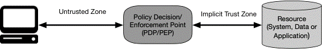

オリジナル文書 [NIST SP 800-207 Zero Trust Architecture](https://csrc.nist.gov/publications/detail/sp/800-207/final)

訳駐：Google translateで翻訳したものを修正しています。間違いの指摘や提案を歓迎します。

# Zero Trust Architecture
# ゼロトラストアーキテクチャ

- Scott Rose, Oliver Borchert
  - Advanced Network Technologies Division Information Technology Laboratory
  - 情報技術研究所 先端ネットワーク技術本部
- Stu Mitchell
  - Stu2Labs Stafford, VA
  - Stu2Labs スタッフォード、バージニア州
- Sean Connelly
  - Cybersecurity & Infrastructure Security Agency Department of Homeland Security
  - 国土安全保障省サイバーセキュリティ＆インフラ安全保障局

This publication is available free of charge from: https://doi.org/10.6028/NIST.SP.800-207
この出版物は次のURLから無償で入手できます。https://doi.org/10.6028/NIST.SP.800-207

August 2020
2020年8月

U.S. Department of Commerce
*Wilbur L. Ross, Jr., Secretary*

*米国商務省
Wilbur L. Ross, Jr., 秘書*

National Institute of Standards and Technology
Walter Copan, NIST Director and Under Secretary of Commerce for Standards and Technology

*国立標準技術研究所*
Walter Copan, NIST ディレクター、商務長官

### Authority
### 発行機関

This publication has been developed by NIST in accordance with its statutory responsibilities under the Federal Information Security Modernization Act (FISMA) of 2014, 44 U.S.C. § 3551 et seq., Public Law (P.L.) 113-283. NIST is responsible for developing information security standards and guidelines, including minimum requirements for federal information systems, but such standards and guidelines shall not apply to national security systems without the express approval of appropriate federal officials exercising policy authority over such systems. This guideline is consistent with the requirements of the Office of Management and Budget (OMB) Circular A-130.

この出版物は、2014年の米国政府情報セキュリティ近代化法（FISMA）に基づく法的責任に従ってNISTによって開発されました。 §3551 et seq。、Public Law（P.L.）113-283。NISTは、米国政府の情報システムの最小要件を含む情報セキュリティ基準とガイドラインを開発する責任がありますが、そのような基準とガイドラインは、そのようなシステムに対して政策当局を行使する適切な米国政府当局の明示的な承認なしに、国家セキュリティシステムに適用されません。このガイドラインは、Office of Management and Budget（OMB）Circular A-130の要件と一致しています。

Nothing in this publication should be taken to contradict the standards and guidelines made mandatory and binding on federal agencies by the Secretary of Commerce under statutory authority. Nor should these guidelines be interpreted as altering or superseding the existing authorities of the Secretary of Commerce, Director of the OMB, or any other federal official. This publication may be used by nongovernmental organizations on a voluntary basis and is not subject to copyright in the United States. Attribution would, however, be appreciated by NIST.

この出版物のいかなるものも、法的権限の下で商務長官によって米国政府機関に対して義務的かつ拘束力を持たせた基準とガイドラインに矛盾するものと解釈されるべきではありません。また、これらのガイドラインは、商務長官、OMBの局長、またはその他の米国政府当局の既存の権限を変更または置き換えるものとして解釈されるべきではありません。この出版物は自主的に非政府組織によって使用される可能性があり、米国における著作権の対象ではありません。ただし、帰属表示はNISTによって評価されるでしょう。

National Institute of Standards and Technology Special Publication 800-207
Natl. Inst. Stand. Technol. Spec. Publ. 800-207, 59 pages (August 2020) CODEN: NSPUE2

国立標準技術研究所の特別刊行物800-207
Natl. インスト スタンド テクノール スペック 公開 800-207、59ページ（2020年8月）CODEN：NSPUE2

This publication is available free of charge from: https://doi.org/10.6028/NIST.SP.800-207
この出版物は次のURLから無償で入手できます。https://doi.org/10.6028/NIST.SP.800-207

Certain commercial entities, equipment, or materials may be identified in this document in order to describe an experimental procedure or concept adequately. Such identification is not intended to imply recommendation or endorsement by NIST, nor is it intended to imply that the entities, materials, or equipment are necessarily the best available for the purpose.

実験手順または概念を適切に説明するために、このドキュメントでは特定の商用エンティティ、機器、または材料が特定されている場合があります。そのような識別は、NISTによる推奨または承認を暗示することを意図したものではなく、エンティティ、材料、または機器がその目的のために必ずしも最良の入手が可能であることを暗示することを意図したものではありません。

There may be references in this publication to other publications currently under development by NIST in accordance with its assigned statutory responsibilities. The information in this publication, including concepts and methodologies, may be used by federal agencies even before the completion of such companion publications. Thus, until each publication is completed, current requirements, guidelines, and procedures, where they exist, remain operative. For planning and transition purposes, federal agencies may wish to closely follow the development of these new publications by NIST.

この出版物には、NISTが割り当てられた法的責任に従って現在開発中の他の出版物への参照がある場合があります。概念や方法論を含むこの出版物の情報は、そのような関連出版物の完成前であっても、米国政府機関によって使用される場合があります。したがって、各出版物が完成するまで、現在の要件、ガイドライン、および手順（存在する場合）は引き続き有効です。 計画と移行の目的で、米国政府機関はNISTによるこれらの新しい出版物の開発を綿密に追跡することを望む場合があります。

Organizations are encouraged to review all draft publications during public comment periods and provide feedback to NIST. Many NIST cybersecurity publications, other than the ones noted above, are available at https://csrc.nist.gov/publications.

組織は、パブリックコメント期間中にすべてのドラフト出版物をレビューし、NISTにフィードバックを提供することをお勧めします。上記以外の多くのNISTサイバーセキュリティ出版物は次のURLから入手できます。https://csrc.nist.gov/publications

Comments on this publication may be submitted to:
National Institute of Standards and Technology
Attn: Advanced Network Technologies Division, Information Technology Laboratory 100 Bureau Drive (Mail Stop 8920) Gaithersburg, MD 20899-8920
Email: [zerotrust-arch@nist.gov](mailto:zerotrust-arch@nist.gov)

この出版物へのコメントは以下に提出できます。
国立標準技術研究所
情報技術研究所Advanced Network Technologies Division、100 Bureau Drive（Mail Stop 8920）Gaithersburg、MD 20899-8920
メール：zerotrust-arch@[nist.gov](http://nist.gov)

All comments are subject to release under the Freedom of Information Act (FOIA).
すべてのコメントは、情報公開法（FOIA）に基づいて公開される場合があります。

### Reports on Computer Systems Technology
### コンピュータシステム技術に関する報告書

The Information Technology Laboratory (ITL) at the National Institute of Standards and Technology (NIST) promotes the U.S. economy and public welfare by providing technical leadership for the Nation’s measurement and standards infrastructure. ITL develops tests, test methods, reference data, proof of concept implementations, and technical analyses to advance the development and productive use of information technology. ITL’s responsibilities include the development of management, administrative, technical, and physical standards and guidelines for the cost-effective security and privacy of other than national security-related information in federal information systems. The Special Publication 800-series reports on ITL’s research, guidelines, and outreach efforts in information system security, and its collaborative activities with industry, government, and academic organizations.

米国国立標準技術研究所（NIST）の情報技術研究所（ITL）は、米国による評価方法と標準化の基盤の技術的リーダーシップを提供することにより、米国の経済と公共の福祉を推進しています。ITLは、テストの開発、テスト方法の開発、参照データの作成、概念実証の実装および技術分析を開発を通じて、情報技術の開発と生産的な利用を促進します。 ITLの責務は、米国の情報システムにおける国家安全保障に関する情報以外の費用対効果の高いセキュリティとプライバシーに関する管理、管理、技術、および物理的な標準とガイドラインの開発を含んでいます。Special Publication 800シリーズは、ITLの研究、ガイドライン、情報システムのセキュリティに関する取り組み、および業界、政府、学術機関との協力活動について報告しています。

### Abstract 
### 概要

Zero trust (ZT) is the term for an evolving set of cybersecurity paradigms that move defenses from static, network-based perimeters to focus on users, assets, and resources. A zero trust architecture (ZTA) uses zero trust principles to plan industrial and enterprise infrastructure and workflows. Zero trust assumes there is no implicit trust granted to assets or user accounts based solely on their physical or network location (i.e., local area networks versus the internet) or based on asset ownership (enterprise or personally owned). Authentication and authorization (both subject and device) are discrete functions performed before a session to an enterprise resource is established. Zero trust is a response to enterprise network trends that include remote users, bring your own device (BYOD), and cloud-based assets that are not located within an enterprise-owned network boundary. Zero trust focuses on protecting resources (assets, services, workflows, network accounts, etc.), not network segments, as the network location is no longer seen as the prime component to the security posture of the resource. This document contains an abstract definition of zero trust architecture (ZTA) and gives general deployment models and use cases where zero trust could improve an enterprise’s overall information technology security posture.

ゼロトラスト（ZT）は、防御の方法を静的なネットワークベースの境界から、ユーザー、アセット、およびリソースに注目するように促し、進化する一連のサイバーセキュリティパラダイムの用語です。ゼロトラストアーキテクチャ（ZTA）は、ゼロトラストの原則を使用して、産業およびエンタープライズインフラストラクチャとワークフローを計画します。ゼロトラストは、物理的またはネットワークの場所（つまり、ローカルエリアネットワークとインターネット）のみに基づいて、またはアセットの所有権（企業または個人所有）に基づいて、アセットまたはユーザーアカウントに暗黙的な信頼が付与されていないことを前提としています。認証と承認（主体(ユーザ)とデバイスの両方）は、エンタープライズリソースへのセッションが確立される前に実行される、それぞれ別個の機能です。ゼロトラストとは、リモートユーザーを含む企業ネットワークのトレンド、ユーザの所有するデバイス（BYOD）の持ち込み、企業が所有するネットワーク境界内にないクラウドベースのアセットへの対応です。ゼロトラストは、ネットワークの場所がリソースのセキュリティ体制の主要なコンポーネントと見なされなくなったため、ネットワークセグメントではなく、リソース（アセット、サービス、ワークフロー、ネットワークアカウントなど）の保護に重点を置いています。この文書には、ゼロトラストアーキテクチャ（ZTA）の抽象的な定義が含まれており、ゼロトラストが企業全体の情報技術のセキュリティへの態度を改善する一般的な導入モデルとそのユースケースが示されています。

### Keywords 
### キーワード

architecture; cybersecurity; enterprise; network security; zero trust.

アーキテクチャ、サイバーセキュリティ、企業、ネットワークセキュリティ、ゼロトラスト

### Acknowledgments 
### 謝辞

This document is the product of a collaboration between multiple federal agencies and is overseen by the Federal CIO Council. The architecture subgroup is responsible for development of this document, but there are specific individuals who deserve recognition. These include Greg Holden, project manager of the Federal CIO Council ZTA project; Alper Kerman, project manager for the NIST/National Cybersecurity Center of Excellence ZTA effort; and Douglas Montgomery.

このドキュメントは、複数の米国政府機関間の協業の成果物であり、米国CIO評議会が監修しています。アーキテクチャサブグループがこの文書の開発を担当しますが、特に以下の方を挙げます。米国CIO評議会ZTAプロジェクトのプロジェクトマネージャーであるGreg Holden、ZTAに素晴らしく尽力してくれたNIST/米国サイバーセキュリティセンターのプロジェクトマネージャのAlper Kerman、そしてダグラス・モンゴメリーです。

### Audience
### 対象読者

This document is intended to describe zero trust for enterprise security architects. It is meant to aid understanding of zero trust for civilian unclassified systems and provide a road map to migrate and deploy zero trust security concepts to an enterprise environment. Agency cybersecurity managers, network administrators, and managers may also gain insight into zero trust and ZTA from this document. It is not intended to be a single deployment plan for ZTA as an enterprise will have unique business use cases and data assets that require safeguards. Starting with a solid understanding of the organization’s business and data will result in a strong approach to zero trust.

この文書は、エンタープライズセキュリティアーキテクトのゼロトラストについて説明することを目的としています。これは、民間の未分類システムのゼロトラストの理解を支援し、ゼロトラストセキュリティの考え方をエンタープライズ環境に移行および展開するためのロードマップを提供することを目的としています。サイバーセキュリティ管理者の担当機関、ネットワーク運用者および管理者も、この文書からゼロトラストとZTAに関する洞察を得ることができます。企業にはそれぞれビジネスユースケースと保護を必要とするデータアセットがあり、ここで説明するZTAが唯一の展開計画であることを意図している訳ではありません。組織のビジネスとデータをしっかりと理解することから始めることにより、ゼロトラストへの強力なアプローチを生み出すことができます。

### Trademark
### 商標

Information All registered trademarks or trademarks belong to their respective organizations.

登録商標または商標は、それぞれの組織に帰属します。

### Patent Disclosure Notice
### 特許開示通知

NOTICE: The Information Technology Laboratory (ITL) has requested that holders of patent claims whose use may be required for compliance with the guidance or requirements of this publication disclose such patent claims to ITL. However, holders of patents are not obligated to respond to ITL calls for patents and ITL has not undertaken a patent search in order to identify which, if any, patents may apply to this publication.

注意：情報技術研究所（ITL）は、この出版物のガイダンスまたは要件への準拠のために使用が必要となる可能性のある特許クレームの所有者に、そのような特許クレームをITLに開示することを要求しています。ただし、特許の保有者は、ITLの特許請求に対応する義務はなく、ITLは、この出版物に適用される可能性のある特許を特定するための特許調査を行っていません。

Following the ITL call for the identification of patent claims whose use may be required for compliance with the guidance or requirements of this publication, notice of one or more such claims has been received.

この出版物のガイダンスまたは要件に準拠するために使用が必要となる可能性のある特許クレームの特定を求めるITLの要請を受けて、そのようなクレームの通知が1つ以上受信されました。

By publication, no position is taken by ITL with respect to the validity or scope of any patent claim or of any rights in connection therewith. The known patent holder(s) has (have), however, provided to NIST a letter of assurance stating either (1) a general disclaimer to the effect that it does (they do) not hold and does (do) not currently intend holding any essential patent claim(s), or (2) that it (they) will negotiate royalty-free or royalty-bearing licenses with other parties on a demonstrably nondiscriminatory basis with reasonable terms and conditions.

公開により、ITLは、特許クレームまたはそれに関連する権利の有効性または範囲に関していかなる立場も取りません。ただし、既知の特許権者は、NISTに、（1）保持しない（保持している）か、現在保持している意図がない（有効である）かについての一般的な免責事項を記載した次のような保証書を提供しています。必須の特許請求、または（2）それが（彼らは）正当な条件で明白に差別のない根拠で他の当事者とロイヤルティフリーまたはロイヤルティ保有ライセンスを交渉するということ。

Details may be obtained from [zerotrust-arch@nist.gov](mailto:zerotrust-arch@nist.gov).

詳細はzerotrust-arch@[nist.gov](http://nist.gov)から入手できます。

No representation is made or implied that this is the only license that may be required to avoid patent infringement in the use of this publication.

これがこの出版物の使用における特許侵害を回避するために必要となる可能性のある唯一のライセンスであることを表明または示唆するものではありません。

## 1 Introduction
## 1 はじめに

A typical enterprise’s infrastructure has grown increasingly complex. A single enterprise may operate several internal networks, remote offices with their own local infrastructure, remote and/or mobile individuals, and cloud services.

一般的な企業のインフラストラクチャは、ますます複雑になっています。単一の企業が、複数の内部ネットワーク、独自のローカルインフラストラクチャを備えたリモートオフィス、リモートおよび/またはモバイルの個人、クラウドサービスを運用している場合があります。

This complexity has outstripped legacy methods of perimeter-based network security as there is no single, easily identified perimeter for the enterprise. Perimeter-based network security has also been shown to be insufficient since once attackers breach the perimeter, further lateral movement is unhindered.This complex enterprise has led to the development of a new model for cybersecurity known as “zero trust” (ZT). A ZT approach is primarily focused on data and service protection but can and should be expanded to include all enterprise assets (devices, infrastructure components, applications, virtual and cloud components) and subjects (end users, applications and other non-human entities that request information from resources). Throughout this document, “subject” will be used unless the section relates directly to a human end user in which “user” will be specifically used instead of the more generic “subject.” Zero trust security models assume that an attacker is present in the environment and that an enterprise-owned environment is no different—or no more trustworthy—than any nonenterprise-owned environment. In this new paradigm, an enterprise must assume no implicit trust and continually analyze and evaluate the risks to its assets and business functions and then enact protections to mitigate these risks. In zero trust, these protections usually involve minimizing access to resources (such as data and compute resources and applications/services) to only those subjects and assets identified as needing access as well as continually authenticating and authorizing the identity and security posture of each access request.

企業が境界を簡単に特定できる単一の境界がないため、この複雑さは従来手法である境界ベースのネットワークセキュリティのでは対応することが困難です。攻撃者が一たび境界内に侵入すれば、攻撃者が横方向への動き(境界内の他のアセットやリソースへの侵害)を妨げることができなくなるため、境界ベースのネットワークセキュリティが不十分であることが示されています。この複雑な企業は、「ゼロトラスト」（ZT）と呼ばれるサイバーセキュリティの新しいモデルの開発につながっています。ZTアプローチは、主にデータとサービスの保護に焦点を当てていますが、すべてのエンタープライズアセット（デバイス、インフラストラクチャコンポーネント、アプリケーション、仮想コンポーネントとクラウドコンポーネント）とサブジェクト（エンドユーザー、アプリケーション、およびリソースから要求されるその他の人間以外のエンティティ）を含めるように拡張できます。この文書では、より一般的な「サブジェクト」の代わりに「ユーザー」が具体的に使用される人間のエンドユーザーに直接関連するセクションを除いて、「サブジェクト」を使用します。ゼロトラストセキュリティモデルは、攻撃者が環境内に存在し、企業内の環境とその外側の環境とが変わらない、またはどちらも信頼できないと想定しています。この新しいパラダイムでは、企業は暗黙の信頼を想定せず、アセットとビジネス機能に対するリスクを継続的に分析および評価し、次にこれらのリスクを軽減するための保護を実施する必要があります。ゼロトラストでは、これらの保護には通常、アクセスが必要であると識別されたサブジェクトとアセットへのリソース（データおよびコンピューティングリソースとアプリケーション/サービスなど）へのアクセスの最小化と、各アクセスリクエストのIDとセキュリティの状態(security posture)の継続的な認証と承認が含まれます。

A zero trust architecture (ZTA) is an enterprise cybersecurity architecture that is based on zero trust principles and designed to prevent data breaches and limit internal lateral movement. This publication discusses ZTA, its logical components, possible deployment scenarios, and threats. It also presents a general road map for organizations wishing to migrate to a zero trust design approach and discusses relevant federal policies that may impact or influence a zero trust architecture.

ゼロトラストアーキテクチャ（ZTA）は、ゼロトラストの原則に基づくエンタープライズサイバーセキュリティアーキテクチャであり、データ侵害を防止し、内部の横方向の動きを制限するように設計されています。この文書では、ZTA、その論理コンポーネント、可能な展開シナリオ、および脅威について説明します。また、ゼロトラスト設計アプローチへの移行を希望する組織向けの一般的なロードマップを示し、ゼロトラストアーキテクチャに影響を与える、または影響を与える可能性のある関連する米国政策について説明します。

ZT is not a single architecture but a set of guiding principles for workflow, system design and operations that can be used to improve the security posture of any classification or sensitivity level [FIPS199]. Transitioning to ZTA is a journey concerning how an organization evaluates risk in its mission and cannot simply be accomplished with a wholesale replacement of technology. That said, many organizations already have elements of a ZTA in their enterprise infrastructure today.

ZTは単一のアーキテクチャではなく、分類、機密レベル[FIPS199]のセキュリティ体制を改善するために使用できるワークフロー、システム設計、および操作の一連の指針となる原則です。ZTAへの移行は、組織がそのミッションにおけるリスクを評価する方法に関する道のりであり、テクノロジーの大規模な置き換えだけでは達成できません。とは言っても、今日の多くの組織では、すでにエンタープライズインフラストラクチャにZTAの要素が含まれています。

Organizations should seek to incrementally implement zero trust principles, process changes, and technology solutions that protect their data assets and business functions by use case. Most enterprise infrastructures will operate in a hybrid zero trust/perimeter-based mode while continuing to invest in IT modernization initiatives and improve organization business processes. Organizations need to implement comprehensive information security and resiliency practices for zero trust to be effective. When balanced with existing cybersecurity policies and guidance, identity and access management, continuous monitoring, and best practices, a ZTA can protect against common threats and improve an organization’s security posture by using a managed risk approach.

組織は、ゼロトラストの原則、プロセスの変更、およびユースケースによってデータアセットとビジネス機能を保護するテクノロジーソリューションを段階的に実装するように努めるべきです。ほとんどのエンタープライズインフラストラクチャは、ITの近代化イニシアチブに投資し続け、組織のビジネスプロセスを改善しながら、ゼロトラスト/境界ベースのハイブリッドモードで動作します。ゼロトラストを効果的にするために、組織は包括的な情報セキュリティと回復力を維持するための手法(resiliency practices)を実装する必要があります。ZTAは、既存のサイバーセキュリティポリシーとガイダンス、IDとアクセスの管理、継続的なモニタリング、ベストプラクティスとバランスをとり、マネージドリスクアプローチを使用することで、一般的な脅威から保護し、組織のセキュリティ体制を改善できます。

### 1.1 History of Zero Trust Efforts Related to Federal Agencies
### 1.1 米国政府機関に関連するゼロトラストの取り組みの歴史

The concept of zero trust has been present in cybersecurity since before the term “zero trust” was coined. The Defense Information Systems Agency (DISA) and the Department of Defense published their work on a more secure enterprise strategy dubbed “black core” [BCORE]. Black core involved moving from a perimeter-based security model to one that focused on the security of individual transactions. The work of the Jericho Forum in 2004 publicized the idea of de- perimeterization—limiting implicit trust based on network location and the limitations of relying on single, static defenses over a large network segment [JERICHO]. The concepts of de- perimeterization evolved and improved into the larger concept of zero trust, which was later coined by John Kindervag[^1] while at Forrester.[^2] Zero trust then became the term used to describe various cybersecurity solutions that moved security away from implied trust based on network location and instead focused on evaluating trust on a per-transaction basis. Both private industry and higher education have also undergone this evolution from perimeter-based security to a security strategy based on zero trust principles.

ゼロトラストの概念は、「ゼロトラスト」という用語が作られる前からサイバーセキュリティに存在しています。アメリカ国防情報システム局（DISA）と国防総省は、「ブラックコア」[BCORE]と呼ばれるより安全な企業戦略に関する研究を発表しました。ブラックコアには、境界ベースのセキュリティモデルから、個々のトランザクションのセキュリティに焦点を当てたモデルへの移行が含まれていました。2004年のエリコフォーラム(Jericho Forum)の作業では、ネットワークの場所に基づいた暗黙の信頼を制限し、大規模なネットワークセグメントで単一の静的防御に依存することを制限する[JERICHO]非境界化をアイデアとして公表しました。非境界化の概念は進化し、ゼロトラストというより大きな概念に改善されました。これは後にForresterにいる間にJohn Kindervag[^1]によって新語として作られました[^2]。ゼロトラストは、ネットワークの場所に基づいて暗黙の信頼からセキュリティを離れ、トランザクションごとに信頼を評価することに焦点を当てたさまざまなサイバーセキュリティソリューションを表す用語として使用されるようになりました。民間産業と高等教育の両方でも、境界ベースのセキュリティからゼロトラスト原則に基づくセキュリティ戦略へのこの進化を遂げています。

[^1]: https://go.forrester.com/blogs/next-generation-access-and-zero-trust/
[^2]:  Any mention of commercial products or services within NIST documents is for information only; it does not imply a recommendation or endorsement by NIST.

Federal agencies have been urged to move to security based on zero trust principles for more than a decade, building capabilities and policies such as the Federal Information Security Modernization Act (FISMA) followed by the Risk Management Framework (RMF); Federal Identity, Credential, and Access Management (FICAM); Trusted Internet Connections (TIC); and Continuous Diagnostics and Mitigation (CDM) programs. All of these programs aim to restrict data and resource access to authorized parties. When these programs were started, they were limited by the technical capabilities of information systems. Security policies were largely static and were enforced at large “choke points” that an enterprise could control to get the largest effect for the effort. As technology matures, it is becoming possible to continually analyze and evaluate access requests in a dynamic and granular fashion to a “need to access” basis to mitigate data exposure due to compromised accounts, attackers monitoring a network, and other threats.

米国政府機関は、10年以上にわたってゼロトラスト原則に基づいてセキュリティへの移行を促されており、米国情報セキュリティ近代化法（FISMA）に続いてリスク管理フレームワーク（RMF）、米国政府ID、資格、およびアクセス管理（FICAM）、信頼できるインターネット接続（TIC）、継続的な診断と緩和（CDM）プログラムなどの機能とポリシーを構築するよう求められています。これらのプログラムはすべて、データとリソースへのアクセスを許可された関係者に制限することを目的としています。これらのプログラムが開始されたときは、まだ、情報システムの不十分な情報処理能力によって制限されていました。セキュリティポリシーはほとんど静的であり、企業がその取り組みに対して最大の効果を得るために制御できる大きな「難所(choke points)」で実施されました。テクノロジーが成熟するにつれ、アクセス要求を動的かつきめ細かく分析し、「アクセスが必要」という基準で継続的に分析および評価することで、アカウントの侵害、攻撃者によるネットワークの監視、およびその他の脅威によるデータ漏洩を軽減することが可能になりました。

### 1.2 Structure of This Document
### 1.2 この文書の構成

The rest of the document is organized as follows:
この後、この文書は次のように構成されています。

- Section 2 defines ZT and ZTA and lists some assumptions when designing a ZTA for an enterprise. This section also includes a list of the tenets of ZT design.
- 第2章では、ZTとZTAを定義し、企業のZTAを設計する際のいくつかの前提を示します。この章には、ZT設計の原則のリストも含まれています。
- Section 3 documents the logical components, or building blocks, of ZT. It is possible that unique implementations compose ZTA components differently yet serve the same logical functionality.
- 第3章では、ZTの論理コンポーネント（ビルディングブロック）について説明します。ユニークな実装では、同じ論理機能を提供しながらも、ZTAコンポーネントの構成が異なる可能性があります。
- Section 4 lists some possible use cases where a ZTA may make enterprise environments more secure and less prone to successful exploitation. These include enterprises with remote employees, cloud services, and guest networks.
- 第4章は、ZTAがエンタープライズ環境をより安全にし、悪用される可能性を低くする可能性があるいくつかの考えられるユースケースを示しています。これらには、リモートの従業員、クラウドサービス、およびゲストネットワークを持つ企業が含まれます。
- Section 5 discusses threats to an enterprise using a ZTA. Many of these threats are similar to any architected networks but may require different mitigation techniques.
- 第5章では、ZTAを使用する企業に対する脅威について説明します。これらの脅威の多くは、設計されたネットワークと似ていますが、異なる緩和手法が必要になる場合があります。
- Section 6 discusses how ZTA tenets fit into and/or complement existing guidance for federal agencies.
- 第6章では、米国政府機関向けの既存のガイダンスにZTAの理念をどのように適合または補完させたかについて説明します。
- Section 7 presents the starting point for transitioning an enterprise (such as a federal agency) to a ZTA. This includes a description of the general steps needed to plan and deploy applications and enterprise infrastructure that are guided by ZT tenets.
- 第7章は、企業（米国政府機関など）をZTAに移行するための開始点を示しています。これには、ZTの理念に基づいてアプリケーションとエンタープライズインフラストラクチャを計画および展開するために必要な一般的な手順の説明が含まれます。

## 2 Zero Trust Basics
## 2 ゼロトラストの基本

Zero trust is a cybersecurity paradigm focused on resource protection and the premise that trust is never granted implicitly but must be continually evaluated. Zero trust architecture is an end-to- end approach to enterprise resource and data security that encompasses identity (person and non- person entities), credentials, access management, operations, endpoints, hosting environments, and the interconnecting infrastructure. The initial focus should be on restricting resources to those with a need to access and grant only the minimum privileges (e.g., read, write, delete) needed to perform the mission. Traditionally, agencies (and enterprise networks in general) have focused on perimeter defense and authenticated subjects are given authorized access to a broad collection of resources once on the internal network. As a result, unauthorized lateral movement within the environment has been one of the biggest challenges for federal agencies.

ゼロトラストは、リソース保護に焦点を当てたサイバーセキュリティのパラダイムであり、暗黙的にトラストが付与されることはなく、継続的に評価する必要があるという前提です。ゼロトラストアーキテクチャは、アイデンティティ（人エンティティと非人エンティティ）、資格情報、アクセス管理、運用、エンドポイント、ホスティング環境、および相互接続インフラストラクチャを含む、エンタープライズリソースとデータセキュリティへのエンドツーエンドのアプローチです。最初の焦点は、ミッションを実行するために必要な最小限の権限（たとえば、読み取り、書き込み、削除）と付与とアクセスにより、それらに与えるリソースを制限することです。従来、機関（および企業ネットワーク全般）は境界防御に重点を置いており、認証されたサブジェクト(ユーザなど)には、内部ネットワーク上で幅広いリソース群へのアクセスが許可されていました。その結果、環境内での不正な横方向の移動は、米国政府機関にとって最大の課題の1つになっていました。

The Trusted Internet Connections (TIC) and agency perimeter firewalls provide strong internet gateways. This helps block attackers from the internet, but the TICs and perimeter firewalls are less useful for detecting and blocking attacks from inside the network and cannot protect subjects outside of the enterprise perimeter (e.g., remote workers, cloud-based services, edge devices, etc.).

信頼できるインターネット接続（TIC）と機関の境界ファイアウォールは、強力なインターネットゲートウェイを提供します。これは、インターネットからの攻撃者をブロックするのに役立ちますが、TICおよび境界ファイアウォールは、ネットワーク内部からの攻撃を検出およびブロックするのにはあまり役立ちません。また、企業境界の外部のサブジェクト（リモートワーカー、クラウドベースのサービス、エッジデバイスなど）を保護できません。

An operative definition of zero trust and zero trust architecture is as follows:
ゼロトラストおよびゼロトラストアーキテクチャの運用上の定義は次のとおりです。

Zero trust (ZT) provides a collection of concepts and ideas designed to minimize uncertainty in enforcing accurate, least privilege per-request access decisions in information systems and services in the face of a network viewed as compromised. Zero trust architecture (ZTA) is an enterprise’s cybersecurity plan that utilizes zero trust concepts and encompasses component relationships, workflow planning, and access policies. Therefore, a zero trust enterprise is the network infrastructure (physical and virtual) and operational policies that are in place for an enterprise as a product of a zero trust architecture plan.

ゼロトラスト（ZT）は、侵害されたと見なされるネットワーク上の情報システムおよびサービスにおいて、リクエストごとの正確で最小権限のアクセス許可決定を実施する際の、不確実性を最小限に抑えるように設計された概念とアイデアの集合体を提供します。ゼロトラストアーキテクチャ（ZTA）は、ゼロトラストの概念を利用し、コンポーネントの関係、ワークフローの計画、アクセスポリシーを網羅する企業のサイバーセキュリティ計画です。したがって、ゼロトラストエンタープライズとは、ゼロトラストアーキテクチャプランの製品として企業に導入されているネットワークインフラストラクチャ（物理および仮想）と運用ポリシーです。

An enterprise decides to adopt zero trust as its core strategy and generate a zero trust architecture as a plan developed with zero trust principles (see Section 2.1 below) in mind. This plan is then deployed to produce a zero trust environment for use in the enterprise.

企業は、中核戦略としてゼロトラストを採用し、ゼロトラストの原則（以下のセクション2.1を参照）を念頭に置いて開発される計画として、ゼロトラストアーキテクチャを生み出すことを決定します。次に、この計画に基づき、企業で使用するゼロトラスト環境を作り、展開します。

This definition focuses on the crux of the issue, which is the goal to prevent unauthorized access to data and services coupled with making the access control enforcement as granular as possible. That is, authorized and approved subjects (combination of user, application (or service), and device) can access the data to the exclusion of all other subjects (i.e., attackers). To take this one step further, the word “resource” can be substituted for “data” so that ZT and ZTA are about resource access (e.g., printers, compute resources, Internet of Things [IoT] actuators) and not just data access.

この定義は、問題の核心に焦点を当てています。これは、アクセス制御の実施を可能な限り細かくすることと相まって、データやサービスへの不正アクセスを防ぐことを目標としています。つまり、承認および承認されたサブジェクト（ユーザー、アプリケーション（またはサービス）、およびデバイスの組み合わせ）は、他のすべてのサブジェクト（つまり、攻撃者）を除外してデータにアクセスできます。これをさらに一歩進めるために、「データ」の代わりに「リソース」という単語を使用できます。これにより、ZTおよびZTAは、データアクセスだけでなく、リソースアクセス (プリンター、コンピューティングリソース、モノのインターネット(IoT)、アクチュエーターなど）に関するものになります。

To lessen uncertainties (as they cannot be eliminated), the focus is on authentication, authorization, and shrinking implicit trust zones while maintaining availability and minimizing temporal delays in authentication mechanisms. Access rules are made as granular as possible to enforce least privileges needed to perform the action in the request.

不確実性を軽減するために（それらを排除できないため）、注目するべきは認証、承認、および暗黙的な信頼ゾーンの縮小であり、可用性を維持し、認証メカニズムの時間遅延を最小限に抑えます。アクセスルールは、リクエストでアクションを実行するために必要な最小限の権限を適用するために、可能な限り細かくされています。

In the abstract model of access shown in Figure 1, a subject needs access to an enterprise resource. Access is granted through a policy decision point (PDP) and corresponding policy enforcement point (PEP).[^3]

図1に示すアクセスの抽象的なモデルでは、サブジェクトはエンタープライズリソースへのアクセスを必要とします。アクセスは、ポリシー決定ポイント（PDP）および対応するポリシー実施ポイント（PEP）を通じて許可されます[^3]。

[^3]: Part of the concepts defined in OASIS XACML 2.0 [https://docs.oasis-open.org/xacml/2.0/access_control-xacml-2.0-core-spec-](https://docs.oasis-open.org/xacml/2.0/access_control-xacml-2.0-core-spec-os.pdf) [os.pdf](https://docs.oasis-open.org/xacml/2.0/access_control-xacml-2.0-core-spec-os.pdf)

Figure 1: Zero Trust Access
図1: ゼロトラストアクセス

The system must ensure that the subject is authentic and the request is valid. The PDP/PEP passes proper judgment to allow the subject to access the resource. This implies that zero trust applies to two basic areas: authentication and authorization. What is the level of confidence about the subject’s identity for this unique request? Is access to the resource allowable given the level of confidence in the subject’s identity? Does the device used for the request have the proper security posture? Are there other factors that should be considered and that change the confidence level (e.g., time, location of subject, subject’s security posture)? Overall, enterprises need to develop and maintain dynamic risk-based policies for resource access and set up a system to ensure that these policies are enforced correctly and consistently for individual resource access requests. This means that an enterprise should not rely on implied trustworthiness wherein if the subject has met a base authentication level (e.g., logging into an asset), all subsequent resource requests are assumed to be equally valid.

システムは、サブジェクトが本物であり、要求が有効であることを確認する必要があります。PDP / PEPは、サブジェクトがリソースにアクセスできるようにする適切な判断を渡します。これは、ゼロトラストが認証と認可の2つの基本的な領域に適用されることを意味します。このユニークなリクエストに対する対象の身元について、どの程度の信頼度がありますか？ 被験者の身元に対する信頼のレベルが与えられれば、リソースへのアクセスは許可されますか？ リクエストに使用されたデバイスは適切なセキュリティ状態になっていますか？ 考慮する必要があり、信頼レベルを変更する他の要因はありますか（例：時間、対象の場所、対象のセキュリティ状態）。 全体として、企業はリソースアクセスに関する動的なリスクベースのポリシーを開発および維持し、これらのポリシーが個々のリソースアクセス要求に対して正しくかつ一貫して実施されるようにシステムを設定する必要があります。これは、企業が暗黙の信頼性に依存すべきではないことを意味します。もし、サブジェクトが基本認証レベル（たとえば、アセットへのログイン）を満たしている場合、以降のすべてのリソース要求は同等に有効であると見なされてしまいます。

The “implicit trust zone” represents an area where all the entities are trusted to at least the level of the last PDP/PEP gateway. For example, consider the passenger screening model in an airport. All passengers pass through the airport security checkpoint (PDP/PEP) to access the boarding gates. The passengers, airport employees, aircraft crew, etc., mill about in the terminal area, and all the individuals are considered trusted. In this model, the implicit trust zone is the boarding area.

「暗黙の信頼ゾーン」は、すべてのエンティティが少なくとも最後のPDP / PEPゲートウェイのレベルに信頼されている領域を表します。たとえば、空港の乗客スクリーニングモデルを考えてみます。すべての乗客は、空港のセキュリティチェックポイント（PDP / PEP）を通過して搭乗ゲートにアクセスします。乗客、空港の従業員、航空機の乗員などがターミナルエリアで混ざり、すべての個人が信頼されていると見なされます。このモデルでは、暗黙の信頼ゾーンが搭乗エリアです。

The PDP/PEP applies a set of controls so that all traffic beyond the PEP has a common level of trust. The PDP/PEP cannot apply additional policies beyond its location in the flow of traffic. To allow the PDP/PEP to be as specific as possible, the implicit trust zone must be as small as possible.

PDP / PEPは一連の制御を適用して、PEPを超えるすべてのトラフィックが共通の信頼レベルを持つようにします。PDP / PEPは、トラフィックフロー内の場所を超えて追加のポリシーを適用することはできません。PDP / PEPをできるだけ具体的(specific)にするには、暗黙の信頼ゾーンをできるだけ小さくする必要があります。

Zero trust provides a set of principles and concepts around moving the PDP/PEPs closer to the resource. The idea is to explicitly authenticate and authorize all subjects, assets and workflows that make up the enterprise.

ゼロトラストは、PDP / PEPをリソースに近づけるための一連の原則と概念を提供します。そのアイデアは、企業を構成するすべてのサブジェクト、アセット、およびワークフローを明示的に認証および認可をすることです。

### 2.1 Tenets of Zero Trust
### 2.1 ゼロトラストの理念

Many definitions and discussions of ZT stress the concept of removing wide-area perimeter defenses (e.g., enterprise firewalls) as a factor. However, most of these definitions continue to define themselves in relation to perimeters in some way (such as micro-segmentation or micro- perimeters; see Section 3.1) as part of the functional capabilities of a ZTA. The following is an attempt to define ZT and ZTA in terms of basic tenets that should be involved rather than what is excluded. These tenets are the ideal goal, though it must be acknowledged that not all tenets may be fully implemented in their purest form for a given strategy.

ZTの多くの定義と議論は、広域境界防御（エンタープライズファイアウォールなど）を要素として取り除くという概念を強調しています。ただし、これらの定義のほとんどは、ZTAの機能の一部として、境界との関係で何らかの方法（マイクロセグメンテーションまたはマイクロ境界など、3.1節を参照）で定義され続けています。以下は、除外されているものではなく、関与する必要がある基本的な原則の観点からZTとZTAを定義する試みです。これらの原則は理想的な目標ですが、すべての原則が特定の戦略の最も純粋な形で完全に実装されるとは限らないことを認めなければなりません。

A zero trust architecture is designed and deployed with adherence to the following zero trust basic tenets:

ゼロトラストアーキテクチャは、次のゼロトラストの基本理念を遵守して設計および展開されています。

* 1. All data sources and computing services are considered resources. A network may be composed of multiple classes of devices. A network may also have small footprint devices that send data to aggregators/storage, software as a service (SaaS), systems sending instructions to actuators, and other functions. Also, an enterprise may decide to classify personally owned devices as resources if they can access enterprise-owned resources.
* 1. すべてのデータソースとコンピューティングサービスはリソースと見なされます。 ネットワークは、複数のクラスのデバイスで構成される場合があります。 ネットワークには、アグリゲーター/ストレージにデータを送信する小さな設置面積のデバイス、サービスとしてのソフトウェア（SaaS）、アクチュエーターに指示を送信するシステム、およびその他の機能が含まれる場合もあります。 また、企業所有のリソースにアクセスできる場合は、個人所有のデバイスをリソースとして分類することもできます。
* 2. All communication is secured regardless of network location. Network location alone does not imply trust. Access requests from assets located on enterprise-owned network infrastructure (e.g., inside a legacy network perimeter) must meet the same security requirements as access requests and communication from any other nonenterprise-owned network. In other words, trust should not be automatically granted based on the device being on enterprise network infrastructure. All communication should be done in the most secure manner available, protect confidentiality and integrity, and provide source authentication.
* 2. ネットワークの場所に関係なく、すべての通信が保護されます。ネットワークの場所だけでは信頼を意味しません。企業が所有するネットワークインフラストラクチャ（レガシーネットワーク境界内など）にあるアセットからのアクセス要求は、他の非企業所有ネットワークからのアクセス要求および通信と同じセキュリティ要件を満たす必要があります。つまり、企業ネットワークインフラストラクチャ上にあるデバイスに基づいて、信頼が自動的に付与されるべきではありません。すべての通信は、利用可能な最も安全な方法で行われ、機密性と整合性が保護され、送信元認証が提供されます。
* 3. Access to individual enterprise resources is granted on a per-session basis. Trust in the requester is evaluated before the access is granted. Access should also be granted with the least privileges needed to complete the task. This could mean only “sometime recently” for this particular transaction and may not occur directly before initiating a session or performing a transaction with a resource. However, authentication and authorization to one resource will not automatically grant access to a different resource.
* 3. 個々のエンタープライズリソースへのアクセスは、セッションごとに許可されます。 要求者の信頼性は、アクセスが許可される前に評価されます。 また、タスクを完了するために必要な最小限の特権でアクセス権も付与する必要があります。 これは、この特定のトランザクションの「最近」という意味でしかなく、セッションを開始する前、実行する前に直接的に(常に/directly)発生するというわけでもありません。 ただし、1つのリソースに対する認証と承認によって、別のリソースへのアクセスが自動的に許可されるわけではありません。
* 4. Access to resources is determined by dynamic policy—including the observable state of client identity, application/service, and the requesting asset—and may include other behavioral and environmental attributes. An organization protects resources by defining what resources it has, who its members are (or ability to authenticate users from a federated community), and what access to resources those members need. For zero trust, client identity can include the user account (or service identity) and any associated attributes assigned by the enterprise to that account or artifacts to authenticate automated tasks. Requesting asset state can include device characteristics such as software versions installed, network location, time/date of request, previously observed behavior, and installed credentials. Behavioral attributes include, but not limited to, automated subject analytics, device analytics, and measured deviations from observed usage patterns. Policy is the set of access rules based on attributes that an organization assigns to a subject, data asset, or application. Environmental attributes may include such factors as requestor network location, time, reported active attacks, etc. These rules and attributes are based on the needs of the business process and acceptable level of risk. Resource access and action permission policies can vary based on the sensitivity of the resource/data. Least privilege principles are applied to restrict both visibility and accessibility.
* 4. リソースへのアクセスは、クライアントID、アプリケーション/サービス、および要求しているアセットの観察可能な状態を含む動的ポリシーによって決定され、他の行動および環境属性を含む場合があります。組織は、所有しているリソース、そのメンバーが誰であるか（またはフェデレーションコミュニティ(訳註：認証連携の共同体?)からユーザーを認証する機能）、およびそれらのメンバーが必要とするリソースへのアクセス権を定義することにより、リソースを保護します。ゼロトラストの場合、クライアントIDには、ユーザーアカウント（またはサービスID）と、企業がそのアカウントまたはアーティファクト(訳註：物やプロセスなど?)に割り当てた関連属性を含めて、自動化タスクを認証できます。アセットの状態の要求には、インストールされているソフトウェアのバージョン、ネットワークの場所、要求の日時、以前に観察された動作、インストールされている資格情報などのデバイスの特性を含めることができます。行動属性には、自動化された対象分析、デバイス分析、観測された使用パターンからの測定された偏差が含まれますが、これらに限定されません。ポリシーは、組織がサブジェクト、データアセット、またはアプリケーションに割り当てた属性に基づくアクセスルールのセットです。環境属性には、要求元のネットワークの場所、時間、報告されたアクティブな攻撃などの要因が含まれる場合があります。これらのルールと属性は、ビジネスプロセスのニーズと許容可能なリスクレベルに基づいています。リソースアクセスおよびアクション許可ポリシーは、リソース/データの機密性に基づいて異なる場合があります。最小特権の原則は、可視性とアクセシビリティの両方を制限するために適用されます。
* 5. The enterprise monitors and measures the integrity and security posture of all owned and associated assets. No asset is inherently trusted. The enterprise evaluates the security posture of the asset when evaluating a resource request. An enterprise implementing a ZTA should establish a continuous diagnostics and mitigation (CDM) or similar system to monitor the state of devices and applications and should apply patches/fixes as needed. Assets that are discovered to be subverted, have known vulnerabilities, and/or are not managed by the enterprise may be treated differently (including denial of all connections to enterprise resources) than devices owned by or associated with the enterprise that are deemed to be in their most secure state. This may also apply to associated devices (e.g., personally owned devices) that may be allowed to access some resources but not others. This, too, requires a robust monitoring and reporting system in place to provide actionable data about the current state of enterprise resources.
* 5. 企業は、所有および関連するすべてのアセットの完全性とセキュリティ体制を監視および測定します。本質的に信頼できるアセットはありません。企業は、リソース要求を評価するときに、アセットのセキュリティ体制を評価します。 ZTAを実装する企業は、継続的な診断と軽減（CDM）または同様のシステムを確立して、デバイスとアプリケーションの状態を監視し、必要に応じてパッチ/修正を適用する必要があります。侵害されていることが判明したアセット、既知の脆弱性を有するアセット、および／または企業が管理していないアセットは、最も安全な状態にあると考えられる企業が所有している、または企業に関連するデ バイスとは異なる扱い（企業リソースへのすべての接続を拒否することを含む）を受ける可能性があります。これは、一部のリソースへのアクセスは許可されているが他のリソースへのアクセスは許可されていない可能性のある関連デバイス（個人所有のデバイスなど）にも適用される場合があります。これも、エンタープライズリソースの現在の状態に関する実用的なデータを提供するために、適切な監視およびレポートシステムが必要です。
* 6. All resource authentication and authorization are dynamic and strictly enforced before access is allowed. This is a constant cycle of obtaining access, scanning and assessing threats, adapting, and continually reevaluating trust in ongoing communication. An enterprise implementing a ZTA would be expected to have Identity, Credential, and Access Management (ICAM) and asset management systems in place. This includes the use of multifactor authentication (MFA) for access to some or all enterprise resources. Continual monitoring with possible reauthentication and reauthorization occurs throughout user transactions, as defined and enforced by policy (e.g., time-based, new resource requested, resource modification, anomalous subject activity detected) that strives to achieve a balance of security, availability, usability, and cost-efficiency.
* 6. すべてのリソースの認証と認可は動的であり、アクセスが許可される前に厳密に実施されます。これは、アクセスの取得、脅威のスキャンと評価、適応、継続的なコミュニケーションへの信頼の継続的な再評価の一定のサイクルです。 ZTAを実装する企業は、ID、資格情報、アクセス管理（ICAM）とアセット管理システムが配備されていることが期待されます。これには、一部またはすべてのエンタープライズリソースにアクセスするための多要素認証（MFA）の使用が含まれます。可能性のある再認証と再認可による継続的な監視は、セキュリティ、可用性、使いやすさ、費用効率のバランスを達成するためのポリシー（たとえば、時間ベース、要求された新しいリソース、リソースの変更、異常な対象アクティビティの検出）によって定義および施行されたユーザートランザクション全体で発生します。
* 7. The enterprise collects as much information as possible about the current state of assets, network infrastructure and communications and uses it to improve its security posture. An enterprise should collect data about asset security posture, network traffic and access requests, process that data, and use any insight gained to improve policy creation and enforcement. This data can also be used to provide context for access requests from subjects (see Section 3.3.1).
* 7. 企業は、アセット、ネットワークインフラストラクチャ、および通信の現在の状態に関するできるだけ多くの情報を収集し、それを使用してセキュリティ態勢を改善します。企業は、アセットのセキュリティ状況、ネットワークトラフィック、アクセス要求に関するデータを収集し、そのデータを処理し、得られた洞察を使用して、ポリシーの作成と適用を改善する必要があります。このデータは、サブジェクトからのアクセス要求のコンテキストを提供するためにも使用できます（3.3.1節を参照）。

The above tenets attempt to be technology agnostic. For example, “user identification (ID)” could include several factors such as username/password, certificates, and onetime password. These tenets apply to work done within an organization or in collaboration with one or more partner organizations and not to anonymous public or consumer-facing business processes. An organization cannot impose internal policies on external actors (e.g., customers or general internet users) but may be able to implement some ZT-based policies on nonenterprise users who have a special relationship with the organization (e.g. registered customers, employee dependents, etc.).

上記の理念は、特定の技術にとらわれないことを試みています。 たとえば、「ユーザー識別（ID）」には、ユーザー名/パスワード、証明書、ワンタイムパスワードなどのいくつかの要素を含めることができます。 これらの理念は、組織内で、または1つ以上のパートナー組織と協力して行われる作業に適用され、匿名の公共または消費者向けビジネスプロセスには適用されません。 組織は、外部のアクター（顧客や一般的なインターネットユーザーなど）に内部ポリシーを課すことはできませんが、組織と特別な関係を持つ企業以外のユーザー（たとえば、登録済みの顧客、従業員の扶養家族など）にZTベースのポリシーを実装できる場合があります。

### 2.2 A Zero Trust View of a Network
### 2.2 ネットワークからのゼロトラストの見え方

There are some basic assumptions for network connectivity for any organization that utilizes ZTA in network planning and deployment. Some of these assumptions apply to enterprise-owned network infrastructure, and some apply to enterprise-owned resources operating on
nonenterprise-owned network infrastructure (e.g., public Wi-Fi or public cloud providers). These assumptions are used to direct the formation of a ZTA. The network in an enterprise implementing a ZTA should be developed with the ZTA tenets outlined above and with the following assumptions.

ネットワークの計画と展開についてZTAを利用する組織のネットワーク接続には、いくつかの基本的な前提条件があります。これらの前提条件の一部は、企業所有のネットワークインフラストラクチャに適用され、一部は、企業所有ではないネットワークインフラストラクチャ（パブリックWi-Fiやパブリッククラウドプロバイダーなど）で動作する企業所有のリソースに適用されます。これらの仮定は、ZTAを形作ることを指示するために使用されます。ZTAを実装する企業のネットワークは、上記で概説したZTAの理念と、次の前提条件を使用して開発する必要があります。

* 1. The entire enterprise private network is not considered an implicit trust zone. Assets should always act as if an attacker is present on the enterprise network, and communication should be done in the most secure manner available (see tenet 2 above). This entails actions such as authenticating all connections and encrypting all traffic.
* 1. エンタープライズプライベートネットワーク全体は、暗黙的な信頼ゾーンとは見なされません。アセットは常に攻撃者が企業ネットワークに存在するかのように動作し、通信は利用可能な最も安全な方法で行われる必要があります（上記の原則2を参照）。これには、すべての接続の認証やすべてのトラフィックの暗号化などのアクションが伴います。
* 2. Devices on the network may not be owned or configurable by the enterprise. Visitors and/or contracted services may include nonenterprise-owned assets that need network access to perform their role. This includes bring-your-own-device (BYOD) policies that allow enterprise subjects to use nonenterprise-owned devices to access enterprise resources.
* 2. ネットワーク上のデバイスは、企業が所有または構成できない場合があります。訪問者や契約サービスには、その役割を実行するためにネットワークアクセスを必要とする非企業所有のアセットが含まれる場合があります。これには、企業が非企業所有デバイスを使用して企業リソースにアクセスできるようにする持参デバイス（BYOD）ポリシーが含まれます。
* 3. No resource is inherently trusted. Every asset must have its security posture evaluated via a PEP before a request is granted to an enterprise-owned resource (similar to tenet 6 above for assets as well as subjects). This evaluation should be continual for as long as the session lasts. Enterprise-owned devices may have artifacts that enable authentication and provide a confidence level higher than the same request coming from nonenterprise- owned devices. Subject credentials alone are insufficient for device authentication to an enterprise resource.
* 3. 本質的に信頼できるリソースはありません。すべてのアセットは、企業所有リソースにリクエストが許可される前に、PEPを介してセキュリティ状態を評価する必要があります（アセットとサブジェクトの上記の原則6と同様）。この評価は、セッションが続く限り継続する必要があります。企業所有のデバイスには、認証を可能にし、非企業所有のデバイスからの同じリクエストよりも高い信頼レベルを提供するアーティファクトがある場合があります。サブジェクト資格情報だけでは、エンタープライズリソースに対するデバイス認証には不十分です。
* 4. Not all enterprise resources are on enterprise-owned infrastructure. Resources include remote enterprise subjects as well as cloud services. Enterprise-owned or - managed assets may need to utilize the local (i.e., nonenterprise) network for basic connectivity and network services (e.g., DNS resolution).
* 4. すべての企業リソースが企業所有のインフラストラクチャ上にあるわけではありません。リソースには、リモートのエンタープライズサブジェクトとクラウドサービスが含まれます。企業が所有または管理するアセットは、基本的な接続とネットワークサービス（DNS解決など）のためにローカル（つまり、非エンタープライズ）ネットワークを利用する必要がある場合があります。
* 5. Remote enterprise subjects and assets cannot fully trust their local network connection. Remote subjects should assume that the local (i.e., nonenterprise-owned) network is hostile. Assets should assume that all traffic is being monitored and potentially modified. All connection requests should be authenticated and authorized, and all communications should be done in the most secure manner possible (i.e., provide confidentiality, integrity protection, and source authentication). See the tenets of ZTA above.
* 5. リモートのエンタープライズサブジェクトとアセットは、ローカルネットワーク接続を完全に信頼することはできません。リモートのサブジェクトは、ローカル（つまり、企業が所有していない）ネットワーク(訳駐：リモートにいる人にとってのローカルネットワーク？)が敵対的であると想定する必要があります。アセットは、すべてのトラフィックが監視され、変更される可能性があると想定する必要があります。すべての接続要求は認証および認可される必要があり、すべての通信は可能な限り最も安全な方法で行われる必要があります（つまり、機密性、完全性保護、および送信元認証を提供します）。すでに説明したZTAの理念を参照してください。
* 6. Assets and workflows moving between enterprise and nonenterprise infrastructure should have a consistent security policy and posture. Assets and workloads should retain their security posture when moving to or from enterprise-owned infrastructure. This includes devices that move from enterprise networks to nonenterprise networks (i.e. remote users). This also includes workloads migrating from on-premises data centers to nonenterprise cloud instances.
* 6. エンタープライズインフラストラクチャと非エンタープライズインフラストラクチャの間を移動するアセットとワークフローには、一貫したセキュリティポリシーとセキュリティの状態が必要です。アセットとワークロードは、企業所有のインフラストラクチャとの間で移動するときに、セキュリティの状態を維持する必要があります。これには、エンタープライズネットワークから非エンタープライズネットワーク（つまり、リモートユーザー）に移動するデバイスが含まれます。また、オンプレミスのデータセンターから非エンタープライズクラウドインスタンスに移行するワークロードも含まれます。

## 3 Logical Components of Zero Trust Architecture
## 3 ゼロトラストアーキテクチャの論理コンポーネント

There are numerous logical components that make up a ZTA deployment in an enterprise. These components may be operated as an on-premises service or through a cloud-based service. The conceptual framework model in Figure 2 shows the basic relationship between the components and their interactions. Note that this is an ideal model showing logical components and their interactions. From Figure 1, the policy decision point (PDP) is broken down into two logical components: the policy engine and policy administrator (defined below). The ZTA logical components use a separate control plane to communicate, while application data is communicated on a data plane (see Section 3.4).

企業内にZTAの展開を構成する論理コンポーネントは多数あります。これらのコンポーネントは、オンプレミスサービスとして、またはクラウドベースのサービスを通じて運用できます。図2の概念フレームワークモデルは、コンポーネントとその相互作用の基本的な関係を示しています。これは、論理コンポーネントとその相互作用を示す理想的なモデルであることに注意してください。図1から、ポリシー決定ポイント（PDP）は、ポリシーエンジンとポリシー管理者（以下で定義）の2つの論理コンポーネントに分類されます。ZTA論理コンポーネントは、個別のコントロールプレーンを使用して通信しますが、アプリケーションデータはデータプレーンで通信します（3.4節を参照）。

Figure 2: Core Zero Trust Logical Components
図2：コアゼロトラストの論理コンポーネント

The component descriptions:
各コンポーネントの説明：

- Policy engine (PE): This component is responsible for the ultimate decision to grant access to a resource for a given subject. The PE uses enterprise policy as well as input from external sources (e.g., CDM systems, threat intelligence services described below) as input to a trust algorithm (see Section 3.3 for more details) to grant, deny, or revoke access to the resource. The PE is paired with the policy administrator component. The policy engine makes and logs the decision (as approved, or denied), and the policy administrator executes the decision.
- ポリシーエンジン（PE）：このコンポーネントは、特定のサブジェクトのリソースへのアクセスを許可する最終的な決定を行います。PEはエンタープライズポリシーと外部ソース（CDMシステム、以下で説明する脅威インテリジェンスサービスなど）を信頼アルゴリズム（詳細については3.3節を参照）への入力として使用して、リソースへのアクセスを許可、拒否、または取り消します。PEは、ポリシー管理者コンポーネントとペアになります。ポリシーエンジンが決定を行ってログに記録し（承認または拒否）、ポリシー管理者が決定を実行します。
- Policy administrator (PA): This component is responsible for establishing and/or shutting down the communication path between a subject and a resource (via commands to relevant PEPs). It would generate any session-specific authentication and authentication token or credential used by a client to access an enterprise resource. It is closely tied to the PE and relies on its decision to ultimately allow or deny a session. If the session is authorized and the request authenticated, the PA configures the PEP to allow the session to start. If the session is denied (or a previous approval is countermanded), the PA signals to the PEP to shut down the connection. Some implementations may treat the PE and PA as a single service; here, it is divided into its two logical components. The PA communicates with the PEP when creating the communication path. This communication is done via the control plane.
- ポリシー管理者（PA）：このコンポーネントは、（関連するPEPへのコマンドを介して）サブジェクトとリソースの間の通信経路を確立または遮断する責任があります。クライアントがエンタープライズリソースにアクセスするために使用するセッション固有の認証と認証トークンまたは資格情報を生成します。これはPEと密接に関連しており、最終的にセッションを許可または拒否するという決定に依存しています。セッションが認可され、要求が認証されると、PAはPEPを構成してセッションの開始を許可します。セッションが拒否された場合（または以前の承認が取り消された場合）、PAはPEPに信号を送り、接続を遮断します。一部の実装では、PEとPAを単一のサービスとして扱う場合があります。 ここでは、2つの論理コンポーネントに分かれています。PAは、通信経路を作成するときにPEPと通信します。この通信は、コントロールプレーンを介して行われます。
- Policy enforcement point (PEP): This system is responsible for enabling, monitoring, and eventually terminating connections between a subject and an enterprise resource. The PEP communicates with the PA to forward requests and/or receive policy updates from the PA. This is a single logical component in ZTA but may be broken into two different components: the client (e.g., agent on a laptop) and resource side (e.g., gateway component in front of resource that controls access) or a single portal component that acts as a gatekeeper for communication paths. Beyond the PEP is the trust zone (see Section 2) hosting the enterprise resource.
- ポリシー実施ポイント（PEP）：このシステムは、サブジェクトとエンタープライズリソース間の接続の有効化、監視、および最終的な終了を担当します。PEPはPAと通信して、要求を転送したり、PAからポリシーの更新を受信したりします。これはZTAの単一の論理コンポーネントですが、クライアント（ラップトップ上のエージェントなど）とリソース側（アクセスを制御するリソースの前にあるゲートウェイコンポーネントなど）、または通信パスのゲートキーパーとして機能する単一のポータルコンポーネントの2つの異なるコンポーネントに分割できます。 PEPの先には、エンタープライズリソースをホストする信頼ゾーン（2章を参照）があります。

In addition to the core components in an enterprise implementing a ZTA, several data sources provide input and policy rules used by the policy engine when making access decisions. These include local data sources as well as external (i.e., nonenterprise-controlled or -created) data sources. These can include:

ZTAを実装する企業のコアコンポーネントに加えて、いくつかのデータソースは、アクセス決定を行うときにポリシーエンジンが使用する入力およびポリシールールを提供します。これらには、ローカルデータソースと外部（つまり、企業が管理または作成していない）データソースが含まれます。これらには以下が含まれます。

- Continuous diagnostics and mitigation (CDM) system: This gathers information about the enterprise asset’s current state and applies updates to configuration and software components. An enterprise CDM system provides the policy engine with the information about the asset making an access request, such as whether it is running the appropriate patched operating system (OS), the integrity of enterprise-approved software components or presence of non-approved components and whether the asset has any known vulnerabilities. CDM systems are also responsible for identifying and potentially enforcing a subset of polices on nonenterprise devices active on enterprise infrastructure.
- 継続的な診断と軽減（CDM）システム：これにより、エンタープライズアセットの現在の状態に関する情報が収集され、構成およびソフトウェアコンポーネントの更新を適用します。エンタープライズCDMシステムは、ポリシーエンジンにアクセス要求を行っているアセットに関する次のような情報を提供します。エンタープライズCDMシステムは、適切なパッチが適用されたオペレーティングシステム（OS）を実行しているかどうか、エンタープライズ承認されたソフトウェアコンポーネントの整合性、未承認コンポーネントの存在など、アクセス要求を行っているアセットに関する情報をポリシーエンジンに提供します。 アセットに既知の脆弱性があるかどうか、などです。また、CDMシステムは、エンタープライズインフラストラクチャでアクティブな非エンタープライズデバイスにポリシーのサブセットを識別し、強制する可能性もあります。
- Industry compliance system: This ensures that the enterprise remains compliant with any regulatory regime that it may fall under (e.g., FISMA, healthcare or financial industry information security requirements). This includes all the policy rules that an enterprise develops to ensure compliance.
- 業界コンプライアンスシステム：これにより、企業は該当する規制制度（FISMA、医療機関、金融業界の情報セキュリティ要件など）に引き続き準拠できます。これには、企業がコンプライアンスを確保するために開発するすべてのポリシールールが含まれます。
- Threat intelligence feed(s): This provides information from internal or external sources that help the policy engine make access decisions. These could be multiple services that take data from internal and/or multiple external sources and provide information about newly discovered attacks or vulnerabilities. This also includes newly discovered flaws in software, newly identified malware, and reported attacks to other assets that the policy engine will want to deny access to from enterprise assets.
- 脅威インテリジェンスフィード：これは、ポリシーエンジンがアクセス決定を行うのに役立つ内部または外部ソースからの情報を提供します。これらは、内部および/または複数の外部ソースからデータを取得し、新たに発見された攻撃または脆弱性に関する情報を提供する複数のサービスである可能性があります。これには、ソフトウェアで新たに発見された欠陥、新たに識別されたマルウェア、およびポリシーエンジンがエンタープライズアセットからのアクセスを拒否する他のアセットへの攻撃の報告も含まれます。
- Network and system activity logs: This enterprise system aggregates asset logs, network traffic, resource access actions, and other events that provide real-time (or near- real-time) feedback on the security posture of enterprise information systems.
- ネットワークおよびシステムアクティビティログ：このエンタープライズシステムは、アッセットのログ、ネットワークトラフィック、リソースアクセスアクション、およびエンタープライズ情報システムのセキュリティ状態に関するリアルタイム（またはほぼリアルタイム）のフィードバックを提供するその他のイベントを集約します。
- Data access policies: These are the attributes, rules, and policies about access to enterprise resources. This set of rules could be encoded in (via management interface) or dynamically generated by the policy engine. These policies are the starting point for authorizing access to a resource as they provide the basic access privileges for accounts and applications/services in the enterprise. These policies should be based on the defined mission roles and needs of the organization.
- データアクセスポリシー：これらは、エンタープライズリソースへのアクセスに関する属性、ルール、およびポリシーです。このルールのセットは、（管理インターフェイスを介して）エンコードするか、ポリシーエンジンによって動的に生成できます。これらのポリシーは、企業内のアカウントおよびアプリケーション/サービスに基本的なアクセス権限を提供するため、リソースへのアクセスを承認するための開始点です。これらのポリシーは、定義されたミッションの役割と組織のニーズに基づいている必要があります。
- Enterprise public key infrastructure (PKI): This system is responsible for generating and logging certificates issued by the enterprise to resources, subjects, services and applications. This also includes the global certificate authority ecosystem and the Federal PKI[^4], which may or may not be integrated with the enterprise PKI. This could also be a PKI that is not built upon X.509 certificates.
- エンタープライズ公開キー基盤（PKI）：このシステムは、企業がリソース、サブジェクト、サービス、およびアプリケーションに発行する証明書を生成してログに記録します。これには、グローバル認証局エコシステムと米国政府PKI[^4]も含まれます。これらはエンタープライズPKIと統合されている場合とされていない場合があります。これは、X.509証明書に基づいて構築されていないPKIの場合もあります。
- ID management system: This is responsible for creating, storing, and managing enterprise user accounts and identity records (e.g., lightweight directory access protocol (LDAP) server). This system contains the necessary subject information (e.g., name, email address, certificates) and other enterprise characteristics such as role, access attributes, and assigned assets. This system often utilizes other systems (such as a PKI) for artifacts associated with user accounts. This system may be part of a larger federated community and may include nonenterprise employees or links to nonenterprise assets for collaboration.
- ID管理システム：これは、エンタープライズユーザーアカウントとIDレコード（軽量ディレクトリアクセスプロトコル（LDAP）サーバーなど）の作成、保存、管理を担当します。このシステムには、必要なサブジェクト情報（名前、電子メールアドレス、証明書など）と、役割、アクセス属性、割り当てられたアセットなどのその他の企業特性が含まれています。このシステムは、ユーザーアカウントに関連付けられたアーティファクトに対して他のシステム（PKIなど）を利用することがよくあります。このシステムは、より大きなフェデレーションコミュニティの一部である場合があり、非エンタープライズ従業員またはコラボレーションのための非エンタープライズアセットへのリンクを含む場合があります。
- Security information and event management (SIEM) system: This collects security- centric information for later analysis. This data is then used to refine policies and warn of possible attacks against enterprise assets.
- セキュリティ情報およびイベント管理（SIEM）システム：これは、後で分析するためにセキュリティに関することを中心の情報を収集します。このデータは、ポリシーを調整し、エンタープライズアセットに対する攻撃の可能性を警告するために使用されます。

[^4]: https://www.idmanagement.gov/topics/fpki/

### 3.1 Variations of Zero Trust Architecture Approaches
### 3.1 様々なゼロトラストアーキテクチャのアプローチ

There are several ways that an enterprise can enact a ZTA for workflows. These approaches vary in the components used and in the main source of policy rules for an organization. Each approach implements all the tenets of ZT (see Section 2.1) but may use one or two (or one component) as the main driver of policies. A full ZT solution will include elements of all three approaches. The approaches include enhanced identity governance–driven, logical micro- segmentation, and network-based segmentation.

企業がワークフローのZTAを制定する方法はいくつかあります。これらのアプローチは、使用するコンポーネントや組織のポリシールールの主なソース(訳駐：ポリシーを制定する理由？)によって異なります。各アプローチはZTのすべての原則（2.1節を参照）を実装しますが、ポリシーの主な推進力として1つまたは2つの原則項目（または1つのコンポーネント）を使用できます。完全なZTソリューションには、3つのアプローチがすべての要素が含まれます。アプローチには、強化されたIDガバナンスがリードする論理的なマイクロセグメンテーション、およびネットワークベースのセグメンテーションが含まれます。

Certain approaches lend themselves to some use cases more than others. An organization looking to develop a ZTA for its enterprise may find that its chosen use case and existing policies point to one approach over others. That does not mean the other approaches would not work but rather that other approaches may be more difficult to implement and may require more fundamental changes to how the enterprise currently conducts business flows.

特定のアプローチは、いくつかのユースケースがその他よりも適しています。企業向けにZTAを開発しようとしている組織は、選択したユースケースと既存のポリシーが他のどれでもない1つのアプローチを指していることに気付く場合があります。これは、他のアプローチが機能しないことを意味するのではなく、他のアプローチは実装がより困難であり、企業が現在ビジネスフローを実施する方法に、より根本的な変更が必要になる場合があります。

#### 3.1.1 ZTA Using Enhanced Identity Governance 
#### 3.1.1 拡張されたアイデンティティ・ガバナンスを使用するZTA

The enhanced identity governance approach to developing a ZTA uses the identity of actors as the key component of policy creation. If it were not for subjects requesting access to enterprise resources, there would be no need to create access polices. For this approach, enterprise resource access policies are based on identity and assigned attributes. The primary requirement for resource access is based on the access privileges granted to the given subject. Other factors such as device used, asset status, and environmental factors may alter the final confidence level calculation (and ultimate access authorization) or tailor the result in some way, such as granting only partial access to a given data source based on network location. Individual resources or PEP components protecting the resource must have a way to forward requests to a policy engine service or authenticate the subject and approve the request before granting access.

ZTAを開発するために強化されたIDガバナンスアプローチでは、アクターのIDをポリシー作成の主要コンポーネントとして使用します。もし、エンタープライズリソースへのアクセスを要求するサブジェクトが対象でなければ、アクセスポリシーを作成する必要はありません。このアプローチでは、エンタープライズリソースアクセスポリシーはIDと割り当てられた属性に基づいています。リソースアクセスの主な要件は、特定のサブジェクトに付与されたアクセス権限に基づいています。使用するデバイス、アセットのステータス、環境要因などの他の要因により、最終的な信頼レベルの計算（および最終的なアクセス許可）が変更されるか、ネットワークの場所に基づいて特定のデータソースへの部分的なアクセスのみが許可されるなど、結果が調整されます。リソースを保護する個々のリソースまたはPEPコンポーネントは、アクセスを許可する前に、リクエストをポリシーエンジンサービスに転送するか、サブジェクトを認証してリクエストを認可する方法が必要となります。

Enhanced identity governance-based approaches for enterprises are often employed using an open network model or an enterprise network with visitor access or frequent nonenterprise devices on the network (such as with the use case in Section 4.3 below). Network access is initially granted to all assets but access to enterprise resources are restricted to identities with the appropriate access privileges. There is a downside in granting basic network connectivity as malicious actors could still attempt network reconnaissance and/or use the network to launch denial of service attacks either internally or against a third party. Enterprises still need to monitor and respond to such behavior before it impacts workflows.

企業向けの拡張されたIDガバナンスベースのアプローチは、多くの場合、オープンネットワークモデル、またはビジターアクセスまたはネットワーク上の非エンタープライズデバイス（下の4.3節のユースケースなど）を持つエンタープライズネットワークに適用されます。ネットワークアクセスは、最初はすべてのアセットに許可されていますが、エンタープライズリソースへのアクセスは、適切なアクセス権限を持つIDに制限されています。悪意のある攻撃者がネットワークの偵察を試みたり、ネットワークを使用して内部またはサードパーティに対してサービス拒否攻撃を仕掛けたりする可能性があるため、基本的なネットワーク接続を許可することにはマイナス面があります。企業は、ワークフローに影響を与える前に、そのような動作を監視して対応する必要があります。

The identity-driven approach works well with the resource portal model (see Section 3.2.3) since device identity and status provide secondary support data to access decisions. Other models work as well, depending on policies in place. Identity-driven approaches also work well for enterprises that use cloud-based applications/services that may not allow for enterprise-owned or -operated ZT security components to be used (such as many SaaS offerings). The enterprise can use the identity of requestors to form and enforce policy on these platforms.

デバイスアイデンティティとステータスは、アクセス可否を決定するための二次的なサポートデータを提供するため、リソースポータルモデル（3.2.3節を参照）によるアイデンティティドリブンアプローチはうまく機能します。他のモデルでもポリシー次第でうまく機能します。アイデンティティドリブンのアプローチは、企業が所有または運営するZTセキュリティコンポーネントを使用できないクラウドベースのアプリケーション/サービスを使用している企業（多くのSaaSサービスなど）にも有効です。企業は、リクエスタのIDを使用して、これらのプラットフォームでポリシーを作成および適用できます。

#### 3.1.2 ZTA Using Micro-Segmentation 
#### 3.1.2 マイクロセグメンテーションを使ったZTA

An enterprise may choose to implement a ZTA based on placing individual or groups of resources on a unique network segment protected by a gateway security component. In this approach, the enterprise places infrastructure devices such as intelligent switches (or routers) or next generation firewalls (NGFWs) or special purpose gateway devices to act as PEPs protecting each resource or small group of related resources. Alternatively (or additionally), the enterprise may choose to implement host-based micro-segmentation using software agents (see Section 3.2.1) or firewalls on the endpoint asset(s), These gateway devices dynamically grant access to individual requests from a client, asset or service. Depending on the model, the gateway may be the sole PEP component or part of a multipart PEP consisting of the gateway and client-side agent (see Section 3.2.1).

企業は、ゲートウェイセキュリティコンポーネントで保護された一意のネットワークセグメントにリソースの個別またはグループを配置することに基づいて、ZTAを実装することを選択できます。このアプローチでは、企業はインテリジェントスイッチ（またはルーター）や次世代ファイアウォール（NGFW）などのインフラストラクチャデバイス、または特定の目的のゲートウェイデバイスを配置して、各リソースまたは関連するリソースの小さなグループを保護するPEPとして機能させます。あるいは（またはさらに）、企業はエンドポイントアセットにソフトウェアエージェント（3.2.1節を参照）またはファイアウォールを使用してホストベースのマイクロセグメンテーションを実装することを選択できます。これらのゲートウェイデバイスは、クライアント、アセット、またはサービスからの個々のリクエストへのアクセスを動的に許可します。モデルによっては、ゲートウェイが唯一のPEPコンポーネントである場合と、ゲートウェイとクライアント側エージェントで構成されるマルチパートPEPの一部である場合があります（3.2.1節を参照）。

This approach applies to a variety of use cases and deployment models as the protecting device acts as the PEP, with management of said devices acting as the PE/PA component. This approach requires an identity governance program (IGP) to fully function but relies on the gateway components to act as the PEP that shields resources from unauthorized access and/or discovery.

保護デバイスはPEPとして機能し、デバイスの管理はPE / PAコンポーネントとして機能するため、このアプローチはさまざまなユースケースと展開モデルに適用されます。このアプローチでは、IDガバナンスプログラム（IGP）が完全に機能する必要がありますが、ゲートウェイコンポーネントを利用して、リソースを不正アクセスや攻撃者から発見されることを保護するPEPとして機能します。

The key necessity to this approach is that the PEP components are managed and should be able to react and reconfigure as needed to respond to threats or change in the workflow. It is possible to implement some features of a micro-segmented enterprise by using less advanced gateway devices and even stateless firewalls, but the administration cost and difficulty to quickly adapt to changes make this a very poor choice.

このアプローチの主な必要性は、PEPコンポーネントが管理され、脅威やワークフローの不正な変更に対して、必要に応じて対応および再構成できる必要があることです。高度ではないゲートウェイデバイスやステートレスファイアウォールを使用して、マイクロセグメント化された企業の一部の機能を実装することは可能ですが、管理コストと変更にすばやく適応するのが難しいため、これは非常に貧弱な選択です。

#### 3.1.3 ZTA Using Network Infrastructure and Software Defined Perimeters
#### 3.1.3 ネットワークインフラストラクチャとソフトウェア定義の境界を使用するZTA

The last approach uses the network infrastructure to implement a ZTA. The ZTA implementation could be achieved by using an overlay network (i.e., layer 7 but also could be set up lower of the OSI network stack). These approaches are sometimes referred to as software defined perimeter (SDP) approaches and frequently include concepts from Software Defined Networks (SDN) [SDNBOOK] and intent-based networking (IBN) [IBNVN]. In this approach, the PA acts as the network controller that sets up and reconfigures the network based on the decisions made by the PE. The clients continue to request access via PEPs, which are managed by the PA component.

最後のアプローチでは、ネットワークインフラストラクチャを使用してZTAを実装します。ZTAの実装は、オーバーレイネットワークを使用して実現できます（つまり、レイヤー7をOSIネットワークスタックの下に設定することもできます(訳駐：トンネリングのイメージ)）。これらのアプローチは、ソフトウェア定義境界（SDP）アプローチと呼ばれることもあり、ソフトウェア定義ネットワーク（SDN）[SDNBOOK]およびインテントベースネットワーキング（IBN）[IBNVN]からの概念を頻繁に含みます。このアプローチでは、PAは、PEによって行われた決定に基づいてネットワークをセットアップおよび再構成するネットワークコントローラーとして機能します。クライアントは、PAコンポーネントによって管理されるPEPを介してアクセスを要求し続けます。

When the approach is implemented at the application network layer (i.e., layer 7), the most common deployment model is the agent/gateway (see Section 3.2.1). In this implementation, the agent and resource gateway (acting as the single PEP and configured by the PA) establish a secure channel used for communication between the client and resource. There may be other variations of this model, as well for cloud virtual networks, non-IP based networks, etc.

このアプローチがアプリケーションネットワークレイヤー（レイヤー7）で実装されている場合、最も一般的な展開モデルはエージェント/ゲートウェイです（3.2.1節を参照）。この実装では、エージェントとリソースゲートウェイ（単一のPEPとして機能し、PAによって構成されます）が、クライアントとリソース間の通信に使用される安全なチャネルを確立します。このモデルには、クラウド仮想ネットワーク、非IPベースのネットワークなどの他のバリエーションがある可能性があります。

### 3.2 Deployed Variations of the Abstract Architecture
### 3.2 展開される抽象アーキテクチャのバリエーション

All of the above components are logical components. They do not necessarily need to be unique systems. A single asset may perform the duties of multiple logical components, and likewise, a logical component may consist of multiple hardware or software elements to perform the tasks. For example, an enterprise-managed PKI may consist of one component responsible for issuing certificates for devices and another used for issuing certificates to end users, but both use intermediate certificates issued from the same enterprise root certificate authority. In some ZT product offerings currently available on the market, the PE and PA components are combined in a single service.

上記のコンポーネントはすべて論理コンポーネントです。それらは必ずしも個別のシステムである必要はありません。単一のアセットが複数の論理コンポーネントの役割を果たし、同様に、論理コンポーネントがタスクを実行するための複数のハードウェアまたはソフトウェア要素で構成されている場合があります。たとえば、企業が管理するPKIは、デバイスの証明書の発行を担当する1つのコンポーネントと、エンドユーザーに証明書を発行するのに使用される別のコンポーネントで構成されますが、どちらも同じ企業ルート認証局から発行された中間証明書を使用します。現在市場で入手可能な一部のZT製品では、PEおよびPAコンポーネントが1つのサービスに統合されています。

There are several variations on deployment of selected components of the architecture that are outlined in the sections below. Depending on how an enterprise network is set up, multiple ZTA deployment models may be in use for different business processes in one enterprise.

アーキテクチャの選択されたコンポーネントの展開のいくつかのバリエーションは、以下で説明します。企業ネットワークの設定方法によっては、1つの企業のさまざまなビジネスプロセスで複数のZTA展開モデルが使用されている場合があります。

#### 3.2.1 Device Agent/Gateway-Based Deployment 
#### 3.2.1 デバイスエージェント／ゲートウェイに基づく展開

In this deployment model, the PEP is divided into two components that reside on the resource or as a component directly in front of a resource. For example, each enterprise-issued asset has an installed device agent that coordinates connections, and each resource has a component (i.e., gateway) that is placed directly in front so that the resource communicates only with the gateway, essentially serving as a proxy for the resource. The agent is a software component that directs some (or all) traffic to the appropriate PEP in order for requests to be evaluated. The gateway is responsible for communicating with the policy administrator and allowing only approved communication paths configured by the policy administrator (see Figure 3).

この展開モデルでは、PEPは2つのコンポーネントに分割され、リソース上に存在するか、リソースの直前にあるコンポーネントとして存在します。たとえば、企業が支給した各アセットには、接続を調整するインストール済みのデバイスエージェントがあり、各リソースにはコンポーネント（ゲートウェイ）が直前に配置されるため、リソースはゲートウェイとのみ通信し、本質的にはプロキシとして機能します。 エージェントは、要求を評価するために、一部（またはすべて）のトラフィックを適切なPEPに送信するソフトウェアコンポーネントです。ゲートウェイは、ポリシーマネージャと通信し、ポリシーマネージャが構成した承認済みの通信パスのみを許可する責任があります（図3を参照）。

Figure 3: Device Agent/Gateway Model
図3: デバイスエージェント／ゲートウェイモデル

In a typical scenario, a subject with an enterprise-issued laptop wishes to connect to an enterprise resource (e.g., human resources application/database). The access request is taken by the local agent, and the request is forwarded to the policy administrator. The policy administrator and policy engine could be an enterprise local asset or a cloud-hosted service. The policy administrator forwards the request to the policy engine for evaluation. If the request is authorized, the policy administrator configures a communication channel between the device agent and the relevant resource gateway via the control plane. This may include information such as an internet protocol (IP) address, port information, session key, or similar security artifacts.

典型的なシナリオでは、企業が支給したラップトップを持つサブジェクト(訳駐：従業員)が、企業のリソース（人事アプリケーション/データベースなど）に接続したいと考えています。アクセス要求はローカルエージェントによって行われ、要求はポリシーマネージャに転送されます。ポリシーマネージャとポリシーエンジンは、エンタープライズローカルアセットまたはクラウドでホストされるサービスである可能性があります。ポリシーマネージャは、要求を評価のためにポリシーエンジンに転送します。要求が認可されると、ポリシーマネージャは、コントロールプレーンを介してデバイスエージェントと関連するリソースゲートウェイの間の通信チャネルを構成します。これには、インターネットプロトコル（IP）アドレス、ポート情報、セッションキー、または同様のセキュリティアーティファクトなどの情報が含まれる場合があります。

The device agent and gateway then connect, and encrypted application/service data flows begin. The connection between the device agent and resource gateway is terminated when the workflow is completed or when triggered by the policy administrator due to a security event (e.g., session time-out, failure to reauthenticate).

次に、デバイスエージェントとゲートウェイが接続し、暗号化されたアプリケーション/サービスのデータフローが始まります。ワークフローが完了したとき、またはセキュリティイベント（セッションのタイムアウト、再認証の失敗など）が通知されたとき、デバイスエージェントとリソースゲートウェイ間の接続はポリシーマネージャによって終了します。

This model is best utilized for enterprises that have a robust device management program in place as well as discrete resources that can communicate with the gateway. For enterprises that heavily utilize cloud services, this is a client-server implementation of the Cloud Security Alliance (CSA) Software Defined Perimeter (SDP) [CSA-SDP]. This model is also appropriate for enterprises that do not want a BYOD policy in place. Access is possible only via the device agent, which can be placed on enterprise-owned assets.

このモデルは、堅牢なデバイス管理プログラムおよびゲートウェイと通信できる個別のリソースを備えている企業に最適です。クラウドサービスを多用する企業の場合、これはCloud Security Alliance（CSA）ソフトウェア定義境界（SDP）[CSA-SDP]のクライアントサーバー実装です。このモデルは、BYODポリシーを導入したくない企業にも適しています。アクセスは、企業所有のアセットに配置できるデバイスエージェントを介してのみ可能です。

#### 3.2.2 Enclave-Based Deployment 
#### 3.2.2 飛び地に基づく展開

This deployment model is a variation of the device agent/gateway model above. In this model, the gateway components may not reside on assets or in front of individual resources but instead reside at the boundary of a resource enclave (e.g., on-location data center) as shown in Figure 4. Usually, these resources serve a single business function or may not be able to communicate directly to a gateway (e.g., legacy database system that does not have an application programming interface [API] that can be used to communicate with a gateway). This deployment model may also be useful for enterprises that use cloud-based micro-services for a single business processes (e.g., user notification, database lookup, salary disbursement). In this model, the entire private cloud is located behind a gateway.

この展開モデルは、上記のデバイスエージェント/ゲートウェイモデルのバリエーションです。このモデルでは、図4に示すように、ゲートウェイコンポーネントはアセット上または個々のリソースの前に存在するのではなく、飛び地のリソース（オンロケーションデータセンターなど）の境界に存在する場合があります。通常、これらのリソースは単一のビジネス機能を提供するか、もしくは、ゲートウェイと直接通信できないようなシステムです（たとえば、ゲートウェイとの通信に使用できるアプリケーションプログラミングインターフェイス[API]を持たないレガシーデータベースシステム）。この展開モデルは、単一のビジネスプロセス（ユーザー通知、データベースルックアップ、給与支払いなど）にクラウドベースのマイクロサービスを使用する企業にも役立ちます。このモデルでは、プライベートクラウド全体がゲートウェイの背後に配置されています。

Figure 4: Enclave Gateway Model
図4: 飛び地ゲートウェイモデル

It is possible for this model to be a hybrid with the device agent/gateway model. In this model, enterprise assets have a device agent that is used to connect to enclave gateways, but these connections are created using the same process as the basic device agent/gateway model.

このモデルは、デバイスエージェント/ゲートウェイモデルとハイブリッドで利用することができます。このモデルでは、エンタープライズアセットに飛び地ゲートウェイへの接続に使用されるデバイスエージェントがありますが、これらの接続は基本的なデバイスエージェント/ゲートウェイモデルと同じプロセスを使用して作成されます。

This model is useful for enterprises that have legacy applications or on-premises data centers that cannot have individual gateways in place. The enterprise needs a robust asset and configuration management program in place to install/configure the device agents. The downside is that the gateway protects a collection of resources and may not be able to protect each resource individually. This may also allow for subjects to see resources which they do not have privileges to access.

このモデルは、レガシーアプリケーションを使用している企業や、個別のゲートウェイを配置できないオンプレミスのデータセンターで役立ちます。企業は、デバイスエージェントをインストール/構成するための堅牢なアセットおよび構成管理プログラムを導入する必要があります。欠点は、ゲートウェイがリソースのコレクションを保護し、各リソースを個別に保護できない可能性があることです。これにより、サブジェクトは、アクセスする権限のないリソースに触れることを許してしまうかもしれません。

#### 3.2.3 Resource Portal-Based Deployment 
#### 3.2.3 リソースポータルに基づく展開

In this deployment model, the PEP is a single component that acts as a gateway for subject requests. The gateway portal can be for an individual resource or a secure enclave for a collection of resources used for a single business function. One example would be a gateway portal into a private cloud or data center containing legacy applications as shown in Figure 5.

この展開モデルでは、PEPはサブジェクト要求のゲートウェイとして機能する単一のコンポーネントです。ゲートウェイポータルは、個々のリソース用、または単一のビジネス機能に使用されるリソースの集まりのための安全な飛び地用にすることができます。図5に示すように、1つの例は、レガシーアプリケーションを含むプライベートクラウドまたはデータセンターへのゲートウェイポータルです。

Figure 5: Resource Portal Model
図5: リソースポータルモデル

The primary benefit of this model over the others is that a software component does not need to be installed on all client devices. This model is also more flexible for BYOD policies and inter- organizational collaboration projects. Enterprise administrators do not need to ensure that each device has the appropriate device agent before use. However, limited information can be inferred from devices requesting access. This model can only scan and analyze assets and devices once they connect to the PEP portal and may not be able to continuously monitor them for malware, unpatched vulnerabilities, and appropriate configuration.

このモデルの主な利点は、ソフトウェアコンポーネントをすべてのクライアントデバイスにインストールする必要がないことです。このモデルは、BYODポリシーや組織間コラボレーションプロジェクトにも柔軟に対応できます。エンタープライズ管理者は、使用する前に各デバイスに適切なデバイスエージェントがあることを確認する必要はありません。ただし、アクセスを要求するデバイスから限られた情報を推測します。このモデルは、PEPポータルに接続した場合にのみアセットとデバイスをスキャンおよび分析するだけであり、マルウェア、パッチ未適用の脆弱性、および適切な構成についてそれらを継続的に監視できない場合があります。

The main difference with this model is there is no local agent that handles requests, and so the enterprise may not have full visibility or arbitrary control over assets as it can only see/scan them when they connect to a portal. The enterprise may be able to employ measures such as browser isolation to mitigate or compensate. These assets may be invisible to the enterprise between these sessions. This model also allows attackers to discover and attempt to access the portal or attempt a denial-of-service (DoS) attack against the portal. The portal systems should be well- provisioned to provide availability against a DoS attack or network disruption.

このモデルと他のモデルとの間の主な違いは、リクエストを処理するローカルエージェントがなく、企業はサブジェクトがポータルに接続したときにのみサブジェクトを確認/スキャンできるため、アセットを完全に表示したり任意に制御したりできない場合があります。企業は、ブラウザの分離などの対策を講じて軽減または補償できる場合があります。これらのアセットは、これらのセッション間では企業から見えない場合があります。このモデルでは、攻撃者がポータルを検出してアクセスしたり、ポータルに対してサービス拒否（DoS）攻撃を試みたりすることもできます。ポータルシステムは、DoS攻撃やネットワークの中断に対する可用性を提供するために適切にプロビジョニングする必要があります。

#### 3.2.4 Device Application Sandboxing 
#### 3.2.4 デバイスアプリケーションのサンドボックス

Another variation of the agent/gateway deployment model is having vetted applications or processes run compartmentalized on assets. These compartments could be virtual machines, containers, or some other implementation, but the goal is the same: to protect the application or instances of applications from a possibly compromised host or other applications running on the asset.

エージェント/ゲートウェイ展開モデルの別のバリエーションは、精査されたアプリケーションまたはプロセスをアセットごとに区分して実行することです。これらのコンパートメントは、仮想マシン、コンテナ、またはその他の実装でもかまいませんが、危険にさらされる可能性のあるホストまたはアセットで実行されている他のアプリケーションからアプリケーションまたはアプリケーションのインスタンスを保護する、という目的は同じです。

Figure 6: Application Sandboxes
図6: アプリケーションのサンドボックス

In Figure 6, the subject device runs approved, vetted applications in a sandbox. The applications can communicate with the PEP to request access to resources, but the PEP will refuse requests from other applications on the asset. The PEP could be an enterprise local service or a cloud service in this model.

図6で、対象のデバイスは、サンドボックス内で承認および検証されたアプリケーションを実行しています。アプリケーションはPEPと通信してリソースへのアクセスを要求できますが、PEPはアセットの他のアプリケーションの要求を拒否します。このモデルでは、PEPはエンタープライズローカルサービスまたはクラウドサービスかもしれません。

The main advantage of this model variant is that individual applications are segmented from the rest of the asset. If the asset cannot be scanned for vulnerabilities, these individual, sandboxed applications may be protected from a potential malware infection on the host asset. One of the disadvantages of this model is that enterprises must maintain these sandboxed applications for all assets and may not have full visibility into client assets. The enterprise also needs to make sure each sandboxed application is secure, which may require more effort than simply monitoring devices.

このモデルの主な利点は、個々のアプリケーションが他のアセットからセグメント化されることです。アセットの脆弱性をスキャンできない場合、これらの個別のサンドボックスアプリケーションは、ホストアセット上の潜在的なマルウェア感染から保護されている可能性があります。このモデルの欠点の1つは、企業がすべてのアセットに対してこれらのサンドボックスアプリケーションを維持する必要があり、クライアントアセットを完全に可視化できない可能性があることです。企業は、サンドボックス化された各アプリケーションが安全であることを確認する必要もあります。これには、単にデバイスを監視するよりも多くの労力が必要になる場合があります。

### 3.3 Trust Algorithm 
### 3.3 信頼アルゴリズム

For an enterprise with a ZTA deployment, the policy engine can be thought of as the brain and the PE’s trust algorithm as its primary thought process. The trust algorithm (TA) is the process used by the policy engine to ultimately grant or deny access to a resource. The policy engine takes input from multiple sources (see Section 3): the policy database with observable information about subjects, subject attributes and roles, historical subject behavior patterns, threat intelligence sources, and other metadata sources. The process can be grouped into broad categories and visualized in Figure 7.

ZTAを導入している企業の場合、ポリシーエンジンは頭脳であり、PEの信頼アルゴリズムは主要な思考プロセスであると考えることができます。信頼アルゴリズム（TA）は、ポリシーエンジンがリソースへのアクセスを最終的に許可または拒否するために使用するプロセスです。ポリシーエンジンは次のような複数のソースから入力を受け取ります（3章を参照）：サブジェクト、サブジェクトの属性と役割、過去のサブジェクトの動作パターン、脅威インテリジェンスソース、およびその他のメタデータソースに関する観察可能な情報を含むポリシーデータベース。プロセスは、幅広いカテゴリにグループ化され、図7のように視覚化されます。

Figure 7: Trust Algorithm Input
図7: 信頼アルゴリズムのインプット

In the figure, the inputs can be broken into categories based on what they provide to the trust algorithm.

図では、入力は、信頼アルゴリズムに提供するものに基づいてカテゴリに分類できます。

- Access request: This is the actual request from the subject. The resource requested is the primary information used, but information about the requester is also used. This can include OS version, software used (e.g., does the requesting application appear on a list of approved applications?), and patch level. Depending on these factors and the asset security posture, access to assets might be restricted or denied.
- アクセス要求：これは、サブジェクトからの実際の要求です。要求されたリソースは使用される主要な情報ですが、要求者に関する情報も使用されます。これには、OSバージョン、使用されているソフトウェア（要求しているアプリケーションが承認済みアプリケーションのリストに表示されているかどうか）、およびパッチレベルを含めることができます。これらの要素とアセットのセキュリティ状態によっては、アセットへのアクセスは制限または拒否される場合があります。
- Subject database: This is the “who” that is requesting access to a resource [SP800-63]. This is the set of subjects (human and processes) of the enterprise or collaborators and a collection of subject attributes/privileges assigned. These subjects and attributes form the basis of policies for resource access [SP800-162] [NISTIR 7987]. User identities can include a mix of logical identity (e.g., account ID) and results of authentication checks performed by PEPs. Attributes of identity that can be factored into deriving the confidence level include time and geolocation. A collection of privileges given to multiple subjects could be thought of as a role, but privileges should be assigned to a subject on an individual basis and not simply because they may fit into a particular role in the organization. This collection should be encoded and stored in an ID management system and policy database. This may also include data about past observed subject behavior in some (TA) variants (see Section 3.3.1).
- サブジェクトデータベース：これは、リソースへのアクセスを要求しているのが「誰」かを示すものです（SP800-63）。これは、エンタープライズまたはコラボレーターのサブジェクト（人とプロセス）のセット、および割り当てられたサブジェクト属性/特権の情報のコレクションです。これらのサブジェクトと属性は、リソースアクセス[SP800-162] [NISTIR 7987]のポリシーの基礎を形成します。ユーザーIDには、論理ID（アカウントIDなど）とPEPによって実行された認証チェックの結果の組み合わせを含めることができます。信頼レベルを導き出す際に考慮できるアイデンティティの属性には、時間と地理位置情報が含まれます。複数のサブジェクトに与えられた権限のコレクションはロールと考えることができますが、権限は、組織の特定のロールに適合する可能性があるという理由だけでなく、個別にサブジェクトに割り当てる必要があります。このコレクションにはエンコードされ、ID管理システムとポリシーデータベースに保存する必要があります。これには、一部の（TA）バリエーション（3.3.1節を参照）で過去に観察されたサブジェクトの行動に関するデータも含まれます。
- Asset database (and observable status): This is the database that contains the known status of each enterprise-owned (and possibly known nonenterprise/BYOD) asset (physical and virtual, to some extent). This is compared to the observable status of the asset making the request and can include OS version, software present, and its integrity, location (network location and geolocation), and patch level. Depending on the asset state compared with this database, access to assets might be restricted or denied.
- アセットデータベース（および監視可能なステータス）：これは、企業所有（およびおそらくは既知の非企業/BYOD）アセットの既知のステータス（物理および仮想、ある程度）を含むデータベースです。これは、OSバージョン、存在するソフトウェア、およびその整合性、場所（ネットワークの場所とジオロケーション）、およびパッチレベルを含めることができ、要求を行っているアセットの監視可能なステータスと比較されます。このデータベースと比較されたアセットの状態によっては、アセットへのアクセスが制限または拒否される場合があります。
- Resource requirements: This set of policies complements the user ID and attributes database [SP800-63] and defines the minimal requirements for access to the resource. Requirements may include authenticator assurance levels, such as MFA network location (e.g., deny access from overseas IP addresses), data sensitivity, and requests for asset configuration. These requirements should be developed by both the data custodian (i.e., those responsible for the data) and those responsible for the business processes that utilize the data (i.e., those responsible for the mission).
- リソース要件：このポリシーのセットは、ユーザーIDと属性データベース[SP800-63]を補完し、リソースへのアクセスの最小要件を定義します。要件には、MFAネットワークの場所（海外のIPアドレスからのアクセスの拒否など）、データの機密性、アセット構成の要求などの認証システム保証レベルが含まれる場合があります。これらの要件は、データカストディアン（つまり、データの責任者）と、データを利用するビジネスプロセスの責任者（つまり、ミッションの責任者）の両者が作成する必要があります。
- Threat intelligence: This is an information feed or feeds about general threats and active malware operating on the internet. This could also include specific information about communication seen from the device that may be suspect (such as queries for possible malware command and control nodes). These feeds can be external services or internal scans and discoveries and can include attack signatures and mitigations. This is the only component that will most likely be under the control of a service rather than the enterprise.
- 脅威インテリジェンス：これは、インターネット上で動作する一般的な脅威とアクティブなマルウェアに関する情報フィードです。これには、疑いの可能性があるデバイスからに通信に関する特定の情報（マルウェアコマンドやコントロールノードの可能性があるクエリなど）も含まれます。これらのフィードは、外部サービスまたは内部スキャンで検出する可能性があり、攻撃シグネチャと軽減策を含めることができます。これは、企業ではなくサービスの制御下に置かれる可能性が高い唯一のコンポーネントです。

The weight of importance for each data source may be a proprietary algorithm or may be configured by the enterprise. These weight values can be used to reflect the importance of the data source to an enterprise.

各データソースの重要度の重み付けは、独自仕様のアルゴリズムである場合や、企業によって構成されている場合があります。これらの重み付けの値は、企業にとってのデータソースの重要性を反映するために使用できます。

The final determination is then passed to the PA for execution. The PA’s job is to configure the necessary PEPs to enable authorized communication. Depending on how the ZTA is deployed, this may involve sending authentication results and connection configuration information to gateways and agents or resource portals. PAs may also place a hold or pause on a communication session to reauthenticate and reauthorize the connection in accordance with policy requirements. The PA is also responsible for issuing the command to terminate the connection based on policy (e.g., after a time-out, when the workflow has been completed, due to a security alert).

次に、最終決定がPAに渡されて実行されます。PAの仕事は、認可された通信を可能にするために必要なPEPを構成することです。ZTAの展開方法によっては、認証結果と接続構成情報をゲートウェイとエージェントまたはリソースポータルに送信する必要があります。PAは、通信セッションを保留または一時停止して、ポリシー要件に従って接続を再認証および再認可することもできます。PAは、ポリシーに基づいて接続を終了するコマンドを発行する責任もあります（たとえば、タイムアウト後、ワークフローが完了したとき、セキュリティ警告により）。

#### 3.3.1 Trust Algorithm Variations 
#### 3.3.1 信頼アルゴリズムのバリエーション

There are different ways to implement a TA. Different implementers may wish to weigh the above factors differently according to the factors’ perceived importance. There are two other major characteristics that can be used to differentiate TAs. The first is how the factors are evaluated, whether as binary decisions or weighted parts of a whole “score” or confidence level. The second is how requests are evaluated in relation to other requests by the same subject, application/service, or device.

TAを実装する方法はいくつかあります。異なる実装者は、認識されている要素の重要性に応じて、上記の要素を異なる重み付けにすることを望むかもしれません。TAを区別するために使用できる他の2つの主要な特性があります。1つ目は、要因がどのように評価されているかということで、Yes/No判断(binary decision)の判断なのか、全体の「スコア」や信頼度の重み付けされた部分なのか、ということです。2つ目は、同じサブジェクト、アプリケーション/サービス、またはデバイスによる他の要求との関連で要求を評価する方法です。

- Criteria- versus score-based: A criteria-based TA assumes a set of qualified attributes that must be met before access is granted to a resource or an action (e.g., read/write) is allowed. These criteria are configured by the enterprise and should be independently configured for every resource. Access is granted or an action applied to a resource only if all the criteria are met. A score-based TA computes a confidence level based on values for every data source and enterprise-configured weights. If the score is greater than the configured threshold value for the resource, access is granted, or the action is performed. Otherwise, the request is denied, or access privileges are reduced (e.g., read access is granted but not write access for a file).
- 基準ベースとスコアベース：基準ベースのTAは、リソースへのアクセスまたはアクション（たとえば、読み取り/書き込み）が許可される前に満たす必要がある一連の修飾属性を想定しています。これらの基準は企業によって設定され、リソースごとに個別に設定する必要があります。 すべての基準が満たされた場合にのみ、アクセスが許可されるか、アクションがリソースに適用されます。スコアベースのTAは、すべてのデータソースの値とエンタープライズ構成の重みに基づいて信頼レベルを計算します。スコアがリソースに構成されたしきい値より大きい場合、アクセスが許可されるか、アクションが実行されます。それ以外の場合は、要求が拒否されるか、アクセス権限が低下します（たとえば、ファイルへの読み取りアクセスは許可されますが、書き込みアクセスは許可されません）。
- Singular versus contextual: A singular TA treats each request individually and does not take the subject history into consideration when making its evaluation. This can allow faster evaluations, but there is a risk that an attack can go undetected if it stays within a subject’s allowed role. A contextual TA takes the subject or network agent’s recent history into consideration when evaluating access requests. This means the PE must maintain some state information on all subjects and applications but may be more likely to detect an attacker using subverted credentials to access information in a pattern that is atypical of what the PE sees for the given subject. This also means that the PE must be informed of user behavior by the PA (and PEPs) that subjects interact with when communicating. Analysis of subject behavior can be used to provide a model of acceptable use, and deviations from this behavior could trigger additional authentication checks or resource request denials.
- 非コンテキスト型対コンテキスト型：非コンテキスト形のTAは、各要求を個別に処理し、評価を行うときに対象の履歴を考慮しません。これにより、より迅速な評価が可能になりますが、攻撃が対象の許可された役割の範囲内に留まると、攻撃が検出されない可能性があります。コンテキスト型TAは、アクセス要求を評価するときに、対象またはネットワークエージェントの最近の履歴を考慮に入れます。これは、PEがすべてのサブジェクトとアプリケーションに関するいくつかの状態情報を維持する必要があることを意味しますが、特定のサブジェクトについてPEが見る典型的なパターンの情報にアクセスするために、欠損した資格情報を使用する攻撃者を検出できる可能性が高くなります。これは、サブジェクトが通信するときに対話するPA（およびPEP）がPEにユーザーの行動が通知する必要があることも意味します。サブジェクトの行動の分析することで、許容できる利用モデルを提供でき、この行動からの逸脱は、追加の認証チェックやリソース要求拒否となる可能性があります。

The two factors are not always dependent on each other. It is possible to have a TA that assigns a confidence level to every subject and/or device and still considers every access request independently (i.e., singular). However, contextual, score-based TAs would provide the ability to offer more dynamic and granular access control, since the score provides a current confidence level for the requesting account and adapts to changing factors more quickly than static policies modified by human administrators.

2つの要素は常に互いに依存しているわけではありません。すべてのサブジェクトまたはデバイス、あるいはその両方に信頼レベルを割り当て、それでもすべてのアクセス要求を個別に（つまり、非コンテキストで）検討するTAを持つことが可能です。ただし、状況に応じたスコアベースのTAは、動的で詳細なアクセス制御を提供する機能を提供します。これは、スコアが要求アカウントの現在の信頼レベルを提供し、人間の管理者が変更した静的ポリシーよりも迅速に変化する要素に適応するためです。

Ideally, a ZTA trust algorithm should be contextual, but this may not always be possible with the infrastructure components available to the enterprise. A contextual TA can mitigate threats where an attacker stays close to a “normal” set of access requests for a compromised subject account or insider attack. It is important to balance security, usability, and cost-effectiveness when defining and implementing trust algorithms. Continually prompting a subject for reauthentication against behavior that is consistent with historical trends and norms for their mission function and role within the organization can lead to usability issues. For example, if an employee in the HR department of an agency normally accesses 20 to 30 employee records in a typical workday, a contextual TA may send an alert if the access requests suddenly exceed 100 records in a day. A contextual TA may also send an alert if someone is making access requests after normal business hours as this could be an attacker exfiltrating records by using a compromised HR account. These are examples where a contextual TA can detect an attack whereas a singular TA may fail to detect the new behavior. In another example, an accountant who typically accesses the financial system during normal business hours is now trying to access the system in the middle of the night from an unrecognizable location. A contextual TA may trigger an alert and require the subject to satisfy a more stringent confidence level or other criteria as outlined in NIST Special Publication 800-63A [SP800-63A].

理想的には、ZTA信頼アルゴリズムは状況に応じたものである必要がありますが、企業が利用できるインフラストラクチャコンポーネントでは、これが常に可能であるとは限りません。コンテキスト型TAは、攻撃者が侵害されたサブジェクトアカウントまたはインサイダー攻撃に対する「通常の」アクセス要求のセットの近くに留まる場合の脅威を軽減できます。信頼アルゴリズムを定義および実装する場合は、セキュリティ、使いやすさ、および費用対効果のバランスをとることが重要です。組織内でのミッション機能と役割の歴史的な傾向と規範に一致する行動に対して再認証を継続的に要求することは、ユーザビリティの問題につながる可能性があります。たとえば、ある機関のHR部門の従業員が通常の就業日に20〜30の従業員レコードに通常アクセスする場合、アクセス要求が1日に突然100レコードを超えると、コンテキスト型TAがアラートを送信します。攻撃者が侵害されたHRアカウントを使用してレコードを盗み出す可能性があるため、コンテキスト型TAは、通常の営業時間後に誰かがアクセス要求を行った場合にアラートを送信することもあります。これらは、コンテキスト型TAが攻撃を検出できるが、非コンテキスト型TAが新しい動作を検出できない場合の例です。別の例では、通常の営業時間中に金融システムに通常アクセスする会計士が、認識できない場所から真夜中にシステムにアクセスしようとしています。コンテキスト型TAはアラートを発し、NIST特別刊行物800-63A [SP800-63A]で概説されているように、より厳しい信頼レベルまたは他の基準を満たすことを対象に要求することがあります。

Developing a set of criteria or weights/threshold values for each resource requires planning and testing. Enterprise administrators may encounter issues during the initial implementation of ZTA where access requests that should be approved are denied due to misconfiguration. This will result in an initial “tuning” phase of deployment. Criteria or scoring weights may need to be adjusted to ensure that the policies are enforced while still allowing the enterprise’s business processes to function. How long this tuning phase lasts depends on the enterprise-defined metrics for progress and tolerance for incorrect access denials/approvals for the resources used in the workflow.

各リソースの一連の基準または重み/しきい値を開発するには、計画とテストが必要です。エンタープライズ管理者は、ZTAの初期実装中に、構成の誤りにより承認されるべきアクセス要求が拒否されるという問題に遭遇することがあります。これにより、展開の最初の「調整」フェーズが行われます。企業のビジネスプロセスを機能させながら、ポリシーを確実に実施するには、基準またはスコアの重みを調整する必要がある場合があります。この調整フェーズが続く期間は、ワークフローで使用されるリソースの不正アクセスの拒否/承認の進行状況と許容度に関する企業定義のメトリックに依存します。

### 3.4 Network/Environment Components
### 3.4 ネットワーク／環境コンポーネント

In a ZT environment, there should be a separation (logical or possibly physical) of the communication flows used to control and configure the network and application/service communication flows used to perform the actual work of the organization. This is often broken down to a control plane for network control communication and a data plane for application/service communication flows [Gilman].

ZT環境では、組織の実作業をするために使用されるネットワークと、アプリケーション/サービスの通信フローを制御および構成するために使用される通信フローを分離（論理的または場合によっては物理的）する必要があります。これは多くの場合、ネットワーク制御通信用のコントロールプレーンとアプリケーション/サービス通信フロー用のデータプレーンに分解されます[Gilman]。

The control plane is used by various infrastructure components (both enterprise-owned and from service providers) to maintain and configure assets; judge, grant, or deny access to resources; and perform any necessary operations to set up communication paths between resources. The data plane is used for actual communication between software components. This communication channel may not be possible before the path has been established via the control plane. For example, the control plane could be used by the PA and PEP to set up the communication path between the subject and the enterprise resource. The application/service workload would then use the data plane path that was established.

コントロールプレーンは、さまざまなインフラストラクチャコンポーネント（企業所有のものとサービスプロバイダのものの両方）によって使用され、アセットの保守と構成、リソースへのアクセスの判定、許可、または拒否、およびリソース間の通信パスを設定するために必要な操作を実行するために使用されます。データプレーンは、ソフトウェアコンポーネント間の実際の通信に使用されます。コントロールプレーンを介してパスが確立されるまで、この通信チャネルは使用できない場合があります。たとえば、PAとPEPはコントロールプレーンを使用して、サブジェクトとエンタープライズリソース間の通信パスをセットアップできます。アプリケーション/サービスのワークロードは、確立されたデータプレーンパスを使用します。

#### 3.4.1 Network Requirements to Support ZTA 
#### 3.4.1 ZTAをサポートするネットワーク要求

* 1. Enterprise assets have basic network connectivity. The local area network (LAN), enterprise controlled or not, provides basic routing and infrastructure (e.g., DNS). The remote enterprise asset may not necessarily use all infrastructure services.
* 1. エンタープライズアセットには基本的なネットワーク接続性があります。ローカルエリアネットワーク（LAN）は、企業が制御するかどうかに関係なく、基本的なルーティングとインフラストラクチャ（DNSなど）を提供します。リモートのエンタープライズアセットは、必ずしもすべてのインフラストラクチャサービスを使用するわけではありません。
* 2. The enterprise must be able to distinguish between what assets are owned or managed by the enterprise and the devices’ current security posture. This is determined by enterprise-issued credentials and not using information that cannot be authenticated information (e.g., network MAC addresses that can be spoofed).
* 2. 企業は、企業が所有または管理しているアセットとデバイスの現在のセキュリティ状態を識別できる必要があります。これは、企業が発行した資格情報によって決定され、認証されない情報（スプーフィングされる可能性のあるネットワークMACアドレスなど）を使用しません。
* 3. The enterprise can observe all network traffic. The enterprise records packets seen on the data plane, even if it is not be able to perform application layer inspection (i.e., OSI layer 7) on all packets. The enterprise filters out metadata about the connection (e.g., destination, time, device identity) to dynamically update policies and inform the PE as it evaluates access requests.
* 3. 企業はすべてのネットワークトラフィックを監視できます。企業は、すべてのパケットに対してアプリケーション層検査（OSI層7など）を実行できない場合でも、データプレーンで見られるパケットを記録します。企業は、接続に関するメタデータ（宛先、時間、デバイスIDなど）を除外して、ポリシーを動的に更新し、アクセス要求を評価するときにPEに通知します。
* 4. Enterprise resources should not be reachable without accessing a PEP. Enterprise resources do not accept arbitrary incoming connections from the internet. Resources accept custom-configured connections only after a client has been authenticated and authorized. These communication paths are set up by the PEP. Resources may not even be discoverable without accessing a PEP. This prevents attackers from identifying targets via scanning and/or launching DoS attacks against resources located behind PEPs. Note that not all resources should be hidden this way; some network infrastructure components (e.g., DNS servers) must be accessible.
* 4. PEPにアクセスしないと、エンタープライズリソースに到達できません。エンタープライズリソースは、インターネットからの任意の着信接続を受け入れません。リソースは、クライアントが認証および認可された後にのみ、カスタム構成された接続を受け入れます。これらの通信パスは、PEPによってセットアップされます。リソースは、PEPにアクセスしないと発見できない場合もあります。これにより、攻撃者がPEPの背後にあるリソースに対してDoS攻撃をスキャンしたり起動したりすることでターゲットを特定できなくなります。この方法ですべてのリソースを非表示にする必要があるわけではないことに注意してください。 一部のネットワークインフラストラクチャコンポーネント（DNSサーバーなど）にはアクセスできる必要があります。
* 5. The data plane and control plane are logically separate. The policy engine, policy administrator, and PEPs communicate on a network that is logically separate and not directly accessible by enterprise assets and resources. The data plane is used for application/service data traffic. The policy engine, policy administrator, and PEPs use the control plane to communicate and manage communication paths between assets. The PEPs must be able to send and receive messages from both the data and control planes.
* 5. データプレーンとコントロールプレーンは論理的に分離されています。ポリシーエンジン、ポリシーマネージャ、およびPEPは、論理的に分離されたネットワーク上で通信し、エンタープライズアセットやリソースから直接アクセスすることはできません。データプレーンは、アプリケーション/サービスのデータトラフィックに使用されます。ポリシーエンジン、ポリシーマネージャ、およびPEPは、コントロールプレーンを使用して、アセット間の通信パスを通信および管理します。PEPは、データプレーンとコントロールプレーンの両方からメッセージを送受信できる必要があります。
* 6. Enterprise assets can reach the PEP component. Enterprise subjects must be able to access the PEP component to gain access to resources. This could take the form of a web portal, network device, or software agent on the enterprise asset that enables the connection.
* 6. エンタープライズアセットはPEPコンポーネントに到達できます。エンタープライズサブジェクトは、リソースにアクセスするためにPEPコンポーネントにアクセスできる必要があります。これは、接続を可能にするエンタープライズアセット上のWebポータル、ネットワークデバイス、またはソフトウェアエージェントの形を取ることがあります。
* 7. The PEP is the only component that accesses the policy administrator as part of a business flow. Each PEP operating on the enterprise network has a connection to the policy administrator to establish communication paths from clients to resources. All enterprise business process traffic passes through one or more PEPs.
* 7. PEPは、ビジネスフローの一部としてポリシーマネージャにアクセスする唯一のコンポーネントです。エンタープライズネットワーク上で動作する各PEPは、クライアントからリソースへの通信パスを確立するためのポリシーマネージャへの接続を持っています。すべてのエンタープライズビジネスプロセストラフィックは、1つ以上のPEPを通過します。
* 8. Remote enterprise assets should be able to access enterprise resources without needing to traverse enterprise network infrastructure first. For example, a remote subject should not be required to use a link back to the enterprise network (i.e., virtual private network [VPN]) to access services utilized by the enterprise and hosted by a public cloud provider (e.g., email).
* 8. リモートのエンタープライズアセットは、最初にエンタープライズネットワークインフラストラクチャを通過する必要なく、エンタープライズリソースにアクセスできる必要があります。たとえば、リモートのサブジェクトは、エンタープライズネットワーク（仮想プライベートネットワーク[VPN]）へのリンクを使用して、エンタープライズで利用され、パブリッククラウドプロバイダー（電子メールなど）でホストされているサービスにアクセスする必要はありません。
* 9. The infrastructure used to support the ZTA access decision process should be made scalable to account for changes in process load. The PE(s), PA(s), and PEPs used in a ZTA become the key components in any business process. Delay or inability to reach a PEP (or inability of the PEPs to reach the PA/PE) negatively impacts the ability to perform the workflow. An enterprise implementing a ZTA needs to provision the components for the expected workload or be able to rapidly scale the infrastructure to handle increased usage when needed.
* 9. ZTAアクセス決定プロセスをサポートするために使用されるインフラストラクチャは、プロセス負荷の変化に対応できるようにスケーラブルにする必要があります。ZTAで使用されるPE、PA、およびPEPは、ビジネスプロセスの主要コンポーネントになります。PEPに到達できない、またはPEPがPA / PEに到達できないことは、ワークフローを実行する能力に悪影響を及ぼします。ZTAを実装する企業は、予想されるワークロードに応じてコンポーネントをプロビジョニングするか、インフラストラクチャを迅速に拡張して、必要に応じて使用量の増加に対応できるようにする必要があります。
* 10. Enterprise assets may not be able to reach certain PEPs due to policy or observable factors. For example, there may be a policy stating that mobile assets may not be able to reach certain resources if the requesting asset is located outside of the enterprise’s home country. These factors could be based on location (geolocation or network location), device type, or other criteria.
* 10. エンタープライズアセットは、ポリシーまたは観察可能な要素により、特定のPEPに到達できない場合があります。たとえば、要求しているアセットが企業の母国外にある場合、モバイルアセットが特定のリソースに到達できない可能性があることを示すポリシーがある場合があります。これらの要素は、場所（地理的位置またはネットワークの場所）、デバイスの種類、またはその他の基準に基づく可能性があります。

## 4 Deployment Scenarios/Use Cases
## 4 シナリオ／ユースケースの展開

Any enterprise environment can be designed with zero trust tenets in mind. Most organizations already have some elements of zero trust in their enterprise infrastructure or are on their way through implementation of information security and resiliency policies and best practices.
Several deployment scenarios and use cases lend themselves readily to a zero trust architecture. For instance, ZTA has its roots in organizations that are geographically distributed and/or have a highly mobile workforce. That said, any organization can benefit from a zero trust architecture.

エンタープライズ環境は、ゼロの理念を念頭に置いて設計します。ほとんどの組織は、すでに企業インフラストラクチャへのゼロトラストの要素をいくつか持っているか、情報セキュリティと回復力のポリシーとベストプラクティスの実装を進めています。いくつかのシナリオとユースケースの展開では、ゼロトラストアーキテクチャに適しています。たとえば、ZTAは、地理的に分散している、またはモバイルワーカーが多い組織にルーツがあります。とはいえ、どの組織もゼロトラストアーキテクチャの恩恵を受けることができます。

In the use cases below, ZTA is not explicitly indicated since the enterprise likely has both perimeter-based and possibly ZTA infrastructures. As discussed in Section 7.2, there will likely be a period when ZTA components and perimeter-based network infrastructure are concurrently in operation in an enterprise.

以下のユースケースでは、企業には境界ベースのインフラストラクチャとおそらくZTAインフラストラクチャの両方があるため、ZTAは明示的に示されていません。7.2節で説明したように、企業内でZTAコンポーネントと境界ベースのネットワークインフラストラクチャが同時に動作している期間が存在する可能性があります。

### 4.1 Enterprise with Satellite Facilities
### 4.1 サテライトオフィスを持つ企業

The most common scenario involves an enterprise with a single headquarters and one or more geographically dispersed locations that are not joined by an enterprise-owned physical network connection (see Figure 8). Employees at the remote location may not have a full enterprise- owned local network but still need to access enterprise resources to perform their tasks. The enterprise may have a Multiprotocol Label Switch (MPLS) link to the enterprise HQ network but may not have adequate bandwidth for all traffic or may not wish for traffic destined for cloud- based applications/services to traverse through the enterprise HQ network. Likewise, employees may be teleworking or in a remote location and using enterprise-owned or personally-owned devices. In such cases, an enterprise may wish to grant access to some resources (e.g., employee calendar, email) but deny access or restrict actions to more sensitive resources (e.g., HR database).

最も一般的なシナリオは、単一の本社と、企業が所有する物理ネットワーク接続によって統合されていない地理的に分散した1つ以上の場所を持つ企業です（図8を参照）。リモートの場所にいる従業員は、企業が所有する完全なローカルネットワークを持っていない場合でも、企業のリソースにアクセスしてタスクを実行する必要があります。企業には、企業本社ネットワークへのマルチプロトコルラベルスイッチ（MPLS）リンクがありますが、すべてのトラフィックのための十分な帯域幅がない場合や、クラウドベースのアプリケーション/サービスを宛先とするトラフィックが企業本社ネットワークを通過することを望まない場合があります。同様に、従業員は在宅勤務または遠隔地にいて、企業所有または個人所有のデバイスを使用している場合があります。このような場合、企業は一部のリソース（例：従業員のカレンダー、電子メール）へのアクセスを許可し、アクセスを拒否するか、より機密性の高いリソース（例：人事データベース）へのアクションを制限する、ということをしたいと思うかもしれません。

In this use case, the PE/PA(s) is often hosted as a cloud service (which usually provides superior availability and would not require remote workers to rely on enterprise infrastructure to access cloud resources) with end assets having an installed agent (see Section 3.2.1) or accessing a resource portal (see Section 3.2.3). It may not be most responsive to have the PE/PA(s) hosted on the enterprise local network as remote offices and workers must send all traffic back to the enterprise network to reach applications/services hosted by cloud services.

リモートオフィスとワーカーは、クラウドサービスがホストするアプリケーション/サービスに到達するために、すべてのトラフィックをエンタープライズネットワークに送り返す必要があるため、PE/PAをエンタープライズローカルネットワークでホストすることは、最も応答が遅い場合があります。リモートオフィスやワーカーは、クラウドサービスによってホストされているアプリケーションやサービスに到達するために、すべてのトラフィックを企業ネットワークに送り返さなければならないため、PE/PAを企業のローカルネットワーク上でホストするのは、最も対応とは言えないかもしれません。

Figure 8: Enterprise with Remote Employees
図8: リモートに従業員がいる企業

### 4.2 Multi-cloud/Cloud-to-Cloud Enterprise
### 4.2 企業のマルチクラウド／クラウド-to-クラウド

One increasingly common use case for deploying a ZTA is an enterprise utilizing multiple cloud providers (see Figure 9). In this use case, the enterprise has a local network but uses two or more cloud service providers to host applications/services and data. Sometimes, the application/service is hosted on a cloud service that is separate from the data source. For performance and ease of management, the application hosted in Cloud Provider A should be able to connect directly to the data source hosted in Cloud Provider B rather than force the application to tunnel back through the enterprise network.

ZTAを展開する一般的なユースケースの1つは、複数のクラウドプロバイダーを利用する企業です（図9を参照）。このユースケースでは、企業はローカルネットワークを持っていますが、2つ以上のクラウドサービスプロバイダーを使用して、アプリケーション/サービスとデータをホストしています。場合によっては、アプリケーション/サービスはデータソースとは別のクラウドサービスでホストされます。パフォーマンスと管理のしやすさのために、クラウドプロバイダーAでホストされているアプリケーションは、エンタープライズネットワークを介してアプリケーションを強制的にトンネルバックするのではなく、クラウドプロバイダーBでホストされているデータソースに直接接続できる必要があります。

Figure 9: Multi-cloud Use Case
図9: マルチクラウドのユースケース

This use case is the server-server implementation of the CSA’s software defined perimeter (SDP) specification [CSA-SDP]. As enterprises move to more cloud-hosted applications and services, it becomes apparent that relying on the enterprise perimeter for security becomes a liability. As discussed in Section 2.2, ZT principles take the view that there should be no difference between enterprise-owned and -operated network infrastructure and infrastructure owned and operated by any other service provider. The zero trust approach to multi-cloud use is to place PEPs at the access points of each application/service and data source. The PE and PA may be services located in either cloud or even on a third cloud provider. The client (via a portal or local installed agent) then accesses the PEPs directly. That way, the enterprise can still manage access to resources even when hosted outside the enterprise. One challenge is that different cloud providers have unique ways of implementing similar functionality. Enterprise architects will need to be aware of the how to implement their enterprise ZTA with each cloud provider they utilize.

このユースケースは、CSAのソフトウェア定義境界（SDP）仕様[CSA-SDP]のサーバー間実装です。企業がクラウドでホストされるアプリケーションとサービスにより多く移行するにつれて、セキュリティを企業の境界に依存することが責任になることが明らかになります。2.2節で説明したように、ZTの原則は、企業が所有および運営するネットワークインフラストラクチャと、他のサービスプロバイダーが所有および運営するインフラストラクチャとの間に違いはないという見方をしています。マルチクラウドの使用に対するゼロトラストアプローチは、各アプリケーション/サービスおよびデータソースのアクセスポイントにPEPを配置することです。PEとPAは、クラウドまたはサードクラウドプロバイダーのいずれかにあるサービスである可能性があります。クライアントは（ポータルまたはローカルにインストールされたエージェントを介して）PEPに直接アクセスします。これにより、企業は、企業外でホストされている場合でも、リソースへのアクセスを管理できます。1つの課題は、異なるクラウドプロバイダーが同様の機能を実装する独自の方法を持っていることです。エンタープライズアーキテクトは、使用する各クラウドプロバイダーでエンタープライズZTAを実装する方法を認識する必要があります。

### 4.3 Enterprise with Contracted Services and/or Nonemployee Access
### 4.3 契約サービスおよび/または非従業員からのアクセスのある企業

Another common scenario is an enterprise that includes on-site visitors and/or contracted service providers that require limited access to enterprise resources to do their work (see Figure 10). For example, an enterprise has its own internal applications/services, databases, and assets. These include services contracted out to providers who may occasionally be on-site to provide maintenance (e.g., smart heating and lighting systems that are owned and managed by external providers). These visitors and service providers will need network connectivity to perform their tasks. A zero trust enterprise could facilitate this by allowing these devices and any visiting service technician access to the internet while obscuring enterprise resources.

もう1つの一般的なシナリオは、オンサイトの訪問者や契約サービスプロバイダーを含む企業で、エンタープライズリソースへのアクセスを制限して作業を行う必要があります（図10を参照）。たとえば、企業には独自の内部アプリケーション/サービス、データベース、およびアセットがあります。これには、メンテナンスを提供するためにオンサイトになることがあるプロバイダーに委託されたサービスが含まれます（たとえば、外部プロバイダーが所有および管理するスマート暖房および照明システム）。これらの訪問者とサービスプロバイダーは、タスクを実行するためにネットワーク接続を必要とします。ゼロトラストエンタープライズは、エンタープライズリソースを隠しながら、これらのデバイスと訪問サービス技術者がインターネットにアクセスできるようにすることで、これらを実施できます。

Figure 10: Enterprise with Nonemployee Access
図10: 非従業員を伴う企業

In this example, the organization also has a conference center where visitors interact with employees. Again, with a ZTA approach of SDPs, employee devices and subjects are differentiated and may be able to access appropriate enterprise resources. Visitors to the campus can have internet access but cannot access enterprise resources. They may not even be able to discover enterprise services via network scans (i.e., prevent active network reconnaissance/east- west movement).

この例では、組織には訪問者が従業員と対話する会議センターもあります。ここでも、SDPのZTAアプローチにより、従業員のデバイスとサブジェクトが区別され、適切なエンタープライズリソースにアクセスできる場合があります。キャンパスの訪問者はインターネットにアクセスできますが、エンタープライズリソースにはアクセスできません。彼らは、ネットワークスキャンを介してエンタープライズサービスを発見することさえできないかもしれません（つまり、アクティブなネットワーク偵察/右往左往することを防ぎます）。

In this use case, the PE(s) and PA(s) could be hosted as a cloud service or on the LAN (assuming little or no use of cloud-hosted services). The enterprise assets could have an installed agent (see Section 3.2.1) or access resources via a portal (see Section 3.2.3). The PA(s) ensures that all nonenterprise assets (those that do not have installed agents or cannot connect to a portal) cannot access local resources but may access the internet.

この使用例では、PEとPAをクラウドサービスとして、またはLANでホストできます（クラウドでホストされるサービスをほとんどまたはまったく使用しない場合）。エンタープライズアセットには、エージェントがインストールされている（3.2.1節参照）か、ポータルを介してリソースにアクセスできます（3.2.3節参照）。PAは、すべての非エンタープライズアセット（エージェントがインストールされていないか、ポータルに接続できないもの）がローカルリソースにアクセスできないけれども、インターネットにはアクセスできることを保証します。

### 4.4 Collaboration Across Enterprise Boundaries
### 4.4 企業の境界を越えたコラボレーション

A fourth use case is cross-enterprise collaboration. For example, there is a project involving employees from Enterprise A and Enterprise B (see Figure 11). The two enterprises may be separate federal agencies (G2G) or even a federal agency and a private enterprise (G2B). Enterprise A operates the database used for the project but must allow access to the data for certain members of Enterprise B. Enterprise A can set up specialized accounts for the employees of Enterprise B to access the required data and deny access to all other resources, but this can quickly become difficult to manage. Having both organizations enrolled in a federated ID management system would allow quicker establishment of these relationships provided that both organizations’ PEPs can authenticate subjects in a federated ID community.

4番目の使用例は、企業間のコラボレーションです。たとえば、企業Aと企業Bの従業員が関与するプロジェクトがあります（図11参照）。2つの企業は、別個の国家機関（G2G）である場合と、国家機関と民間企業（G2B）である場合があります。エンタープライズAはプロジェクトで使用されるデータベースを操作しますが、エンタープライズBの特定のメンバーのデータへのアクセスを許可する必要があります。エンタープライズAは、エンタープライズBの従業員が必要なデータにアクセスし、他のすべてのリソースへのアクセスを拒否するための専用アカウントを設定できますが、これはすぐに管理が困難になる可能性があります。両方の組織がフェデレーションID管理システムに登録されていると、両方の組織のPEPがフェデレーションIDコミュニティのサブジェクトを認証できれば、これらの関係をより迅速に確立できます。

Figure 11: Cross-Enterprise Collaboration
図11: 企業相互のコラボレーション

This scenario can be similar to Use Case 1 (Section 4.1) as employees of both enterprises may not be located on their organizations’ network infrastructures, and the resource they need to access may be within one enterprise environment or hosted in the cloud. This means that there do not need to be complex firewall rules or enterprise-wide access control lists (ACLs) allowing certain IP addresses belonging to Enterprise B to access resources in Enterprise A based on Enterprise A’s access policies. How this access is accomplished depends on the technology in use. Similar to Use Case 1, a PE and PA hosted as a cloud service may provide availability to all parties without having to establish a VPN or similar. The employees of Enterprise B may be asked to install a software agent on their asset or access the necessary data resources through a web gateway (see Section 3.2.3).

両方の企業の従業員が組織のネットワークインフラストラクチャに配置されておらず、アクセスする必要があるリソースが1つの企業環境内にあるか、クラウドでホストされている場合があるため、このシナリオはユースケース1（4.1節）に似ています。つまり、企業Bに属する特定のIPアドレスが企業Aのアクセスポリシーに基づいて企業Aのリソースにアクセスできるようにする複雑なファイアウォールルールや企業全体のアクセスコントロールリスト（ACL）は必要ありません。このアクセス方法は、使用しているテクノロジーによって異なります。 ユースケース1と同様に、クラウドサービスとしてホストされるPEおよびPAは、VPNなどを確立する必要なく、すべての関係者に可用性を提供できます。企業Bの従業員は、アセットにソフトウェアエージェントをインストールするか、Webゲートウェイ経由で必要なデータリソースにアクセスするように求められる場合があります（3.2.3節参照）。

### 4.5 Enterprise with Public- or Customer-Facing Services
### 4.5 公開サービスもしくは顧客対応システムを持つ企業

A common feature in many enterprises is a public-facing service that may or may not include user registration (i.e., users must create or have been issued a set of login credentials). Such services could be for the general public, a set of customers with an existing business relationship, or a special set of nonenterprise users such as employee dependents. In all cases, it is likely that requesting assets are not enterprise-owned, and the enterprise is constrained as to what internal cybersecurity polices can be enforced.

多くの企業に共通する機能は、ユーザー登録が含まれる場合と含まれない場合がある公開サービスです（つまり、ユーザーは一連のログイン資格情報を作成するか、発行されている必要があります）。そのようなサービスは、一般の人々、既存のビジネス関係を持つ顧客のセット、または従業員の扶養家族などの非企業ユーザーの特別なセットの場合があります。すべての場合において、要求するアセットは企業所有ではない可能性が高く、企業はどのような内部サイバーセキュリティポリシーを適用できるかについて制約を受けています。

For a general, public-facing resource that does not require login credentials to access (e.g., public web page), the tenets of ZTA do not directly apply. The enterprise cannot strictly control the state of requesting assets, and anonymous public resources (e.g., a public web page) do not require credentials in order to be accessed.

アクセスにログイン認証情報を必要としない一般公開リソース（たとえば、パブリックWebページ）の場合、ZTAの原則は直接適用されません。企業はリクエストするアセットの状態を厳密に制御することはできず、匿名のパブリックリソース（パブリックWebページなど）にアクセスするために資格情報は必要ありません。

Enterprises may establish policies for registered public users such as customers (i.e., those with a business relationship) and special users (e.g., employee dependents). If the users are required to produce or are issued credentials, the enterprise may institute policies regarding password length, life cycle, and other details and may provide MFA as an option or requirement. However, enterprises are limited in the policies they can implement for this class of user. Information about incoming requests may be useful in determining the state of the public service and detecting possible attacks masquerading as legitimate users. For example, a registered user portal is known to be accessed by registered customers using one of a set of common web browsers. A sudden increase in access requests from unknown browser types or known outdated versions could indicate an automated attack of some kind, and the enterprise could take steps to limit requests from these identified clients. The enterprise should also be aware of any statutes or regulations regarding what information can be collected and recorded about the requesting users and assets.

企業は、顧客（つまり、ビジネス関係のあるユーザー）や特別なユーザー（たとえば、従業員の扶養家族）などの登録済みパブリックユーザーのポリシーを確立できます。ユーザーが資格情報を生成または発行する必要がある場合、企業はパスワードの長さ、ライフサイクル、およびその他の詳細に関するポリシーを制定し、オプションまたは要件としてMFAを提供できます。ただし、企業は、このクラスのユーザーに実装できるポリシーに制限があります。着信要求に関する情報は、公共サービスの状態を判別し、正当なユーザーになりすました可能性のある攻撃を検出するのに役立ちます。たとえば、顧客が登録したユーザーポータルは、登録済みの顧客が一般的なWebブラウザーのセットの1つを使用してアクセスすることを知っています。未知のブラウザタイプまたは既知の古いバージョンからのアクセス要求の突然の増加は、何らかの自動化された攻撃を示している可能性があり、企業はこれらの識別されたクライアントからの要求を制限するための措置を講じることができます。また、企業は、要求しているユーザーとアセットについてどのような情報を収集および記録できるかに関する法令または規制にも注意する必要があります。

## 5 Threats Associated with Zero Trust Architecture
## 5 ゼロトラストアーキテクチャに関する脅威

No enterprise can eliminate cybersecurity risk. When complemented with existing cybersecurity policies and guidance, identity and access management, continuous monitoring, and general cyber hygiene, a properly implemented and maintained ZTA can reduce overall risk and protect against common threats. However, some threats have unique features when implementing a ZTA.

サイバーセキュリティリスクを排除できる企業はありません。既存のサイバーセキュリティポリシーとガイダンス、IDとアクセスの管理、継続的な監視、および一般的なサイバー衛生を補完することで、ZTAを適切に実装および維持することで、全体的なリスクを軽減し、一般的な脅威から保護できます。ただし、ZTAを実装する際、一部の脅威が独自の機能を持つものがあります。

### 5.1 Subversion of ZTA Decision Process
### 5.1 ZTA決定プロセスの毀損

In ZTA, the policy engine and policy administrator are the key components of the entire enterprise. No communication between enterprise resources occurs unless it is approved and possibly configured by the PE and PA. This means that these components must be properly configured and maintained. Any enterprise administrator with configuration access to the PE’s rules may be able to perform unapproved changes or make mistakes that can disrupt enterprise operations. Likewise, a compromised PA could allow access to resources that would otherwise not be approved (e.g., to a subverted, personally-owned device). Mitigating associated risks means the PE and PA components must be properly configured and monitored, and any configuration changes must be logged and subject to audit.

ZTAでは、ポリシーエンジンとポリシーマネージャがエンタープライズ全体の主要コンポーネントです。エンタープライズリソース間の通信は、PEとPAによって承認され、構成されていない限り発生しません。つまり、これらのコンポーネントは適切に構成および保守されている必要があります。PEのルールへの構成アクセス権を持つエンタープライズ管理者は、承認されていない変更を実行したり、間違いを犯したりして、エンタープライズの運用を混乱させる可能性があります。同様に、侵害されたPAは、他の方法では承認されないリソースへのアクセスを許可する可能性があります（たとえば、毀損された個人所有のデバイスへ）。関連するリスクを軽減するには、PEおよびPAコンポーネントを適切に構成および監視し、構成の変更をログに記録して監査の対象にする必要があります。

### 5.2 Denial-of-Service or Network Disruption
### 5.2 サービス拒否またはネットワークの混乱

In ZTA, the PA is the key component for resource access. Enterprise resources cannot connect to each other without the PA’s permission and, possibly, configuration action. If an attacker disrupts or denies access to the PEP(s) or PE/PA (i.e., DoS attack or route hijack), it can adversely impact enterprise operations. Enterprises can mitigate this threat by having the policy enforcement reside in a properly secured cloud environment or be replicated in several locations following guidance on cyber resiliency [SP 800-160v2].

ZTAでは、PAはリソースアクセスの主要コンポーネントです。エンタープライズリソースは、PAの許可や、たぶん、構成アクションなしでは相互に接続できません。攻撃者がPEPまたはPE / PAへのアクセスを妨害または拒否した場合（つまり、DoS攻撃または経路ハイジャック）、企業の運用に悪影響を及ぼす可能性があります。企業は、ポリシーの施行を、適切に保護されたクラウド環境に常駐させるか、サイバー回復力(resiliency)に関するガイダンスに従っていくつかの場所に複製を作ることで、この脅威を軽減できます[SP 800-160v2]。

This mitigates the risk but does not eliminate it. Botnets such as Mirai produce massive DoS attacks against key internet service providers and disrupt service to millions of internet users[^5]. It is also possible that an attacker could intercept and block traffic to a PEP or PA from a portion or all of the user accounts within an enterprise (e.g., a branch office or even a single remote employee). In such cases, only a portion of enterprise subjects is affected. This is also possible in legacy remote-access VPNs and is not unique to ZTA.

これによりリスクは軽減されますが、排除されるわけではありません。Miraiなどのボットネットは、主要なインターネットサービスプロバイダーに対して大規模なDoS攻撃を引き起こし、数百万人のインターネットユーザーへのサービスを妨害します[^5]。また、攻撃者が企業内のユーザーアカウントの一部またはすべて（ブランチオフィスや1人のリモートの従業員など）からのPEPまたはPAへのトラフィックを傍受してブロックする可能性もあります。このような場合、影響を受けるのはエンタープライズサブジェクトの一部のみです。 これはレガシーリモートアクセスVPNでも可能であり、ZTAに固有のものではありません。

A hosting provider may also accidentally take a cloud-based PE or PA offline. Cloud services have experienced disruptions in the past, both infrastructure as a service (IaaS)(*6) and SaaS(*7). An operational error could prevent an entire enterprise from functioning if the policy engine or policy administrator component becomes inaccessible from the network.

ホスティングプロバイダーは、クラウドベースのPEまたはPAを誤ってオフラインにすることもあります。クラウドサービスは、サービスとしてのインフラストラクチャ（IaaS）[^6]やSaaS[^7]は過去に混乱を招いたことがあります。操作エラーにより、ポリシーエンジンまたはポリシーマネージャのコンポーネントがネットワークからアクセスできなくなった場合、企業全体が機能しなくなることもあります。

There is also the risk that enterprise resources may not be reachable from the PA, so even if access is granted to a subject, the PA cannot configure the communication path from the network. This could happen due to a DDoS attack or simply due to unexpected heavy usage. This is similar to any other network disruption in that some or all enterprise subjects cannot access a particular resource due to that resource not being available for some reason.

また、PAからエンタープライズリソースに到達できないリスクがあるため、サブジェクトへのアクセスが許可されていても、PAはネットワークからの通信パスを構成できないこともあります。これは、DDoS攻撃が原因であるか、単に予期しない大量の使用が原因で発生する可能性があります。これは、リソースが何らかの理由で利用できないために、一部またはすべてのエンタープライズサブジェクトが特定のリソースにアクセスできないという点で、他のネットワークの中断と似ています。

[^5]: https://blog.cloudflare.com/inside-mirai-the-infamous-iot-botnet-a-retrospective-analysis/
[^6]: https://aws.amazon.com/message/41926/
[^7]: https://www.nzherald.co.nz/business/news/article.cfm?c_id=3&objectid=12286870

### 5.3 Stolen Credentials/Insider Threat
### 5.3 資格情報の盗難 / 内部者の脅威

Properly implemented ZT, information security and resiliency policies, and best practices reduce the risk of an attacker gaining broad access via stolen credentials or insider attack. The ZT principle of no implicit trust based on network location means attackers need to compromise an existing account or device to gain a foothold in an enterprise. A properly developed and implemented ZTA should prevent a compromised account or asset from accessing resources outside its normal purview or access patterns. This means that accounts with access policies around resources that an attacker is interested in would be the primary targets for attackers.

ZT、情報セキュリティと復元力のポリシー、およびベストプラクティスを適切に実装することで、攻撃者が盗んだ資格情報や内部からの攻撃によって広範囲にアクセスするリスクを軽減できます。ネットワークの場所に基づく暗黙の信頼がないというZTの原則は、攻撃者が既存のアカウントまたはデバイスを危険にさらして、企業の足場を固める必要があることを意味します。適切に開発および実装されたZTAは、侵害されたアカウントまたはアセットから普段の権限行使やアクセスパターンではない方法によるリソースへのアクセスを防止する必要があります。これは、攻撃者が関心を持っているリソースに関するアクセスポリシーを持つアカウントが、攻撃者の主要な標的になることを意味します。

Attackers may use phishing, social engineering, or a combination of attacks to obtain credentials of valuable accounts. "Valuable" may mean different things based on the attacker's motivation. For instance, enterprise administrator accounts may be valuable, but attackers interested in financial gain may consider accounts that have access to financial or payment resources of equal value. Implementation of MFA for access requests may reduce the risk of information loss from a compromised account. However, an attacker with valid credentials (or a malicious insider) may still be able to access resources for which the account has been granted access. For example, an attacker or compromised employee who has the credentials and enterprise-owned asset of a valid human resources employee may still be able to access an employee database.

攻撃者は、フィッシング、ソーシャルエンジニアリング、またはそれらの攻撃の組み合わせて、価値のあるアカウントの資格情報を取得しようとします。「価値のある」とは、攻撃者の動機に基づいて異なる意味を持つ場合があります。たとえば、エンタープライズ管理者アカウントは価値があるかもしれませんが、金銭的利益に興味がある攻撃者は、同等の価値の金銭的または支払いリソースにアクセスできるアカウントを検討するかもしれません。アクセス要求にMFAを実装すると、侵害されたアカウントからの情報損失のリスクを減らすことができます。ただし、有効な資格情報を持つ攻撃者（または悪意のある内部関係者）は、アカウントへのアクセスが許可されているリソースにアクセスできる可能性があります。たとえば、有効な人事部の従業員の資格情報と企業所有のアセットを持つ攻撃者または侵害された従業員は、依然として従業員データベースにアクセスできる可能性があります。

ZTA reduces risk and prevents any compromised accounts or assets from moving laterally throughout the network. If the compromised credentials are not authorized to access a particular resource, they will continue to be denied access to that resource. In addition, a contextual trust algorithm (see Section 3.3.1) is more likely to detect and respond quickly to this attack than when occurring in a legacy, perimeter-based network. The contextual TA can detect access patterns that are out of normal behavior and deny the compromised account or insider threat access to sensitive resources.

ZTAはリスクを軽減し、侵害されたアカウントやアセットがネットワーク全体にを横展開するのを防ぎます。侵害された資格情報が特定のリソースへのアクセスを許可されていない場合、そのリソースへのアクセスは引き続き拒否されます。さらに、コンテキスト信頼アルゴリズム（3.3.1節参照）は、従来の境界ベースのネットワークでこの攻撃が発生する場合よりも素早く、この攻撃を検出して応答する可能性が高くなります。コンテキスト型TAは、通常の動作から外れたアクセスパターンを検出し、セキュリティが侵害されたアカウントまたは機密リソースへの内部からの脅威のアクセスを拒否できます。

### 5.4 Visibility on the Network
### 5.4 ネットワーク上の可視性

As mentioned in Section 3.4.1, all traffic is inspected and logged on the network and analyzed to identify and react to potential attacks against the enterprise. However, as also mentioned, some (possibly the majority) of the traffic on the enterprise network may be opaque to layer 3 network analysis tools. This traffic may originate from nonenterprise-owned assets (e.g., contracted services that use the enterprise infrastructure to access the internet) or applications/services that are resistant to passive monitoring. The enterprise that cannot perform deep packet inspection or examine the encrypted traffic and must use other methods to assess a possible attacker on the network.

3.4.1節で述べたように、すべてのトラフィックはネットワーク上で検査およびログとして記録され、分析されて、企業に対する潜在的な攻撃を特定して対応します。ただし、前述したように、エンタープライズネットワーク上のトラフィックの一部（おそらく大部分）は、レイヤー3ネットワーク分析ツールに対して不透明です。このトラフィックは、企業が所有していないアセット（インターネットにアクセスするためにエンタープライズインフラストラクチャを使用する契約サービスなど）またはパッシブモニタリングに耐性のあるアプリケーション/サービスから発生する可能性があります。ディープパケットインスペクションを実行できない、または暗号化されたトラフィックを検査できない企業は、他の方法を使用して、ネットワーク上の攻撃者の可能性を評価する必要があります。(訳駐：andは誤挿入と判断)

That does not mean that the enterprise is unable to analyze encrypted traffic that it sees on the network. The enterprise can collect metadata (e.g., source and destination addresses, etc.) about the encrypted traffic and use that to detect an active attacker or possible malware communicating on the network. Machine learning techniques [Anderson] can be used to analyze traffic that cannot be decrypted and examined. Employing this type of machine learning would allow the enterprise to categorize traffic as valid or possibly malicious and subject to remediation.

これは、企業がネットワーク上で見る暗号化されたトラフィックを分析できないことを意味するものではありません。企業は、暗号化されたトラフィックに関するメタデータ（送信元アドレスや宛先アドレスなど）を収集し、それを使用して、ネットワーク上で通信しているアクティブな攻撃者またはマルウェアの可能性を検出できます。機械学習技術[Anderson]を使用して、復号および検査できないトラフィックを分析できます。このタイプの機械学習を採用すると、企業はトラフィックを有効または悪意のあるものとして分類でき、修正の対象とすることができます。

### 5.5 Storage of System and Network Information
### 5.5 システムのストレージおよびネットワークの情報

A related threat to enterprise monitoring and analysis of network traffic is the analysis component itself. If monitor scans, network traffic, and metadata are being stored for building contextual policies, forensics, or later analysis, that data becomes a target for attackers. Just like network diagrams, configuration files, and other assorted network architecture documents, these resources should be protected. If an attacker can successfully gain access to this information, they may be able to gain insight into the enterprise architecture and identify assets for further reconnaissance and attack.

企業によるネットワークトラフィックの監視と分析に関連する脅威は、分析コンポーネント自体です。モニタースキャン、ネットワークトラフィック、およびメタデータがコンテキストポリシーの構築、フォレンジック、またはその後の分析のために保存されている場合、そのデータは攻撃者のターゲットになります。 ネットワーク図、構成ファイル、その他の各種ネットワークアーキテクチャドキュメントと同様に、これらのリソースは保護する必要があります。攻撃者がこの情報へのアクセスに成功すると、エンタープライズアーキテクチャに関する洞察を得て、さらなる偵察と攻撃のためのアセットを特定できる可能性があります。

Another source of reconnaissance information for an attacker in a ZT enterprise is the management tool used to encode access policies. Like stored traffic, this component contains access policies to resources and can give an attacker information on which accounts are most valuable to compromise (e.g., the ones that have access to the desired data resources).

ZTエンタープライズの攻撃者のための偵察情報のもう1つの情報源は、アクセスポリシーのエンコードに使用される管理ツールです。保存されたトラフィックと同様に、このコンポーネントにはリソースへのアクセスポリシーが含まれており、攻撃に最も価値のあるアカウント（たとえば、目的のデータリソースにアクセスできるアカウント）に関する情報を攻撃者に提供できます。

As for all valuable enterprise data, adequate protections should be in place to prevent unauthorized access and access attempts. As these resources are vital to security, they should have the most restrictive access policies and be accessible only from designated or dedicated administrator accounts.

すべての価値のある企業データについては、不正アクセスやアクセス試行を防ぐために適切な保護を実施する必要があります。これらのリソースはセキュリティに不可欠であるため、最も制限の厳しいアクセスポリシーを設定し、指定または専用の管理者アカウントからのみアクセスできるようにする必要があります。

### 5.6 Reliance on Proprietary Data Formats or Solutions
### 5.6 独自のデータ形式またはソリューションへの依存

ZTA relies on several different data sources to make access decisions, including information about the requesting subject, asset used, enterprise and external intelligence, and threat analysis. Often, the assets used to store and process this information do not have a common, open standard on how to interact and exchange information. This can lead to instances where an enterprise is locked into a subset of providers due to interoperability issues. If one provider has a security issue or disruption, an enterprise may not be able to migrate to a new provider without extreme cost (e.g., replacing several assets) or going through a long transition program (e.g., translating policy rules from one proprietary format to another). Like DoS attacks, this risk is not unique to ZTA, but because ZTA is heavily dependent on the dynamic access of information (both enterprise and service providers), disruption can affect the core business functions of an enterprise. To mitigate associated risks, enterprises should evaluate service providers on a holistic basis by considering factors such as vendor security controls, enterprise switching costs, and supply chain risk management in addition to more typical factors such as performance, stability, etc.

ZTAは、要求するサブジェクト、使用されるアセット、企業と外部のインテリジェンス、脅威分析に関する情報など、いくつかの異なるデータソースを利用してアクセスを決定します。多くの場合、この情報の保存と処理に使用されるアセットには、情報のやり取りと交換の方法に関する共通のオープンスタンダードがありません。これにより、相互運用性の問題により、企業がプロバイダーのサブセットにロックされる場合があります。1つのプロバイダーにセキュリティの問題または混乱がある場合、企業は、極端なコスト（たとえば、複数のアセットの交換）を減らすことができないことや、長い移行プログラム（たとえば、ポリシールールを1つの独自形式から別の形式への変換）なることがあります。DoS攻撃と同様に、このリスクはZTAに固有のものではありませんが、ZTAは情報への動的アクセス（企業とサービスプロバイダーの両方）に大きく依存しているため、混乱は企業のコアビジネス機能に影響を与える可能性があります。関連するリスクを軽減するために、企業は、パフォーマンス、安定性などのより一般的な要素に加えて、ベンダーのセキュリティ管理、企業のスイッチングコスト、サプライチェーンのリスク管理などの要素を考慮して、サービスプロバイダーを総合的に評価する必要があります。

### 5.7 Use of Non-person Entities (NPE) in ZTA Administration
### 5.7 ZTA運用における非人間エンティティ(NPE)の利用

Artificial intelligence and other software-based agents are being deployed to manage security issues on enterprise networks. These components need to interact with the management components of ZTA (e.g., policy engine, policy administrator), sometimes in lieu of a human administrator. How these components authenticate themselves in an enterprise implementing a ZTA is an open issue. It is assumed that most automated technology systems will use some means to authenticate when using an API to resource components.

企業ネットワークのセキュリティ問題を管理するために、人工知能やその他のソフトウェアベースのエージェントが導入されています。これらのコンポーネントは、時には人間の管理者の代わりに、ZTAの管理コンポーネント（ポリシーエンジン、ポリシーマネージャなど）と対話する必要があります。これらのコンポーネントがZTAを実装する企業でどのように認証されるかは、未解決の問題です。ほとんどの自動化技術システムは、APIを使用してコンポーネントをリソース化するときに、認証に何らかの手段を使用すると想定されています。

The biggest risk when using automated technology for configuration and policy enforcement is the possibility of false positives (innocuous actions mistaken for attacks) and false negatives (attacks mistaken for normal activity) impacting the security posture of the enterprise. This can be reduced with regular retuning analysis to correct mistaken decisions and improve the decision process.

構成とポリシーの適用に自動化テクノロジを使用する場合の最大のリスクは、企業のセキュリティ体制に影響を与える偽陽性検知（無害なアクションを攻撃と誤解）と偽陰性非検知（攻撃を通常のアクティビティと誤解）の可能性です。これは、誤った決定を修正し、決定プロセスを改善するための定期的な再調整分析で削減できます。

The associated risk is that an attacker will be able to induce or coerce an NPE to perform some task that the attacker is not privileged to perform. The software agent may have a lower bar for authentication (e.g., API key versus MFA) to perform administrative or security-related tasks compared with a human user. If an attacker can interact with the agent, they could theoretically trick the agent into allowing the attacker greater access or into performing some task on behalf of the attacker. There is also a risk that an attacker could gain access to a software agent’s credentials and impersonate the agent when performing tasks.

関連するリスクは、攻撃者がNPEを誘発または強制して、実行権限を持っていないタスクを攻撃者が実行できるようにすることです。ソフトウェアエージェントには、人間のユーザーと比較して、管理またはセキュリティ関連のタスクを実行するための認証（APIキーとMFAなど）のハードルが低い場合があります。攻撃者がエージェントと対話できる場合、理論的には攻撃者はエージェントをだまして、より多くのアクセスを許可したり、攻撃者に代わって何らかのタスクを実行させたりすることができます。また、攻撃者がソフトウェアエージェントの資格情報にアクセスし、タスクの実行時にエージェントを偽装する可能性もあります。

## 6 Zero Trust Architecture and Possible Interactions with Existing Federal Guidance
## 6 ゼロトラストアーキテクチャと既存の米国ガイダンスとの相互作用の可能性

Several existing federal policies and guidance intersect with the planning, deployment, and operation of a ZTA. These policies do not prohibit an enterprise from moving to a more zero trust-oriented architecture but can influence development of a zero trust strategy for an agency. When complemented with existing cybersecurity policies and guidance, ICAM, continuous monitoring, and general cyber hygiene, ZTA may reinforce an organization’s security posture and protect against common threats.

いくつかの既存の米国政府の方針とガイダンスは、ZTAの計画、展開、運用について関係する部分があります。これらのポリシーは、企業がゼロトラスト指向のアーキテクチャに移行することを禁止していませんが、機関のゼロトラスト戦略の展開に影響を与える可能性があります。ZTAは、既存のサイバーセキュリティポリシーとガイダンス、ICAM、継続的な監視、および一般的なサイバーハイジーンを補完することで、組織のセキュリティ体制を強化し、一般的な脅威から保護します。

### 6.1 ZTA and NIST Risk Management Framework
### 6.1 ZTAとNISTリスク管理フレームワーク

A ZTA deployment involves developing access polices around acceptable risk to the designated mission or business process (see Section 7.3.3). It is possible to deny all network access to a resource and allow access only via a connected terminal, but this is disproportionately restrictive in the majority of cases and could inhibit work from being accomplished. For a federal agency to perform its mission, there is an acceptable level of risk. The risks associated with performing the given mission must be identified and evaluated, and either accepted or mitigated. To assist in this, the NIST Risk Management Framework (RMF) was developed [SP800-37].

ZTAの展開には、指定されたミッションまたはビジネスプロセスへの許容可能なリスクに関するアクセスポリシーを作成することが含まれます（7.3.3節を参照）。リソースへのすべてのネットワークアクセスを拒否し、接続された端末を介してのみアクセスを許可することは可能ですが、これは大部分の場合、過度に制限的であり、作業の完了を妨げる可能性があります。米国機関がその使命を果たすために、許容できるレベルのリスクです。特定のミッションの実行に関連するリスクは、識別および評価され、受け入れられるか、あるいは軽減される必要があります。これを支援するために、NISTリスク管理フレームワーク（RMF）が開発されました[SP800-37]。

ZTA planning and implementation may change the authorization boundaries defined by the enterprise. This is due to the addition of new components (e.g., policy engine, policy administrator, and PEPs) and a reduction of reliance on network perimeter defenses. The overall process described in the RMF will not change in a ZTA.

ZTAの計画と実装は、企業によって定義された認可する境界の変更を求めることもあります。これは、新しいコンポーネント（ポリシーエンジン、ポリシーマネージャ、PEPなど）の追加と、ネットワーク境界の防御への依存度の低下によるものです。RMFで説明されているプロセス全体は、ZTAで変更されません。

### 6.2 Zero Trust and NIST Privacy Framework 
### 6.2 ゼロトラストとNISTプライバシーフレームワーク

Protecting the privacy of users and private information (e.g., personally identifiable information) is a prime concern for organizations. Privacy and data protections are included in compliance programs such as FISMA and the Heath Insurance Portability and Accountability Act (HIPAA). In response, NIST produced a Privacy Framework for use by organizations [NISTPRIV]. This document provides a framework to describe privacy risks and mitigation strategies, as well as a process for an enterprise to identify, measure, and mitigate risks to user privacy and private information stored and processed by an organization. This includes personal information used by the enterprise to support ZTA operations and any biometric attributes used in access request evaluations.

ユーザーのプライバシーと個人情報（個人を特定できる情報など）を保護することは、組織にとって最大の関心事です。プライバシーとデータ保護は、FISMAや医療保険の相互運用性と説明責任に関する法律(Heath Insurance Portability and Accountability Act, HIPAA）などのコンプライアンスプログラムに含まれています。それに応えて、NISTは組織が使用するプライバシーフレームワーク[NISTPRIV]を作成しました。このドキュメントは、プライバシーリスクとその軽減戦略を説明するためのフレームワークと、企業がユーザーのプライバシーと組織によって保存および処理された個人情報に対するリスクを識別、測定、軽減するプロセスを説明するためのフレームワークを提供します。これには、企業がZTA操作をサポートするために使用する個人情報と、アクセス要求の評価で使用される生体認証属性が含まれます。

Part of the core requirements for ZT is that an enterprise should inspect and log traffic (or at least log and inspect metadata when dealing with traffic that cannot be decrypted by monitoring systems) in its environment. Some of this traffic may contain private information or have associated privacy risks. Organizations will need to identify any possible risks associated with intercepting, scanning, and logging network traffic [NISTIR 8062]. This may include actions such as informing users, obtaining consent (via a login page, banner, or similar), and educating enterprise users. The NIST Privacy Framework [NISTPRIV] could help in developing a formal process to identify and mitigate any privacy-related risks to an enterprise developing a zero trust architecture.

ZTのコア要件の一部は、企業が環境内のトラフィックを検査してログに記録する（または、監視システムで復号化できないトラフィックを処理する場合は、少なくともメタデータをログに記録して検査する）ことです。このトラフィックの一部には、個人情報が含まれている場合や、関連するプライバシーリスクがある場合があります。組織は、ネットワークトラフィックの傍受、スキャン、およびロギングに関連する潜在的なリスクを特定する必要があります[NISTIR 8062]。これには、ユーザーへの通知、（ログインページ、バナーなどを介した）同意の取得、エンタープライズユーザーの教育などのアクションが含まれる場合があります。NISTプライバシーフレームワーク[NISTPRIV]は、ゼロトラストアーキテクチャを開発している企業に対するプライバシー関連のリスクを識別して軽減するための正式なプロセスの開発に役立ちます。

### 6.3 ZTA and Federal Identity, Credential, and Access Management Architecture
### 6.3 ZTAおよび米国政府ID、資格情報、アクセス管理アーキテクチャ

Subject provisioning is a key component of ZTA. The policy engine cannot determine if attempted connections are authorized to connect to a resource if the PE has insufficient information to identify associated subjects and resources. Strong subject provision and authentication policies need to be in place before moving to a more zero trust–aligned deployment. Enterprises need a clear set of subject attributes and policies that can be used by a PE to evaluate access requests.

サブジェクトプロビジョニングはZTAの重要なコンポーネントです。連するサブジェクトとリソースを識別するのにPEに十分な情報がない場合、ポリシーエンジンは、試行された接続がリソースへの接続を許可しているかどうかを判断できません。信頼性をゼロにした配置に移行する前に、強力なサブジェクトプロビジョニングと認証ポリシーを導入する必要があります。企業は、PEがアクセス要求を評価するために使用できる明確なサブジェクト属性とポリシーのセットを必要とします。

The Office of Management and Budget (OMB) issued M-19-17 on improving identity management for the Federal Government. The goal of the policy is to develop "... a common vision for identity as an enabler of mission delivery, trust, and safety of the Nation" [M-19-17]. The memo calls on all federal agencies to form an ICAM office to govern efforts related to identity issuance and management. Many of these management policies should use the recommendations in NIST SP 800-63-3, Digital Identity Guidelines [SP800-63]. As ZTA is heavily dependent on precise identity management, any ZTA effort will need to integrate the agency's ICAM policy.

行政管理予算局（OMB）は、米国政府のアイデンティティ管理の改善に関するM-19-17を発行しました。ポリシーの目標は、「...国の使命の提供、信頼、および安全を実現するものとしてのアイデンティティの共通のビジョン」[M-19-17]を策定することです。このメモは、すべての米国政府機関に対し、IDの発行と管理に関連する取り組みを管理するためのICAMオフィスを形成することを求めています。これらの管理ポリシーの多くは、NIST SP 800-63-3、デジタルIDガイドライン[SP800-63]の推奨事項を使用する必要があります。ZTAは正確なID管理に大きく依存しているため、ZTAの取り組みでは、機関のICAMポリシーを統合する必要があります。

### 6.4 ZTA and Trusted Internet Connections 3.0
### 6.4 ZTAと信頼できるインターネット接続 3.0

TIC is a federal cybersecurity initiative jointly managed by OMB, DHS, and the General Services Administration (GSA), and is intended to establish a network security baseline across the Federal Government. Historically, TIC was a perimeter-based cybersecurity strategy which required agencies to consolidate and monitor their external network connections. Inherent in TIC 1.0 and TIC 2.0 is the assumption that the inside of the perimeter is "trusted," whereas ZTA assumes that network location does not infer "trust" (i.e., there is no "trust" on an agency’s internal network). TIC 2.0 provides a list of network-based security capabilities (e.g. content filtering, monitoring, authentication, and others) to be deployed at the TIC Access Point at the agency's perimeter; many of these capabilities are aligned with ZT principles.

TIC (Trusted Internet Connections)は、OMB、DHS、およびアメリカ共通役務庁(General Services Administration, GSA）が共同で管理する米国政府のサイバーセキュリティイニシアチブであり、米国政府全体にネットワークセキュリティのベースラインを確立することを目的としています。歴史的に、TICは境界ベースのサイバーセキュリティ戦略であり、機関は外部ネットワーク接続を統合して監視する必要がありました。 TIC 1.0およびTIC 2.0には、境界の内部が「信頼できる」という前提がありますが、ZTAは、ネットワークの場所が「信頼」を推測しない（つまり、機関の内部ネットワークには「信頼」がない）と想定しています。TIC 2.0は、機関の境界にあるTICアクセスポイントに導入されるネットワークベースのセキュリティ機能（コンテンツフィルタリング、モニタリング、認証など）のリストを提供します。 これらの機能の多くは、ZTの原則に沿っています。

TIC 3.0 has been updated to accommodate cloud services and mobile devices [M-19-26]. In TIC 3.0, it is recognized that the definition of "trust" may vary across specific computing contexts and that agencies have different risk tolerances for defining trust zones. In addition, TIC 3.0 has an updated TIC Security Capability Handbook, which defines two types of security capabilities: (1) Universal Security Capabilities that apply at the enterprise level, and (2) PEP Security Capabilities that are network-level capabilities to be applied to multiple policy enforcement points (PEPs), as defined in TIC use cases. The PEP Security Capabilities may be applied at any appropriate PEP located along a given data flow instead of at a single PEP at the agency perimeter. Many of these TIC 3.0 security capabilities directly support ZTA (e.g., encrypted traffic, strong authentication, microsegmentation, network and system inventory, and others). TIC 3.0 defines specific use cases that describe the implementation of trust zones and security capabilities across specific applications, services, and environments.

TIC 3.0は、クラウドサービスとモバイルデバイスに対応するように更新されました[M-19-26]。TIC 3.0では、「信頼」の定義は特定のコンピューティングコンテキストによって異なる場合があり、信頼ゾーンを定義するためのリスク許容度は機関によって異なることが認識されています。さらに、TIC 3.0には、更新されたTICセキュリティ運用ハンドブック(Security Capability Handbook)があり、次のセキュリティ機能を定義しています。(1) エンタープライズレベルで適用されるユニバーサルセキュリティ機能、および (2) TICユースケースで定義されているように、複数のポリシー実施ポイント（PEP）に適用されるネットワークレベルの機能であるPEPセキュリティ機能の2種類の機能です。PEPセキュリティ機能は、機関の境界にある単一のPEPではなく、特定のデータフローに沿って配置された適切なPEPに適用できます。これらのTIC 3.0セキュリティ機能の多くは、ZTAを直接サポートしています（暗号化されたトラフィック、強力な認証、マイクロセグメンテーション、ネットワークおよびシステムインベントリなど）。TIC 3.0は、特定のアプリケーション、サービス、および環境にわたる信頼ゾーンとセキュリティ機能の実装を説明する特定のユースケースを定義します。

TIC 3.0 is focused on network-based security protections, whereas ZTA is a more inclusive architecture addressing application, user, and data protections. As TIC 3.0 evolves its use cases, it is likely that a ZTA TIC use case will be developed to define the network protections to be deployed at ZTA enforcement points.

TIC 3.0はネットワークベースのセキュリティ保護に重点を置いていますが、ZTAはアプリケーション、ユーザー、およびデータ保護に対処するより包括的なアーキテクチャです。TIC 3.0のユースケースが進化するにつれて、ZTA実施ポイントで展開されるネットワーク保護を定義するためにZTA TICユースケースが開発されることになるでしょう。

### 6.5 ZTA and EINSTEIN (NCPS – National Cybersecurity Protection System)
### 6.5 ZTAとEINSTEIN (国家サイバーセキュリティ防護システム, NCPS, National Cybersecurity Protection System)

NCPS (operationally known as EINSTEIN) is an integrated system-of-systems that delivers intrusion detection, advanced analytics, information sharing, and intrusion prevention capabilities to defend the Federal Government from cyber threats. The goals of NCPS, which align with the overarching goals of zero trust, are to manage cyber risk, improve cyber protection, and empower partners to secure cyber space. EINSTEIN sensors enable CISA’s National Cybersecurity and Communications Integration Center (NCCIC) to defend federal networks and respond to significant incidents at federal agencies.

NCPS(運用上はEINSTEINとして知られている)[^訳註参照1]は、侵入検知、高度な分析、情報共有、および侵入防止機能を提供して米国政府をサイバー脅威から守る統合的なシステムの中のシステムです。NCPSの目標は、ゼロトラストの包括的な目標に沿っており、サイバーリスクを管理し、サイバー保護を改善し、パートナーにサイバー空間を確保する力を与えることです。 EINSTEINセンサーはCISAの国家サイバーセキュリティとコミュニケーションを可能にします。

The placement of NCPS sensors for DHS situational awareness is based on a perimeter network defense in the Federal Government, while ZTA moves protections closer to the assets, data and all other resources. The NCPS program is evolving to ensure that situational awareness is preserved through utilization of security information about cloud-based traffic, helping to set the foundation for expanded situational awareness telemetry from ZTA systems. NCPS intrusion prevention functions would also require evolution to be able to inform policy enforcement at both the current NCPS locations as well as ZTA systems. As ZTA is adopted across the Federal Government, the NCPS implementation would need to continually evolve, or new capabilities would need to be deployed to fulfill NCPS objectives. Incident responders could potentially leverage information from the authentication, traffic inspection, and logging of agency traffic available to federal agencies that have implemented a zero trust architecture. Information generated in a ZTA may better inform event impact quantification; machine learning tools could use ZTA data to improve detection; and additional logs from ZTA may be saved for after-the- fact analyses by incident responders.

DHSの状況認識のためのNCPSセンサーの配置は、米国政府の境界ネットワーク防御に基づいていますが、ZTAはアセット、データ、およびその他すべてのリソースをより適切に保護するようにします。NCPSプログラムは進化しており、クラウドベースのトラフィックに関するセキュリティ情報を利用して状況認識を確実に保持し、ZTAシステムからの状況認識テレメトリを拡張するための基盤を確立するのに役立ちます。NCPS侵入防止機能では、現在のNCPSの場所とZTAシステムの両方でポリシー施行を通知できるように進化する必要もあります。ZTAは米国政府全体で採用されているため、NCPSの実装は継続的に進化する必要があるか、NCPSの目的を満たすために新しい機能を開発する必要があります。インシデントレスポンダーは、ゼロトラストアーキテクチャを実装している米国政府機関が利用できる機関トラフィックの認証、トラフィック検査、およびロギングからの情報を潜在的に活用するでしょう。ZTAで生成された情報は、イベントへの影響の定量化をより適切に通知します。機械学習ツールはZTAデータを使用して検出を改善できます。また、インシデントレスポンダーによる事後分析のために、ZTAからの追加のログが保存されることがあります。

[^訳註参照1]: 米国の国防体制における IT 利活用の動向, http://www.jif.org/column/pdf2012/201201.pdf

### 6.6 ZTA and DHS Continuous Diagnostics and Mitigations (CDM) Program
### 6.6 ZTAとDHSの継続的な診断と緩和 (Continuous Diagnostics and Mitigations, CDM)プログラム

The DHS CDM program is an effort to improve federal agency information technology (IT). Vital to that posture is an agency's insight into the assets, configuration, and subjects within itself. To protect a system, agencies need to set up processes to discover and understand the basic components and actors in their infrastructure:

DHS CDMプログラムは、米国政府機関の情報技術（IT）を改善するための取り組みです。その姿勢に不可欠なのは、組織内のアセット、構成、およびサブジェクトに対する機関の洞察です。システムを保護するために、政府機関はインフラストラクチャの基本的なコンポーネントとアクターを発見して理解するためのプロセスをセットアップする必要があります。

- What is connected? What devices, applications, and services are used by the organization? This includes observing and improving the security posture of these artifacts as vulnerabilities and threats are discovered.
- 何が接続されているか？ 組織で使用されているデバイス、アプリケーション、サービスは何か？ これには、脆弱性や脅威が発見されたときのこれらのアーティファクトのセキュリティ状況の監視と改善が含まれます。
- Who is using the network? What users are part of the organization or are external and allowed to access enterprise resources? These include NPEs that may be performing autonomous actions.
- 誰がネットワークを使用しているか？ どのユーザーが組織の一部であるか、または社外でエンタープライズリソースへのアクセスを許可されているか？ これらには、自律アクションを実行している可能性のあるNPEが含まれます。
- What is happening on the network? An enterprise needs insight into traffic patterns and messages between systems.
- ネットワーク上で何が起こっているか？ 企業には、システム間のトラフィックパターンとメッセージに関する洞察が必要です。
- How is data protected? The enterprise needs a set policy on how information is protected at rest, in transit, and in use.
- データはどのように保護されるか？ 企業は、情報を保存時、転送時、および使用時にどのように保護するかについて、一定のポリシーを必要としています。

Having a strong CDM program implementation is key to the success of ZTA. For example, to move to ZTA, an enterprise must have a system to discover and record physical and virtual assets to create a usable inventory. The DHS CDM program has initiated several efforts to build the capabilities needed within federal agencies to move to a ZTA. For example, the DHS Hardware Asset Management (HWAM) [HWAM] program is an effort to help agencies identify devices on their network infrastructure to deploy a secure configuration. This is similar to the first steps in developing a road map to ZTA. Agencies must have visibility into the assets active on the network (or those accessing resources remotely) to categorize, configure, and monitor the network's activity.

強力なCDMプログラムを実装することがZTAの成功の鍵です。たとえば、企業がZTAに移行するには、物理アセットと仮想アセットを見つけて記録し、使用可能な在庫を作成するシステムが必要です。DHS CDMプログラムは、米国政府機関がZTAに移行するために必要な機能を構築するためのいくつかの取り組みを開始しました。たとえば、DHSハードウェアアセット管理（Hardware Asset Managemet, HWAM）[HWAM]プログラムは、安全な構成を展開するために、機関がネットワークインフラストラクチャ上のデバイスを識別できるようにする取り組みです。これは、ZTAへのロードマップを開発する最初のステップに似ています。機関は、ネットワークの活動を分類、構成、監視するために、ネットワーク上でアクティブなアセット(またはリモートでリソースにアクセスするアセット)を可視化する必要があります。

### 6.7 ZTA, Cloud Smart, and the Federal Data Strategy 
### 6.7 ZTA、Cloud Smart、そして米国政府のデータ戦略

The Cloud Smart[^8] strategy, updated Data Center Optimization Initiative [M-19-19] policy, and Federal Data Strategy[^9] all influence some requirements for agencies planning a ZTA. These policies require agencies to inventory and assess how they collect, store, and access data, both on premises and in the cloud.

Cloud Smart [^8] 戦略、更新されたデータセンター最適化イニシアチブ[M-19-19]ポリシー、および米国政府データ戦略 [^9] はすべて、ZTAを計画する機関の一部の要件に影響を与えます。これらのポリシーでは、オンプレミスとクラウドの両方で、機関がデータを収集、保存、アクセスする方法をインベントリして評価する必要があります。

This inventory is critical to determining what business processes and resources would benefit from implementing a ZTA. Data resources and applications and services that are primarily cloud- based or primarily used by remote workers are good candidates for a ZTA approach (see Section 7.3.3) because the subjects and resources are located outside of the enterprise network perimeter and are likely to see the most benefit in use, scalability, and security.

このインベントリは、ZTAの実装からどのビジネスプロセスとリソースが恩恵を受けるかを決定するために重要です。主にクラウドベースであるか、主にリモートワーカーによって使用されるデータリソースとアプリケーションおよびサービスは、ZTAアプローチ（7.3.3節参照）の良い候補です。 これは、サブジェクトとリソースがエンタープライズネットワーク境界の外側にあり、使用、スケーラビリティ、およびセキュリティの面で最もメリットがあると考えられるためです。

One additional consideration with the Federal Data Strategy is how to make agency data assets accessible to other agencies or the public. This corresponds with the cross-enterprise collaboration ZTA use case (see Section 4.4). Agencies using a ZTA for these assets may need to take collaboration or publication requirements into account when developing the strategy.

米国政府データ戦略に関する追加の考慮事項の1つは、機関のデータアセットを他の機関または一般の人がアクセスできるようにする方法です。これは、企業間コラボレーションのZTAユースケースに対応しています（4.4節参照）。これらのアセットにZTAを使用する機関は、戦略を開発するときにコラボレーションまたは公開の要件を考慮する必要がある場合があります。

[^8]: Federal Cloud Computing Strategy: https://cloud.cio.gov/strategy/
[^9]:  Federal Data Strategy: https://strategy.data.gov/

## 7 Migrating to a Zero Trust Architecture
## 7 ゼロトラストアーキテクチャへの移行

Implementing a ZTA is a journey rather than a wholesale replacement of infrastructure or processes. An organization should seek to incrementally implement zero trust principles, process changes, and technology solutions that protect its highest value data assets. Most enterprises will continue to operate in a hybrid zero-trust/perimeter-based mode for an indefinite period while continuing to invest in ongoing IT modernization initiatives. Having an IT modernization plan that includes moving to an architecture based on ZT principles may help an enterprise form roadmaps for small scale workflow migrations.

ZTAの実装は、インフラストラクチャまたはプロセスの大規模な置き換えではなく、道のりです。組織は、ゼロトラストの原則、プロセスの変更、および最も価値の高いデータ資産を保護するテクノロジーソリューションを段階的に実装するように努める必要があります。ほとんどの企業は、進行中のIT近代化イニシアチブに投資し続けながら、無期限のハイブリッド・ゼロトラスト/境界ベースのハイブリッドモードで運用を継続します。ZTの原則に基づいたアーキテクチャへの移行を含むIT近代化計画を立てることは、企業が小規模なワークフロー移行のロードマップを形成するのに役立つでしょう。

How an enterprise migrates to a strategy depends on its current cybersecurity posture and operations. An enterprise should reach a baseline of competence before it becomes possible to deploy a significant ZT-focused environment [ACT-IAC]. This baseline includes having assets, subjects, business processes, traffic flows and dependency mappings identified and cataloged for the enterprise. The enterprise needs this information before it can develop a list of candidate business processes and the subjects/assets involved in this process.

企業がその戦略にどのように移行するかは、その時のサイバーセキュリティの姿勢と運用に依存します。企業は、ZTに重点を置いた重要な環境を展開する前に、企業のセキュリティ運用能力がベースラインに到達している必要があります[ACT-IAC]。このベースラインには、企業のアセット、サブジェクト、ビジネスプロセス、トラフィックフロー、依存関係のマッピングを特定してカタログ化しておくことを含んでいます。企業は、ビジネスプロセスの候補とこれらプロセスに関係するサブジェクト/アセットのリストを作成する前に、この情報を必要とします。

### 7.1 Pure Zero Trust Architecture
### 7.1 純粋なゼロトラストアーキテクチャ

In a greenfield approach, it would be possible to build a zero trust architecture from the ground up. Assuming the enterprise knows the applications/services and workflows that it wants to use for its operations, it can produce an architecture based on zero trust tenets for those workflows. Once the workflows are identified, the enterprise can narrow down the components needed and begin to map how the individual components interact. From that point, it is an engineering and organizational exercise in building the infrastructure and configuring the components. This may include additional organizational changes depending on how the enterprise is currently set up and operating.

グリーンフィールドアプローチ(訳註：未開拓分野へのアプローチ)では、ゼロトラストアーキテクチャをゼロから構築することができます。企業が運用に使用したいアプリケーション/サービスとワークフローを知っていると仮定すると、それらのワークフローのゼロトラスト原則に基づいたアーキテクチャを作成できます。ワークフローが特定されると、企業は必要なコンポーネントを絞り込み、個々のコンポーネントの相互作用のマッピングを開始できます。その時点から、それはインフラストラクチャの構築とコンポーネントの構成のためのエンジニアリングと組織的な演習となります。これには、現在、企業がどのように設定と運用をしているかによって、追加の組織的な変更をすることを含むことがあります。

In practice, this is rarely a viable option for federal agencies or any organization with an existing network. However, there may be times when an organization is asked to fulfill a new responsibility that would require building its own infrastructure. In these cases, it might be possible to introduce ZT concepts to some degree. For example, an agency may be given a new responsibility that entails building a new application, service, or database. The agency could design the newly needed infrastructure around ZT principles and secure system engineering [SP8900-160v1], such as evaluating subjects' trust before granting access and establishing micro-perimeters around new resources. The degree of success depends on how dependent this new infrastructure is on existing resources (e.g., ID management systems).

実際には、これは、米国政府機関や既存のネットワークを備えた組織にとって、現実的な選択肢となることはめったにありません。ただし、組織が独自のインフラストラクチャの構築を必要とする新しい責任を果たすよう求められる場合があります。これらの場合、ZTの概念をある程度導入できる可能性があります。たとえば、政府機関には、新しいアプリケーション、サービス、またはデータベースの構築を伴う新しい責任が与えられる場合があります。政府機関は、ZTの原則と安全なシステムエンジニアリング[SP8900-160v1]に関連して新たに必要なインフラストラクチャを設計できます。たとえば、アクセスを許可する前にサブジェクトの信頼を評価し、新しいリソースの周囲にマイクロ境界を確立します。成功の度合いは、この新しいインフラストラクチャが既存のリソース（ID管理システムなど）にどの程度依存しているかによって異なります。

### 7.2 Hybrid ZTA and Perimeter-Based Architecture
### 7.2 ZTAと境界型アーキテクチャのハイブリッド

It is unlikely that any significant enterprise can migrate to zero trust in a single technology refresh cycle. There may be an indefinite period when ZTA workflows coexist with non-ZTA workflows in an enterprise. Migration to a ZTA approach to the enterprise may take place one business process at a time. The enterprise needs to make sure that the common elements (e.g., ID management, device management, event logging) are flexible enough to operate in a ZTA and perimeter-based hybrid security architecture. Enterprise architects may also want to restrict ZTA candidate solutions to those that can interface with existing components.

Migrating an existing workflow to a ZTA will likely require (at least) a partial redesign. Enterprises may take this opportunity to adopt secure system engineering [SP800-160v1] practices if they have not already done so for workflows.

どんな大企業でも技術更新の単一サイクルでゼロトラストに移行することはまずありません。企業内でZTAワークフローが非ZTAワークフローと共存する期間が無期限になる可能性すらあります。企業へのZTAアプローチへの移行は、一度に1つのビジネスプロセスで行われる場合もあります。企業は、共通の要素（ID管理、デバイス管理、イベントログなど）がZTAと境界型のハイブリッドセキュリティアーキテクチャで動作するのに十分な柔軟性を備えていることを確認する必要があります。また、エンタープライズアーキテクトは、ZTA候補ソリューションを既存のコンポーネントとやり取りできるものに制限することもできます。

### 7.3 Steps to Introducing ZTA to a Perimeter-Based Architected Network
### 7.3 境界型アーキテクチャネットワークへのZTAの導入のステップ

Migrating to ZTA requires an organization to have detailed knowledge of its assets (physical and virtual), subjects (including user privileges), and business processes. This knowledge is accessed by the PE when evaluating resource requests. Incomplete knowledge will most often lead to a business process failure where the PE denies requests due to insufficient information. This is especially an issue if there are unknown "shadow IT" deployments operating within an organization.

ZTAに移行するには、組織がその資産（物理および仮想）、サブジェクト（ユーザー特権を含む）、およびビジネスプロセスの詳細な知識を持っている必要があります。この知識は、リソース要求を評価するときにPEによってアクセスされます。不完全な知識は、ほとんどの場合、不十分な情報によりPEが要求を拒否してしまうため、ビジネスプロセスの失敗につながります。これは、組織内で動作している未知の「シャドウIT」の展開がある場合に特に問題になります。

Before undertaking an effort to bring ZTA to an enterprise, there should be a survey of assets, subjects, data flows, and workflows. This awareness forms the foundational state that must be reached before a ZTA deployment is possible. An enterprise cannot determine what new processes or systems need to be in place if there is no knowledge of the current state of operations. These surveys can be conducted in parallel, but both are tied to examination of the business processes of the organization. These steps can be mapped to the steps in the RMF [SP800-37] as any adoption of a ZTA is a process to reduce risk to an agency's business functions. The pathway to implementing a ZTA can be visualized in Figure 12.

ZTAを企業に導入する前に、アセット、サブジェクト、データフロー、およびワークフローを調査する必要があります。 これは、ZTA展開する前に到達しなければならないある基本的な状態を形成します。企業は、現在の運用状態に関する知識がない場合、どのような新しいプロセスまたはシステムを導入する必要があるかを判断できません。これらの調査は並行して実施できますが、どちらも組織のビジネスプロセスの調査に結び付けられています。ZTAの採用はすべて、部局のビジネス機能に対するリスクを軽減するためのプロセスであるため、これらのステップはRMF [SP800-37]のステップにマッピングできます。 ZTAを実装するための経路は、図12で視覚化できます。

Figure 12: ZTA Deployment Cycle
図12: ZTA導入サイクル

After the initial inventory is created, there is a regular cycle of maintenance and updating. This updating may either change business processes or not have any impact, but an evaluation of business processes should be conducted. For example, a change in digital certificate providers may not appear to have a significant impact but may involve certificate root store management, Certificate Transparency log monitoring, and other factors that are not apparent at first.

初期インベントリが作成された後、定期的なメンテナンスと更新のサイクルがあります。この更新により、ビジネスプロセスが変更されるか、影響がない場合であっても、ビジネスプロセスの評価を行う必要があります。たとえば、デジタル証明書プロバイダーの変更は大きな影響を与えていないように見えるかもしれませんが、証明書のルートストア管理、証明書の透明性ログの監視、および最初は明らかではない他の要因を含んでいる場合があります。

#### 7.3.1 Identify Actors on the Enterprise 
#### 7.3.1 エンタープライズのアクターの識別

For a zero trust enterprise to operate, the PE must have knowledge of enterprise subjects. Subjects could encompass both human and possible NPEs, such as service accounts that interact with resources.

ゼロトラストエンタープライズを運用するには、PEがエンタープライズサブジェクトの知識を持っている必要があります。サブジェクトには、人間と、リソースとやり取りするサービスアカウントなどの可能なNPEの両方を含めます。

Users with special privileges, such as developers or system administrators, require additional scrutiny when being assigned attributes or roles. In many legacy security architectures, these accounts may have blanket permission to access all enterprise resources. ZTA should allow developers and administrators to have sufficient flexibility to satisfy their business requirements while using logs and audit actions to identify access behavior patterns. ZTA deployments may require administrators to satisfy a more stringent confidence level or criteria as outlined in NIST SP 800-63A, Section 5 [SP800-63A].

開発者やシステム管理者などの特別な権限を持つユーザーは、属性またはロールを割り当てるときに、さらに精査する必要があります。多くのレガシーセキュリティアーキテクチャでは、これらのアカウントにすべてのエンタープライズリソースにアクセスするための包括的な権限が与えることもありました。ZTAを使用すると、開発者と管理者は、ログと監査アクションを使用してアクセス動作パターンを識別しながら、ビジネス要件を満たす十分な柔軟性を持つことができます。ZTAの展開では、NIST SP 800-63A、セクション5 [SP800-63A]で概説されているように、管理者がより厳しい信頼レベルまたは基準を満たす必要があります。

#### 7.3.2 Identify Assets Owned by the Enterprise 
#### 7.3.2 企業が所有するアセットの識別

As mentioned in Section 2.1, one of the key requirements of ZTA is the ability to identify and manage devices. ZTA also requires the ability to identify and monitor nonenterprise-owned devices that may be on enterprise-owned network infrastructure or that access enterprise resources. The ability to manage enterprise assets is key to the successful deployment of ZTA. This includes hardware components (e.g., laptops, phones, IoT devices) and digital artifacts (e.g., user accounts, applications, digital certificates). It may not be possible to conduct a complete census on all enterprise-owned assets, so an enterprise should consider building the capability to quickly identify, categorize, and assess newly discovered assets that are on enterprise-owned infrastructure.

2.1節で述べたように、ZTAの重要な要件の1つは、デバイスを識別および管理する機能です。ZTAには、企業所有のネットワークインフラストラクチャ上にある、または企業リソースにアクセスする可能性のある非企業所有のデバイスを識別および監視する機能も必要です。エンタープライズアセットを管理する機能は、ZTAの展開を成功させるための鍵です。これには、ハードウェアコンポーネント（ラップトップ、電話、IoTデバイスなど）とデジタルアーティファクト（ユーザーアカウント、アプリケーション、デジタル証明書など）が含まれます。企業が所有するすべてのアセットについて完全な調査を実施することはできない可能性があるため、企業は、企業が所有するインフラストラクチャ上にある新しく発見された資産を迅速に識別、分類、および評価する機能の構築を検討する必要があります。

This goes beyond simply cataloging and maintaining a database of enterprise assets. This also includes configuration management and monitoring. The ability to observe the current state of an asset is part of the process of evaluating access requests (see Section 2.1). This means that the enterprise must be able to configure, survey, and update enterprise assets, such as virtual assets and containers. This also includes both its physical (as best estimated) and network location. This information should inform the PE when making resource access decisions.

これは、エンタープライズアセットのデータベースを単にカタログ化して維持するだけではありません。これには、構成管理と監視も含まれます。アセットの現在の状態を監視する機能は、アクセス要求を評価するプロセスの一部です（2.1節を参照）。これは、企業が仮想アセットやコンテナーなどのエンタープライズアセットを構成、調査、および更新できる必要があることを意味します。これには、物理的な場所（最良の推定値）とネットワークの場所の両方も含まれます。 この情報は、リソースアクセスの決定を行うときにPEに通知する必要があります。

Nonenterprise-owned assets and enterprise-owned "shadow IT" should also be cataloged as well as possible. This may include whatever is visible by the enterprise (e.g., MAC address, network location) and augmented by administrator data entry. This information is not only used for access decisions (as collaborator and BYOD assets may need to contact PEPs) but also for monitoring and forensics logging by the enterprise. Shadow IT presents a special problem in that these resources are enterprise-owned but not managed like other resources. Certain ZTA approaches (mainly network-based) may even cause shadow IT components to become unusable as they may not be known and included in network access policies.

非企業所有のアセットと企業所有の「シャドウIT」もできる限りカタログ化する必要があります。これには、企業が認識できるもの（MACアドレス、ネットワークの場所など）が含まれ、管理者データエントリによって拡張されます。この情報は、アクセスの決定（共同作業者およびBYODアセットがPEPに連絡する必要がある場合があるため）だけでなく、企業による監視およびフォレンジックログにも使用されます。シャドウITは、これらのリソースが企業所有であるが他のリソースのように管理されていないという特別な問題を提起します。特定のZTAアプローチ（主にネットワークベース）では、シャドウITコンポーネントが認識されず、ネットワークアクセスポリシーに含まれていないため、シャドウITコンポーネントが使用できなくなる場合があります。

Many federal agencies have already begun identifying enterprise assets. Agencies that have established CDM program capabilities, such as HWAM [HWAM] and Software Asset Management (SWAM) [SWAM], have a rich set of data to draw from when enacting a ZTA. Agencies may also have a list of ZTA candidate processes that involve High Value Assets (HVA) [M-19-03] that have been identified as key to the agency mission. This work would need to exist enterprise- or agency-wide before any business process could be (re)designed with a ZTA. These programs must be designed to be expandable and adaptable to changes in the enterprise, not only when migrating to ZTA but also when accounting for new assets, services, and business processes that become part of the enterprise.

多くの美国政府機関はすでにエンタープライズアセットの特定を始めています。ハードウェアアセット管理 (Harware Asset Management, HWAM) [HWAM]やソフトウェアアセット管理（Software Asset Management, SWAM）[SWAM]などのCDMプログラム機能を確立している機関には、ZTAの制定時に取得できる豊富なデータセットがあります。機関は、高価値アセット（High Value Assets, HVA）[M-19-03]を含むZTAの候補プロセスのリストも持っている場合があり、これらは機関のミッションの鍵として識別されています。この作業は、ビジネスプロセスをZTAで（再）設計する以前から、企業全体または機関全体に存在する必要があります。ZTAに移行するときだけでなく、企業の一部となる新しいアセット、サービス、およびビジネスプロセスの会計処理時にも、これらのプログラムは企業の変化に応じた拡張性と適応性に対応できるように設計する必要があります。

#### 7.3.3 Identify Key Processes and Evaluate Risks Associated with Executing Process 
#### 7.3.3 重要なプロセスの識別とプロセス実行に関するリスクの評価

The third inventory that an agency should undertake is to identify and rank the business processes, data flows, and their relation in the missions of the agency. Business processes should inform the circumstances under which resource access requests are granted and denied. An enterprise may wish to start with a low-risk business process for the first transition to ZTA as disruptions will likely not negatively impact the entire organization. Once enough experience is gained, more critical business processes can become candidates.

機関が行う必要がある3番目のインベントリは、ビジネスプロセス、データフロー、および機関のミッションにおけるそれらの関係を識別してランク付けすることです。ビジネスプロセスは、リソースアクセス要求が許可および拒否される状況を通知する必要があります。企業は、移行時の混乱による組織全体への悪影響を避けるため、最初のZTAへの移行にはリスクの低いビジネスプロセスから始めることをお勧めします。十分な経験が得られると、より重要なビジネスプロセスが候補になります。

Business processes that utilize cloud-based resources or are used by remote workers are often good candidates for ZTA and would likely see improvements to availability and security. Rather than project the enterprise perimeter into the cloud or bring clients into the enterprise network via a VPN, enterprise clients can request cloud services directly. The enterprise’s PEPs ensure that enterprise policies are followed before resource access is granted to a client. Planners should also consider potential tradeoffs in performance, user experience, and possible increased workflow fragility that may occur when implementing ZTA for a given business process.

クラウドベースのリソースを利用する、またはリモートワーカーが使用するビジネスプロセスは、多くの場合ZTAの優れた候補であり、可用性とセキュリティの改善が見える可能性があります。エンタープライズ境界をクラウド上に持ち込んだり、VPN経由のクライアントをエンタープライズネットワークに接続したりするのではなく、エンタープライズクライアントはクラウドサービスを直接要求することが出来るようになります。企業のPEPは、リソースアクセスがクライアントに許可される前に、企業のポリシーが遵守されることを保証します。移行計画を立てる人はは、パフォーマンス、ユーザーエクスペリエンス、および特定のビジネスプロセスにZTAを実装するときに発生する可能性のあるワークフローの脆弱性の潜在的なトレードオフも考慮する必要があります。

#### 7.3.4 Formulating Policies for the ZTA Candidate 
#### 7.3.4 ZTA候補のポリシーの策定

The process of identifying a candidate service or business workflow depends on several factors: the importance of the process to the organization, the group of subjects affected, and the current state of resources used for the workflow. The value of the asset or workflow based on risk to the asset or workflow can be evaluated using the NIST Risk Management Framework [SP800-37].

候補となるサービスまたはビジネスワークフローを識別するプロセスは、組織に対するプロセスの重要性、影響を受けるサブジェクトのグループ、ワークフローに使用されるリソースの現在の状態、などの要因に依存します。アセットまたはワークフローに対する、リスクに基づくアセットまたはワークフローの価値[\訳註参照2]は、NISTリスク管理フレームワーク[SP800-37]を使用して評価できます。

After the asset or workflow is identified, identify all upstream resources (e.g., ID management systems, databases, micro-services), downstream resources (e.g., logging, security monitoring), and entities (e.g., subjects, service accounts) that are used or affected by the workflow. This may influence the candidate choice as a first migration to ZTA. An application/service used by an identified subset of enterprise subjects (e.g., a purchasing system) may be preferred over one that is vital to the entire subject base of the enterprise (e.g., email).

アセットまたはワークフローが特定されたら、使用されている、または、ワークフローの影響を受けるすべての上流リソース（ID管理システム、データベース、マイクロサービスなど）、下流リソース（ロギング、セキュリティ監視など）、およびエンティティ（サブジェクト、サービスアカウントなど）を特定します。これは、ZTAへの最初の移行としての候補の選択に影響を与える可能性があります。 エンタープライズサブジェクトの特定されたサブセット（たとえば、購入システム）によって使用されるアプリケーション/サービスは、エンタープライズのサブジェクトベース全体（たとえば、電子メール）にとって不可欠なものよりも優先される場合があります。

The enterprise administrators then need to determine the set of criteria (if using a criteria-based TA) or confidence level weights (if using a score-based TA) for the resources used in the candidate business process (see Section 3.3.1). Administrators may need to adjust these criteria or values during the tuning phase. These adjustments are necessary to ensure that policies are effective but do not hinder access to resources.

エンタープライズ管理者は、候補のビジネスプロセスで使用されるリソース（3.3.1節を参照）の一連の基準（基準ベースのTAを使用する場合）または信頼レベルの重み（スコアベースのTAを使用する場合）を決定する必要があります。管理者は、チューニング段階でこれらの基準または値を調整する必要がある場合があります。これらの調整は、ポリシーが効果的であり、リソースへのアクセスを妨げないようにするために必要です。

[\訳註参照2]: 「アセットに対する、リスクに基づくアセットの価値」と「ワークフローに対する、リスクに基づくワークフローの価値」の並列構造

#### 7.3.5 Identifying Candidate Solutions 
#### 7.3.5 ソリューション候補の特定

Once a list of candidate business processes has been developed, enterprise architects can compose a list of candidate solutions. Some deployment models (see Section 3.1) are better suited to particular workflows and current enterprise ecosystems. Likewise, some vendor solutions are better suited to some use cases than others. These are some factors to consider:

候補となるビジネスプロセスのリストが作成されたら、エンタープライズアーキテクトは候補となるソリューションのリストを作成できます。一部の展開モデル（3.1節を参照）は、特定のワークフローや現在のエンタープライズエコシステムに適しています。同様に、一部のベンダーのソリューションは、他のケースよりもいくつかのユースケースに適しています。以下は考慮すべきいくつかの要因です：

- Does the solution require that components be installed on the client asset? This may limit business processes where nonenterprise-owned assets are used or desired, such as BYOD or cross-agency collaborations.
- ソリューションでは、コンポーネントをクライアントアセットにインストールする必要がありますか？これにより、BYODや機関間のコラボレーションなど、非企業所有の資産が使用または望まれるビジネスプロセスが制限される場合があります。
- Does the solution work where the business process resources exist entirely on enterprise premises? Some solutions assume that requested resources will reside in the cloud (so-called north-south traffic) and not within an enterprise perimeter (east-west traffic). The location of candidate business process resources will influence candidate solutions as well as the ZTA for the process.
- ソリューションは、ビジネスプロセスリソースが完全に企業敷地内に存在する場合に機能しますか？一部のソリューションは、要求されたリソースがクラウド（いわゆる南北トラフィック(north-south traffic)）内にあり、企業の境界内（東西トラフィック(east-west traffic)）内にはないと想定しています。ビジネスプロセスリソースの候補の場所は、プロセスのZTAと同様に、ソリューションの候補に影響を与えます。
- Does the solution provide a means to log interactions for analysis? A key component of ZT is the collection and use of data related to the process flow that feeds back into the PE when making access decisions.
- ソリューションは、相互作用をログに記録して分析する手段を提供していますか？ZTの主要なコンポーネントは、アクセスの決定を行うときにPEにフィードバックするプロセスフローに関連するデータを収集し、利用します。
- Does the solution provide broad support for different applications, services, and protocols? Some solutions may support a broad range of protocols (web, secure shell [SSH], etc.) and transports (IPv4 and IPv6), while others may only work with a narrow focus such as web or email.
- このソリューションは、さまざまなアプリケーション、サービス、プロトコルを幅広くサポートしていますか？一部のソリューションは、幅広いプロトコル（Web、セキュアシェル[SSH]など）とトランスポート（IPv4およびIPv6）をサポートする場合がありますが、Webや電子メールなどの狭い範囲でのみ機能する場合もあります。
- Does the solution require changes to subject behavior? Some solutions may require additional steps to perform a given workflow. This may change how enterprise subjects perform the workflow.
- ソリューションは対象の動作の変更を必要としますか？一部のソリューションでは、特定のワークフローを実行するために追加の手順が必要になる場合があります。これにより、エンタープライズサブジェクトがワークフローを実行する方法が変わる場合があります。

One solution is to model an existing business process as a pilot program rather than just a replacement. This pilot program could be made general to apply to several business processes or be made specific to one use case. The pilot can be used as a "proving ground" for ZTA before transitioning subjects to the ZTA deployment and away from the legacy process infrastructure.

1つのソリューションは、既存のビジネスプロセスを単なる置き換えではなくパイロットプログラムとしてモデル化することです。このパイロットプログラムを、一般的なものにして複数のビジネスプロセスに適用したり、特定のユースケースに適用したりできます。パイロットは、サブジェクトをZTA展開に移行し、レガシープロセスインフラストラクチャから移行する前に、ZTAの「試験場」として使用できます。

#### 7.3.6 Initial Deployment and Monitoring 
#### 7.3.6 初期展開と監視

Once the candidate workflow and ZTA components are chosen, the initial deployment can start. Enterprise administrators must implement the developed policies by using the selected components but may wish to operate in an observation and monitoring mode at first. Few enterprise policy sets are complete in their first iterations: important user accounts (e.g., administrator accounts) may be denied access to resources they need or may not need all the access privileges they have been assigned.

候補となるワークフローとZTAコンポーネントが選択されると、初期展開を開始できます。エンタープライズ管理者は、選択されたコンポーネントを使用して開発されたポリシーを実装する必要がありますが、最初は監視および監視モードでの運用を希望する場合があります。最初の反復で完全なエンタープライズポリシーセットはほとんどありません。重要なユーザーアカウント（管理者アカウントなど）が必要なリソースへのアクセスを拒否されたり、割り当てられたすべてのアクセス権限を必要としない、などがあります。

The new ZT business workflow could be operated in reporting-only mode for some time to make sure the policies are effective and workable. This also allows the enterprise to gain an understanding of baseline asset and resource access requests, behavior, and communication patterns. Reporting-only means that access should be granted for most requests, and logs and traces of connections should be compared with the initial developed policy. Basic policies such as denying requests that fail MFA or appear from known, attacker controlled or subverted IP addresses should be enforced and logged, but after initial deployment, access polices should be more lenient to collect data from actual interactions of the ZT workflow. Once the baseline activity patterns for the workflow has been established, anomalous behavior can be more easily identify. If it is not possible to operate in a more lenient nature, enterprise network operators should monitor logs closely and be prepared to modify access policies based on operational experience.

新しいZTビジネスワークフローは、しばらくの間レポート専用モードで操作して、ポリシーが効果的で実行可能であることを確認できます。これにより、企業は、ベースラインのアセットとリソースへのアクセス要求、動作、および通信パターンを理解できます。レポートのみとは、ほとんどのリクエストに対してアクセスを許可する必要があり、接続のログとトレースを最初に作成したポリシーと比較する必要があることを意味します。MFAに失敗したり、攻撃者が制御または破壊した既知のIPアドレスから表示されたりするリクエストを拒否するなどの基本的なポリシーを実施してログに記録する必要がありますが、初期導入後は、ZTワークフローの実際のやり取りからデータを収集するためのアクセスポリシーの方が寛容である必要があります。ワークフローのベースラインアクティビティパターンが確立されると、異常な動作をより簡単に特定できます。より緩やかな運用ができない場合、エンタープライズネットワークオペレーターはログを注意深く監視し、運用経験に基づいてアクセスポリシーを変更できるように準備する必要があります。

#### 7.3.7 Expanding the ZTA 
#### 7.3.7 ZTAの拡張

When enough confidence is gained and the workflow policy set is refined, the enterprise enters the steady operational phase. The network and assets are still monitored, and traffic is logged (see Section 2.1), but responses and policy modifications are done at a lower tempo as they should not be severe. The subjects and stakeholders of the resources and processes involved should also provide feedback to improve operations. At this stage, the enterprise administrators can begin planning the next phase of ZT deployment. Like the previous rollout, a candidate workflow and solution set need to be identified and initial policies developed.

十分な信頼が得られ、ワークフローポリシーセットが洗練されると、企業は安定した運用フェーズに入ります。ネットワークと資産は引き続き監視され、トラフィックはログに記録されます（2.1節を参照）が、応答とポリシーの更新はシビアではないはずなので、テンポよく行うことができます。関連するリソースとプロセスのサブジェクトと利害関係者も、運用を改善するためのフィードバックを提供する必要があります。この段階で、エンタープライズ管理者はZT展開の次のフェーズの計画を開始できます。以前のロールアウトと同様に、候補となるワークフローとソリューションセットを特定し、初期ポリシーを策定する必要があります。

However, if a change occurs to the workflow, the operating ZT architecture needs to be reevaluated. Significate changes to the system—such as new devices, major updates to software (especially ZT logical components), and shifts in organizational structure—may result in changes to the workflow or policies. In effect, the entire process should be reconsidered with the assumption that some of the work has already been done. For example, new devices have been purchased, but no new user accounts have been created, so only the device inventory needs to be updated.

ただし、ワークフローに変更が発生した場合は、動作中のZTアーキテクチャを再評価する必要があります。新しいデバイス、ソフトウェアのメジャーアップデート（特にZT論理コンポーネント）、組織構造の変化など、システムへの大幅な変更により、ワークフローやポリシーが変更される場合があります。実質的には、一部の作業がすでに行われていることを前提に、プロセス全体を見直す必要があります。たとえば、新しいデバイスが購入されましたが、新しいユーザーアカウントは作成されていないため、デバイスインベントリのみを更新する必要があります。

## References
## 参考文献

|               |                                                              |
| ------------- | ------------------------------------------------------------ |
| [ACT-IAC]     | American Council for Technology and Industry Advisory Council (2019) *Zero Trust Cybersecurity Current Trends*. Available at https://www.actiac.org/zero-trust-cybersecurity-current-trends |
| [Anderson]    | Anderson B, McGrew D (2017) Machine Learning for Encrypted Malware Traffic Classification: Accounting for Noisy Labels and Non- Stationarity. *Proceedings of the 23rd ACM SIGKDD International Conference on Knowledge Discovery and Data Mining* (ACM, Halifax, Nova Scotia, Canada), pp 1723-1732. https://doi.org/10.1145/3097983.3098163 |
| [BCORE]       | Department of Defense CIO (2007). Department of Defense Global Information Grid Architecture Vision Version 1.0 June 2007. Available at [http://www.acqnotes.com/Attachments/DoD%20GIG%20Architectural%](http://www.acqnotes.com/Attachments/DoD GIG Architectural Vision%2C June 07.pdf) [20Vision,%20June%2007.pdf](http://www.acqnotes.com/Attachments/DoD GIG Architectural Vision%2C June 07.pdf) |
| [CSA-SDP]     | Cloud Security Alliance (2015) SDP Specification 1.0. Available at https://cloudsecurityalliance.org/artifacts/sdp-specification-v1-0/ |
| [FIPS199]     | National Institute of Standards and Technology (2004) Standards for Security Categorization of Federal Information and Information Systems. (U.S. Department of Commerce, Washington, DC), Federal Information Processing Standards Publication (FIPS) 199. https://doi.org/10.6028/NIST.FIPS.199 |
| [Gilman]      | Gilman E, Barth D (2017) *Zero Trust Networks: Building Secure Systems in Untrusted Networks* (O’Reilly Media, Inc., Sebastopol, CA), 1st Ed. |
| [HWAM]        | Department of Homeland Security (2015) *Hardware Asset Management (HWAM) Capability Description*. Available at [https://www.us-](https://www.us-cert.gov/sites/default/files/cdm_files/HWAM_CapabilityDescription.pdf) [cert.gov/sites/default/files/cdm_files/HWAM_CapabilityDescription.pdf](https://www.us-cert.gov/sites/default/files/cdm_files/HWAM_CapabilityDescription.pdf) |
| [IBNVN]       | Cohen R, Barabash K, Rochwerger B, Schour L, Crisan D, Birke R, Minkenberg C, Gusat M, Recio R, Jain V (2013) An Intent-based Approach for Network Virtualization. *2013 IFIP/IEEE International Symposium on Integrated Network Management (IM 2013)*. (IEEE, Ghent, Belgium), pp 42-50. Available at https://ieeexplore.ieee.org/document/6572968 |
| [JERICHO]     | The Jericho Forum (2007) *Jericho Forum Commandments*, version 1.2. Available at https://collaboration.opengroup.org/jericho/commandments_v1.2.pdf |
| [M-19-03]     | Office of Management and Budget (2018) Strengthening the Cybersecurity of Federal Agencies by Enhancing the High Value Asset Program. (The White House, Washington, DC), OMB Memorandum M- 19-03, December 10, 2018. Available at [https://www.whitehouse.gov/wp-](https://www.whitehouse.gov/wp-content/uploads/2018/12/M-19-03.pdf) [content/uploads/2018/12/M-19-03.pdf](https://www.whitehouse.gov/wp-content/uploads/2018/12/M-19-03.pdf) |
| [M-19-17]     | Office of Management and Budget (2019) Enabling Mission Delivery through Improved Identity, Credential, and Access Management. (The White House, Washington, DC), OMB Memorandum M-19-17, May 21, 2019. Available at [https://www.whitehouse.gov/wp-](https://www.whitehouse.gov/wp-content/uploads/2019/05/M-19-17.pdf) [content/uploads/2019/05/M-19-17.pdf](https://www.whitehouse.gov/wp-content/uploads/2019/05/M-19-17.pdf) |
| [M-19-19]     | Office of Management and Budget (2019) Update on Data Center Optimization Initiative (DCOI). (The White House, Washington, DC), OMB Memorandum M-19-19, June 25, 2019. Available at https://datacenters.cio.gov/assets/files/m_19_19.pdf |
| [M-19-26]     | Office of Management and Budget (2019) Update to the Trusted Internet Connections (TIC) Initiative. (The White House, Washington, DC), OMB Memorandum M-19-26, September 12, 2019. Available at https://www.whitehouse.gov/wp-content/uploads/2019/09/M-19-26.pdf |
| [NISTIR 7987] | Ferraiolo DF, Gavrila S, Jansen W (2015) Policy Machine: Features, Architecture, and Specification. (National Institute of Standards and Technology, Gaithersburg, MD), NIST Interagency or Internal Report (IR) 7987, Rev. 1. https://doi.org/10.6028/NIST.IR.7987r1 |
| [NISTIR 8062] | Brooks SW, Garcia ME, Lefkovitz NB, Lightman S, Nadeau EM (2017) An Introduction to Privacy Engineering and Risk Management in Federal Systems. (National Institute of Standards and Technology, Gaithersburg, MD), NIST Interagency or Internal Report (IR) 8062. https://doi.org/10.6028/NIST.IR.8062 |
| [NISTPRIV]    | National Institute of Standards and Technology (2020) Privacy Framework: A Tool for Improving Privacy Through Enterprise Risk Management, Version 1.0. (National Institute of Standards and Technology, Gaithersburg, MD). https://doi.org/10.6028/NIST.CSWP.01162020 |
| [SDNBOOK]     | Nadeau T, Gray K (2013) *SDN: Software Defined Networks: An Authoritative Review of Network Programmability Technologies*. (O’Reilly) 1st Ed. |
| [SP800-37]    | Joint Task Force (2018) Risk Management Framework for Information Systems and Organizations: A System Life Cycle Approach for Security and Privacy. (National Institute of Standards and Technology, Gaithersburg, MD), NIST Special Publication (SP) 800-37, Rev. 2. https://doi.org/10.6028/NIST.SP.800-37r2 |
| [SP800-63]    | Grassi PA, Garcia ME, Fenton JL (2017) Digital Identity Guidelines. (National Institute of Standards and Technology, Gaithersburg, MD), NIST Special Publication (SP) 800-63-3, Includes updates as of March 2, 2020. https://doi.org/10.6028/NIST.SP.800-63-3 |
| [SP800-63A]   | Grassi PA, Fenton JL, Lefkovitz NB, Danker JM, Choong Y-Y, Greene KK, Theofanos MF (2017) Digital Identity Guidelines: Enrollment and Identity Proofing. (National Institute of Standards and Technology, Gaithersburg, MD), NIST Special Publication (SP) 800-63A, Includes updates as of March 2, 2020. https://doi.org/10.6028/NIST.SP.800-63A |
| [SP800-160v1] | Ross R, McEvilley M, Oren JC (2016) Systems Security Engineering: Considerations for a Multidisciplinary Approach in the Engineering of Trustworthy Secure Systems. (National Institute of Standards and Technology, Gaithersburg, MD), NIST Special Publication (SP) 800-160, Vol. 1, Includes updates as of March 21, 2018. https://doi.org/10.6028/NIST.SP.800-160v1 |
| [SP800-160v2] | Ross R, Pillitteri V, Graubart R, Bodeau D, McQuaid R (2019) Developing Cyber Resilient Systems: A Systems Security Engineering Approach. (National Institute of Standards and Technology, Gaithersburg, MD), NIST Special Publication (SP) 800-160, Vol. 2. https://doi.org/10.6028/NIST.SP.800-160v2 |
| [SP800-162]   | Hu VC, Ferraiolo DF, Kuhn R, Schnitzer A, Sandlin K, Miller R, Scarfone KA (2014) Guide to Attribute Based Access Control (ABAC) Definition and Considerations. (National Institute of Standards and Technology, Gaithersburg, MD), NIST Special Publication (SP) 800-162, Includes updates as of August 2, 2019. https://doi.org/10.6028/NIST.SP.800-162 |
| [SWAM]        | Department of Homeland Security (2015) *Software Asset Management (SWAM) Capability Description*. Available at [https://www.us-](https://www.us-cert.gov/sites/default/files/cdm_files/SWAM_CapabilityDescription.pdf) [cert.gov/sites/default/files/cdm_files/SWAM_CapabilityDescription.pdf](https://www.us-cert.gov/sites/default/files/cdm_files/SWAM_CapabilityDescription.pdf) |

## Appendix A - Acronyms 
## Appendix A - 頭字語
|      |                                                |
| ---- | ---------------------------------------------- |
| API  | Application Programming Interface              |
| BYOD | Bring Your Own Device                          |
| CDM  | Continuous Diagnostics and Mitigation          |
| DHS  | Department of Homeland Security                |
| DoS  | Denial of Service                              |
| G2B  | Government to Business (private industry)      |
| G2G  | Government to Government                       |
| NIST | National Institute of Standards and Technology |
| NPE  | Non-Person Entity                              |
| PA   | Policy Administrator                           |
| PDP  | Policy Decision Point                          |
| PE   | Policy Engine                                  |
| PEP  | Policy Enforcement Point                       |
| PKI  | Public Key Infrastructure                      |
| RMF  | NIST Risk Management Framework                 |
| SDN  | Software Defined Network                       |
| SDP  | Software Defined Perimeter                     |
| SIEM | Security Information and Event Monitoring      |
| TIC  | Trusted Internet Connections                   |
| VPN  | Virtual Private Network                        |
| ZT   | Zero Trust                                     |
| ZTA  | Zero Trust Architecture                        |

## Appendix B - Identified Gaps in the Current State-of-the-Art in ZTA 
## Appendix B - ZTAの現在の最先端技術における特定されたギャップ

The current maturity of zero trust components and solutions was surveyed during the research conducted in the development of this document. This survey concluded that the current state of the ZTA ecosystem is not mature enough for widespread adoption. While it is possible to use ZTA strategies to plan and deploy an enterprise environment, there is no single solution that provides all the necessary components. Also, few ZTA components available today can be used for all of the various workflows present in an enterprise.

ゼロトラストコンポーネントとソリューションの現在の成熟度は、このドキュメントの開発で行われた研究(reserach)中に調査(surveyed)されました。この調査では、ZTAエコシステムの現在の状態は、広く採用されるほど成熟していないと結論付けました。ZTA戦略を使用してエンタープライズ環境を計画および展開することは可能ですが、必要なすべてのコンポーネントを提供する単一のソリューションはありません。また、現在利用できるZTAコンポーネントのいくつかは、企業に存在するさまざまなワークフローすべてに使用できます。

The following is a summary of identified gaps in the ZTA ecosystem and areas that need further investigation. Some of these areas have some foundation of work, but how ZTA tenets change these areas is not well-known as there is not enough experience with diverse ZTA-focused enterprise environments.

以下は、ZTAエコシステムで特定されたギャップと、さらに探求が必要な領域の要約です。これらの領域の一部には作業の基礎がありますが、ZTAに焦点を当てた多様なエンタープライズ環境での十分な経験がないため、ZTAの理念がこれらの領域をどのように変更するかはよく分かっていません。

### B.1 Technology Survey
### B.1 技術調査

Multiple vendors were invited to present their products and views on zero trust. The goal of this survey was to identify missing pieces that prevent agencies from moving to a zero trust based enterprise infrastructure now or maintaining an existing ZTA implementation. These gaps can be categorized into immediate deployment (immediate or short term), systemic gaps that affect maintenance or operations (short or midterm), and missing knowledge (areas for future research). They are summarized in Table B-1.

複数のベンダーが彼らの製品とゼロトラストについての見解を発表するよう招待されました。この調査の目的は、機関がゼロトラストベースのエンタープライズインフラストラクチャに今すぐ移行したり、既存のZTA実装を維持したりするのを妨げている欠落部分を特定することでした。これらのギャップは、即時展開（即時または短期）、保守または運用に影響する体系的なギャップ（短期または中期）、および欠落している知識（将来の研究領域）に分類できます。それらを表B-1にまとめます。

Table B-1: Summary of Identified Deployment Gaps
表B-1: 特定された開発ギャップの概要

| **Category**                    | **Example Questions**                                        | **Identified Gaps**                                          |
| ------------------------------- | ------------------------------------------------------------ | ------------------------------------------------------------ |
| **Immediate deployment**        | How should procurement requirements be written?How does a ZTA plan work with TIC, FISMA, and other requirements? | Lack of a common framework and vocabulary for ZTAPerception that ZTA conflicts with existing policy |
| **Systemic**                    | How can vendor lock-in be prevented?How do different ZTA environments interact? | Too much reliance on vendor APIs                             |
| **Areas needing more research** | How will threats evolve in the face of ZTA?How will business processes change in the face of ZTA? | What a successful compromise looks like in an enterprise with a ZTADocumented end user experience in an enterprise with a ZTA |

### B.2 Gaps that Prevent an Immediate Move to ZTA
### B.2 ZTAへの即時意向を妨害しているギャップ

These are the issues that are slowing adoption of a ZTA at present. These were classified as immediate issues, and no thought of future maintenance or migration was considered for this category. A forward-thinking enterprise may also consider the maintenance category to be of immediate concern in preventing the initial deployment of ZTA components, but these issues are considered a separate category for this analysis.

これらは、現在ZTAの採用を遅らせている課題です。これらは差し迫った課題として分類され、このカテゴリでは将来のメンテナンスまたは移行については考慮していません。先見の明のある企業は、保守のカテゴリをZTAコンポーネントの初期展開を防ぐ上で差し迫った課題と見なすこともありますが、これらの課題はこの分析では別のカテゴリと見なします。

#### B.2.1 Lack of Common Terms for ZTA Design, Planning, and Procurement
#### B.2.1 ZTAの設計、計画、および調達に関する共通用語の欠如

Zero trust as a strategy for the design and deployment of enterprise infrastructure is still a forming concept. Industry has not yet coalesced around a single set of terms or concepts to describe ZTA components and operations. This makes it difficult for organizations (e.g., federal agencies) to develop coherent requirements and policies for designing zero trust enterprise infrastructure and procuring components.

エンタープライズインフラストラクチャの設計と展開の戦略としてのゼロトラストは、まだ形成された概念です。業界はまだ、ZTAのコンポーネントと操作を説明するための単一の用語または概念のセットを統合していません。これにより、組織（米国政府機関など）が、ゼロトラストエンタープライズインフラストラクチャを設計し、コンポーネントを調達するための首尾一貫した要件とポリシーを開発することが困難になります。

The driver for Sections 2.1 and 3.1 is an initial attempt to form a neutral base of terms and concepts to describe ZTA. The abstract ZTA components and deployment models were developed to serve as basic terms and ways to think about ZTA. The goal is to provide a common way to view, model, and discuss ZTA solutions when developing enterprise requirements and performing market surveys. The above sections may prove to be incomplete as more experience is gained with ZTA in federal agencies, but they currently serve as a base for a common conceptual framework.

2.1節および3.1節の推進力は、ZTAを説明する用語と概念の中立的な基盤を形成する最初の試みです。抽象ZTAコンポーネントと配備モデルは、ZTAについての基本的な用語と考え方として役立つように開発されました。目標は、エンタープライズ要件を開発し、市場調査を実行するときに、ZTAソリューションを表示、モデル化、および議論するための共通の方法を提供することです。上記のセクションは、米国政府機関でZTAの経験が増えるにつれて不完全になる可能性がありますが、現在、共通の概念フレームワークのベースとして機能しています。

#### B.2.2 Perception that ZTA Conflicts with Existing Federal Cybersecurity Policies
#### B.2.2 ZTAが既存の米国政府サイバーセキュリティポリシーと矛盾するという認識

There is a misconception that ZTA is a single framework with a set of solutions that are incompatible with the existing view of cybersecurity. Zero trust should instead be viewed as an evolution of current cybersecurity strategies as many of the concepts and ideas have been circulating for a long time. Federal agencies have been encouraged to take a more zero trust approach to cybersecurity through existing guidance (see Section 6). If an agency has a mature ID management system and robust CDM capabilities in place, it is on the road to a ZTA (see Section 7.3). This gap is based on a misconception of ZTA and how it has evolved from previous cybersecurity paradigms.

ZTAは、サイバーセキュリティの既存のビューと互換性のない一連のソリューションを備えた単一のフレームワークであるという誤解があります。代わりに、ゼロトラストは、多くの概念とアイデアが長い間流通している現在のサイバーセキュリティ戦略の進化と見なされるべきです。米国政府機関は、既存のガイダンスを通じて、サイバーセキュリティに対してよりゼロトラストなアプローチを取ることを奨励しています(6章参照)。機関が成熟したID管理システムと堅牢なCDM機能を備えている場合、ZTAに向かっています(7.3節を参照)。このギャップは、ZTAの誤解と、ZTAが以前のサイバーセキュリティパラダイムからどのように進化してきたかに基づいています。

### B.3 Systemic Gaps that Impact ZTA
### B.3 ZTAに影響を与えるシステムに関するギャップ

These are the gaps that affect initial implementation and deployment of ZTA and continued operation/maturity. These gaps could slow the adoption of ZTA in agencies or result in fragmentation of the ZTA component industry. Systemic gaps are areas where open standards (produced either by a standards development organization [SDO] or industry consortium) can help.

これらは、ZTAの初期の実装と展開、および継続的な運用/成熟度に影響を与えるギャップです。これらのギャップは、機関でのZTAの採用を遅らせたり、ZTAコンポーネント業界の断片化を招く可能性があります。体系的なギャップは、オープンスタンダード（標準開発組織[SDO]または業界コンソーシアムによって作成されたもの）が役立つ領域です。

#### B.3.3 Standardization of Interfaces Between Components 
#### B.3.3 コンポーネント間のインターフェースの標準化

During the technology survey, it became apparent that no one vendor offers a single solution that will provide zero trust. Furthermore, it might not be desirable to use a single-vendor solution to achieve zero trust and thereby risk vendor lock-in. This leads to interoperability within components not only at the time of purchase but also over time.

技術調査中に、ゼロトラストを提供する単一のソリューションを提供するベンダーはないことが明らかになりました。さらに、シングルベンダーソリューションを使用して信頼をゼロにし、ベンダーロックインのリスクを冒すことは望ましくない場合があります。これは、購入時だけでなく、時間の経過とともにコンポーネント内の相互運用性に関係します。

The spectrum of components within the wider enterprise is vast, with many products focusing on a single niche within zero trust and relying on other products to provide either data or some service to another component (e.g., integration of MFA for resource access). Vendors too often rely on proprietary APIs provided by partner companies rather than standardized, vendor- independent APIs to achieve this integration. The problem with this approach is that these APIs are proprietary and single-vendor controlled. The controlling vendor can change the API behavior, and integrators are required to update their products in response. This requires close partnerships between communities of vendors to ensure early notification of modifications within APIs, which may affect compatibility between products. This adds an additional burden on vendors and consumers: vendors need to expend resources to change their products, and consumers need to apply updates to multiple products when one vendor makes a change to its proprietary API. Additionally, vendors are required to implement and maintain wrappers for each partner component to allow maximum compatibility and interoperability. For example, many MFA product vendors are required to create a different wrapper for each cloud provider or identity management system to be usable in different kinds of client combinations.

企業内のコンポーネントの範囲は広く、多くの製品はゼロトラストの中の単一のニッチに焦点を当てており、他のコンポーネントにデータやサービスを提供するために他の製品に依存しています（例：リソースアクセスのためのMFAの統合）。ベンダーは、この統合を実現するために、標準化されたベンダーに依存しないAPIではなく、パートナー企業が提供する独自のAPIに依存することが多すぎます。このアプローチの問題は、これらのAPIが独自仕様であり、単一ベンダーによって制御されることです。制御ベンダーはAPIの動作を変更でき、インテグレーターはそれに応じて製品を更新する必要があります。これには、製品間の互換性に影響を与える可能性があるAPI内の変更を早期に通知するために、ベンダーコミュニティ間の緊密なパートナーシップが必要です。これにより、ベンダーとコンシューマーに負担が追加されます。ベンダーは製品を変更するためにリソースを費やす必要があり、コンシューマーは1つのベンダーが独自のAPIを変更したときに複数の製品にアップデートを適用する必要があります。さらに、ベンダーは、最大の互換性と相互運用性を実現するために、各パートナーコンポーネントのラッパーを実装および維持する必要があります。たとえば、多くのMFA製品ベンダーは、さまざまな種類のクライアントの組み合わせで使用できるように、クラウドプロバイダーまたはID管理システムごとに異なるラッパーを作成する必要があります。

On the customer side, this generates additional problems when developing requirements for purchasing products. There are no standards that purchasers can rely on to identify compatibility between products. Hence, it is very difficult to create a multiyear road map for moving into ZTA because it is impossible to identify a minimum set of compatibility requirements for components.

顧客側では、これにより、製品の購入要件を開発するときに追加の問題が発生します。製品間の互換性を識別するために購入者が信頼できる標準はありません。したがって、コンポーネントの互換性要件の最小セットを特定できないため、ZTAに移行するための複数年のロードマップを作成することは非常に困難です。

#### B.3.4 Emerging Standards that Address Overreliance on Proprietary APIs 
#### B.3.4 独自のAPIへの過度の依存に対処する新しい標準

As there is no single solution to developing a ZTA, there is no single set of tools or services for a zero trust enterprise. Thus, it is impossible to have a single protocol or framework that enables an enterprise to move to a ZTA. Currently, there is a wide variety of models and solutions seeking to become the leading authority of ZTA.

ZTAを開発するための単一のソリューションはないため、ゼロトラストエンタープライズ向けのツールやサービスの単一のセットはありません。したがって、企業がZTAに移行することを可能にする単一のプロトコルまたはフレームワークを持つことは不可能です。現在、ZTAの主要な権威となることを目指しているさまざまなモデルとソリューションがあります。

This indicates that there is an opportunity for a set of open, standardized protocols or frameworks to be developed to aid organizations in migrating to a ZTA. SDOs like the Internet Engineering Task Force (IETF) have specified protocols that may be useful in exchanging threat information (called XMPP-Grid [1]). The Cloud Security Alliance (CSA) has produced a framework for Software Defined Perimeter (SDP) [2] that may also be useful in ZTA. Efforts should be directed toward surveying the current state of ZTA-related frameworks or the protocols necessary for a useful ZTA and toward identifying places where work is needed to produce or improve these specifications.

これは、ZTAへの移行を支援するために、オープンで標準化された一連のプロトコルまたはフレームワークを開発する機会があることを示しています。Internet Engineering Task Force（IETF）のようなSDOは、脅威情報の交換に役立つ可能性のあるプロトコル（XMPP-Grid [1]と呼ばれる）を指定しています。Cloud Security Alliance（CSA）は、Software Defined Perimeter（SDP）[2]のフレームワークを作成しました。これは、ZTAでも役立ちます。ZTA関連のフレームワークまたは有用なZTAに必要なプロトコルの現状を調査し、これらの仕様を作成または改善するために作業が必要な場所を特定することに努力を向けるべきです。

### B.4 Knowledge Gaps in ZTA and Future Areas of Research
### B.4 ZTAの知識ギャップと今後の研究分野

The gaps listed here do not hinder an organization from adopting a ZTA for its enterprise. These are gray areas in knowledge about operational ZTA environments, and most arise from a lack of time and experience with mature zero trust deployments. These are areas of future work for researchers.

ここに記載されているギャップは、組織が企業のためにZTAを採用することを妨げるものではありません。これらは、運用中のZTA環境に関する知識の中ではグレーゾーンであり、その多くは、成熟したゼロトラスト導入の時間と経験が不足していることに起因しています。これらは、研究者にとって将来の仕事の領域です。

#### B.4.5 Attacker Response to ZTA 
#### B.4.5 ZTAに対する攻撃者の応答

A properly implemented ZTA for an enterprise will improve the enterprise's cybersecurity posture over traditional network perimeter-based security. The tenets of ZTA aim to reduce the exposure of resources to attackers and minimize or prevent lateral movement within an enterprise should a host asset be compromised.

企業に適切に実装されたZTAは、従来のネットワーク境界ベースのセキュリティよりも企業のサイバーセキュリティの状態を改善します。ZTAの理念は、ホスト資産が危険にさらされた場合に、攻撃者へのリソースの露出を減らし、企業内の横方向の動きを最小限に抑えるか防ぐことを目指しています。

However, determined attackers will not sit idle but will instead change behavior in the face of ZTA. The open issue is how the attacks will change. One possibility is that attacks aimed at stealing credentials will be expanded to target MFA (e.g., phishing, social engineering). Another possibility is that in a hybrid ZTA/perimeter-based enterprise, attackers will focus on the business processes that have not had ZTA tenets applied (i.e., follow traditional network perimeter-based security)—in effect, targeting the low-hanging fruit in an attempt to gain some foothold in the ZTA business process.

ただし、決意を持った攻撃者はアイドル状態ではなく、ZTAに向かって行動を変更します。未解決の問題は、攻撃がどのように変化させるかです。1つの可能性は、資格情報を盗むことを目的とした攻撃がMFAを標的とするように拡張されることです（フィッシング、ソーシャルエンジニアリングなど）。別の可能性として、ハイブリッドZTA /境界ベースの企業では、攻撃者は、ZTAビジネスプロセスの足がかりを得るための試みとして、ZTAの原則が適用されていない（つまり、従来のネットワーク境界ベースのセキュリティに従う）ビジネスプロセスに注目することになります。

As ZTA matures, more deployments are seen, and experience is gained, the effectiveness of ZTA in shrinking the attack surface of resources may become apparent. The metrics of success of ZTA over older cybersecurity strategies will also need to be developed.

ZTAが成熟し、より多くの展開が見られ、経験が得られるにつれて、リソースへのアタックサーフェースを縮小するようなZTAの有効性が明らかになる可能性があります。古いサイバーセキュリティ戦略に対するZTAの成功の指標も開発する必要があります。

#### B.4.6 User Experience in a ZTA Environment 
#### B.4.6 ZTA環境におけるユーザ体験

There has not been a rigorous examination of how end users act in an enterprise that is using a ZTA. This is mainly due to the lack of large ZTA use cases available for analysis. There have, however, been studies on how users react to MFA and other security operations that are part of a ZTA enterprise, and this work could form the basis of predicting end user experience and behavior when using ZTA workflows in an enterprise.

ZTAを使用している企業でエンドユーザーがどのように行動するかについては、厳密な調査は行われていません。これは主に、分析に使用できる大規模なZTAユースケースがないためです。ただし、ユーザーがZTAエンタープライズの一部であるMFAおよびその他のセキュリティ操作にどのように反応するかについての研究があり、この作業は、エンタープライズでZTAワークフローを使用するときのエンドユーザーエクスペリエンスと動作の予測の基礎を形成することになるでしょう。

One set of studies that can predict how ZTA affects end user experience is the work done on the use of MFA in enterprises and security fatigue. Security fatigue [3] is the phenomenon wherein end users are confronted with so many security policies and challenges that it begins to impact their productivity in a negative way. Other studies show that MFA may alter user behavior, but the overall change is mixed [4] [5]. Some users readily accept MFA if the process is streamlined and involves devices they are used to using or having with them (e.g., applications on a smartphone). However, some users resent having to use personally-owned devices for business processes or feel that they are being constantly monitored for possible violations of IT policies.

ZTAがエンドユーザー体験にどのように影響するかを予測できる一連の調査としては、企業におけるMFAの使用とセキュリティの疲労についてのものがあります。セキュリティ疲労[3]は、エンドユーザーが非常に多くのセキュリティポリシーと課題に直面して、生産性に悪影響を及ぼし始める現象です。他の研究では、MFAがユーザーの行動を変える可能性があることを示していますが、全体的な変化はさまざまです[4] [5]。一部のユーザーは、プロセスが合理化されていて、使い慣れたデバイス（スマートフォンのアプリケーションなど）を使用している場合、MFAをすぐに受け入れます。ただし、一部のユーザーは、ビジネスプロセスに個人所有のデバイスを使用する必要がある、またはITポリシーの違反の可能性について常に監視されていると感じていることに憤慨しています。

#### B.4.7 Resilience of ZTA to Enterprise and Network Disruption 
#### B.4.7 企業に対するZTAの回復力とネットワークの混乱

The survey of the ZTA vendor ecosystem displayed the wide range of infrastructure that an enterprise deploying a ZTA would need to consider. As previously noted, there is no single provider of a full zero trust solution at this time. As a result, enterprises will purchase several different services and products, which can lead to a web of dependencies for components. If one vital component is disrupted or unreachable, there could be a cascade of failures that impact one or multiple business processes.

ZTAベンダーエコシステムの調査では、ZTAを導入する企業が考慮する必要のある幅広いインフラストラクチャが示されました。前述のように、現時点では完全なゼロトラストソリューションを提供する単一のプロバイダーはありません。その結果、企業はいくつかの異なるサービスと製品を購入することになり、コンポーネントの依存関係のWebにつながる可能性があります。1つの重要なコンポーネントが中断または到達できない場合、1つまたは複数のビジネスプロセスに影響を与える一連の障害が発生する可能性があります。

Most products and services surveyed relied on a cloud presence to provide robustness, but even cloud services have been known to become unreachable through either an attack or simple error. When this happens, key components used to make access decisions may be unreachable or may not be able to communicate with other components. For example, PE and PA components located in a cloud may be reachable during a distributed denial-of-service (DDoS) attack but may not be able to reach all PEPs located with resources. Research is needed on discovering the possible choke points of ZTA deployment models and the impact on network operations when a ZTA component is unreachable or has limited reachability.

調査対象のほとんどの製品とサービスは、堅牢性を提供するためにクラウドの存在に依存していましたが、クラウドサービスでさえ、攻撃または単純なエラーのいずれかによって到達不能になることが知られています。これが発生すると、アクセスの決定に使用される主要なコンポーネントに到達できないか、他のコンポーネントと通信できない場合があります。たとえば、クラウドに配置されたPEおよびPAコンポーネントは、分散型サービス拒否（DDoS）攻撃中に到達できても、リソースが配置されたすべてのPEPに到達できない場合があります。ZTAコンポーネントが到達不能または到達可能性が制限されている場合に、ZTA配置モデルの考えられるチョークポイントとネットワーク操作への影響を発見するための調査が必要です。

The continuity of operations (COOP) plans for an enterprise will likely need revision when adopting a ZTA. A ZTA makes many COOP factors easier as remote workers may have the same access to resources that they had on-premises. However, policies like MFA may also have a negative impact if users are not properly trained or lack experience. Users may forget or not have access to tokens and enterprise devices during an emergency, and that will impact the speed and effectiveness of enterprise business processes.

企業の事業継続（COOP）計画は、ZTAを採用する際に修正が必要になる可能性があります。リモートワーカーがオンプレミスと同じようにリソースにアクセスできるため、ZTAは多くのCOOP要因を容易にします。ただし、MFAなどのポリシーは、ユーザーが適切にトレーニングされていないか、経験がない場合にも悪影響を与える可能性もあります。ユーザーは、緊急時にトークンやエンタープライズデバイスにアクセスできないことを忘れるか、またはアクセスできない場合があります。これは、エンタープライズビジネスプロセスの速度と効率に影響を与えます。

### B.5 References
### B.5 参考文献
|      |     |
|------|-----|
| [1]  | Cam-Winget N (ed.), Appala S, Pope S, Saint-Andre P (2019) Using Extensible Messaging and Presence Protocol (XMPP) for Security Information Exchange. (Internet Engineering Task Force (IETF)), IETF Request for Comments (RFC) 8600. https://doi.org/10.17487/RFC8600 |
| [2]  | Software Defined Perimeter Working Group “SDP Specification 1.0” Cloud Security Alliance. April 2014. |
| [3]  | Stanton B, Theofanos MF, Spickard Prettyman S, Furman S (2016) Security Fatigue. *IT Professional* 18(5):26-32. https://doi.org/10.1109/MITP.2016.84 |
| [4]  | Strouble D, Shechtman GM, Alsop AS (2009) Productivity and Usability Effects of Using a Two-Factor Security System. *SAIS 2009 Proceedings* (AIS, Charleston, SC), p 37. Available at http://aisel.aisnet.org/sais2009/37 |
| [5]  | Weidman J, Grossklags J (2017) I Like It but I Hate It: Employee Perceptions Towards an Institutional Transition to BYOD Second-Factor Authentication. *Proceedings of the 33rd Annual Computer Security Applications Conference (ACSAC 2017)* (ACM, Orlando, FL), pp 212-224.https://doi.org/10.1145/3134600.3134629 |
